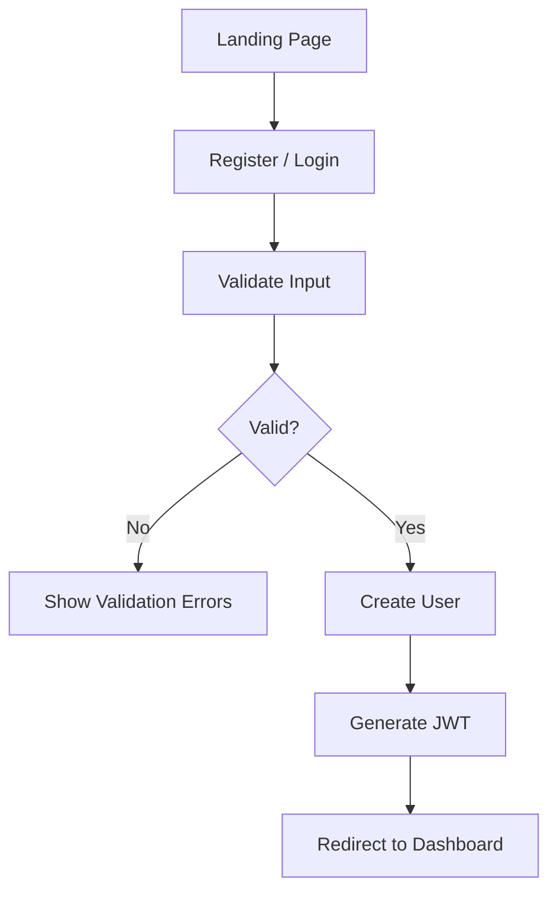
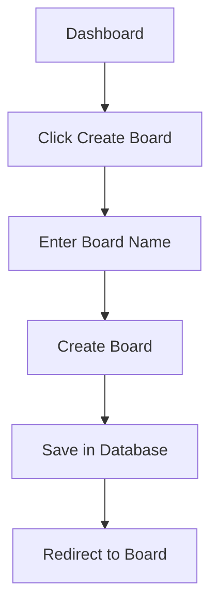
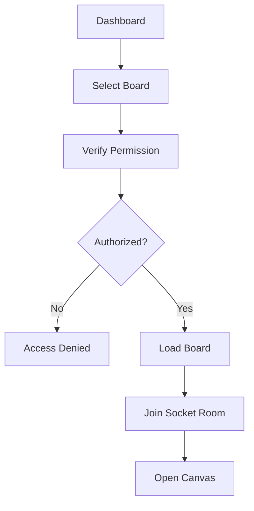
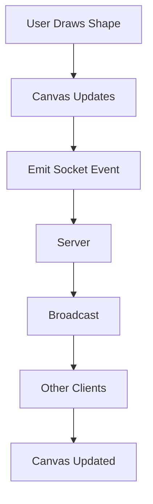
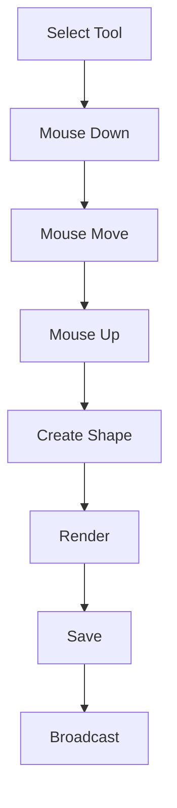
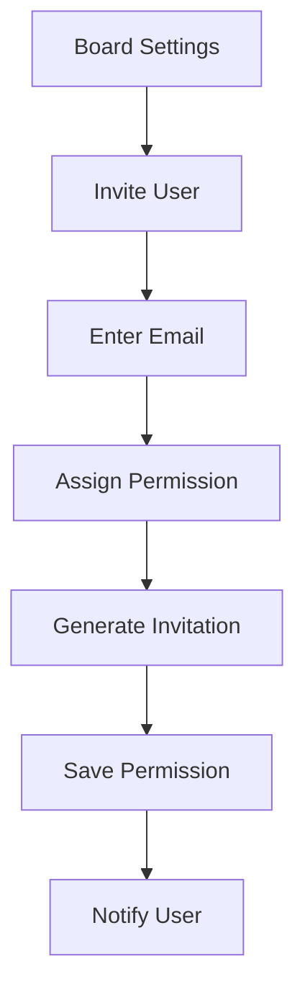
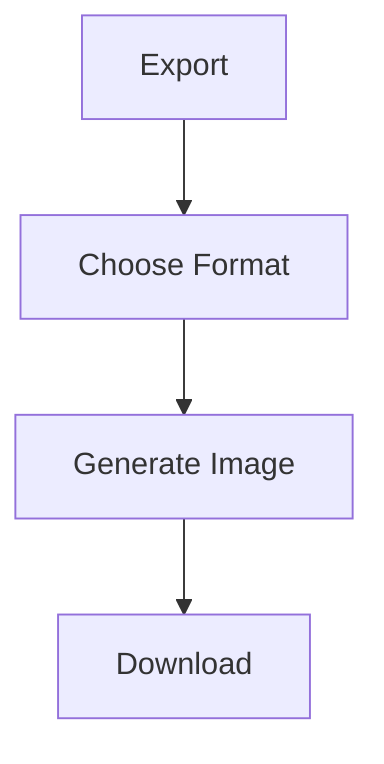
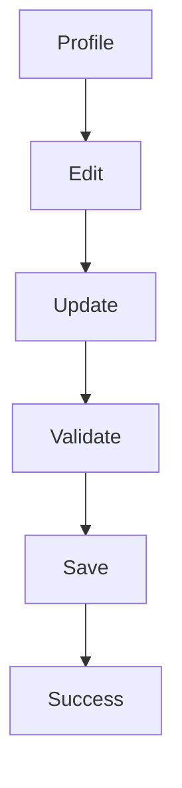

# CanvasFlow – User Flows

---

# Purpose

This document defines the primary user journeys within CanvasFlow. It illustrates how users interact with the application to complete common tasks, from authentication to real-time collaboration.

The user flows help align product design, frontend development, backend APIs, database interactions, and Socket.IO communication.

---

# User Flow Overview

The primary user journeys include:

1. User Authentication
2. Create a Board
3. Open a Board
4. Collaborate on a Board
5. Draw on the Canvas
6. Share a Board
7. Export a Board
8. Manage Profile

---

# Flow 1 – User Authentication

## Goal

Allow users to securely register, log in, and access protected resources.

### Flow

---

### Backend Components

- Authentication Controller
- Authentication Service
- User Repository
- JWT Service

---

### Database

- User Collection

---

### API Endpoints

- POST /auth/register
- POST /auth/login
- POST /auth/logout
- POST /auth/refresh

---

# Flow 2 – Create a Board

## Goal

Allow authenticated users to create a new collaborative board.

### Flow

---

### Backend Components

- Board Controller
- Board Service
- Board Repository

---

### Database

- Boards Collection

---

### API

- POST /boards

---

# Flow 3 – Open Existing Board

## Goal

Open an existing board for editing.

### Flow

---

### Backend

- Board Controller
- Permission Middleware
- Socket Gateway

---

### Database

- Boards
- Permissions

---

### Socket Event

join-board

---

# Flow 4 – Real-Time Collaboration

## Goal

Synchronize canvas updates between multiple users.

### Flow

---

### Socket Events

Client

- draw-shape
- move-object
- delete-object

Server

- board-updated
- user-joined
- user-left

---

# Flow 5 – Draw Object

## Goal

Create visual objects on the whiteboard.

### Flow

---

### Canvas Tools

- Pencil
- Rectangle
- Circle
- Arrow
- Line
- Text
- Sticky Note

---

# Flow 6 – Share Board

## Goal

Invite collaborators to a board.

### Flow

---

### Permissions

- Owner
- Editor
- Viewer

---

### APIs

POST /boards/:id/share

GET /boards/:id/members

DELETE /boards/:id/member

---

# Flow 7 – Export Board

## Goal

Download board contents.

### Flow

---

### Formats

- PNG
- JPEG
- PDF

---

# Flow 8 – Profile Management

## Goal

Allow users to manage account information.

### Flow

---

### Editable Fields

- Name
- Avatar
- Password
- Preferences

---

# Error Flows

The application should gracefully handle failures.

## Authentication Errors

- Invalid credentials
- Expired token
- Duplicate email

---

## Board Errors

- Board not found
- Access denied
- Failed to save

---

## Collaboration Errors

- Lost socket connection
- Failed synchronization
- Version conflict

---

## Upload Errors

- Invalid file type
- File too large
- Upload failed

---

# UX Principles

Every flow should follow these principles:

- Minimize the number of steps
- Provide immediate feedback
- Prevent accidental data loss
- Display meaningful error messages
- Recover gracefully from failures
- Maintain consistent navigation

---

# Future User Flows

Additional flows planned for future releases include:

- Team workspace creation
- Organization management
- AI-assisted diagram generation
- Version history restoration
- Plugin installation
- Voice and video collaboration
- Presentation mode
- Template marketplace

---

# Conclusion

The user flows defined in this document provide a blueprint for implementing the application's navigation, APIs, real-time communication, and interaction patterns. They ensure a consistent user experience while serving as a reference for frontend and backend development.