# 12. Security & RBAC Architecture

This document details the authentication lifecycle, role-based access control (RBAC), multi-tenant isolation, and security guarantees implemented in CanvasFlow.

---

## 1. Authentication Architecture

CanvasFlow uses a hybrid JWT + HTTP-Only Cookie strategy:
- **Short-Lived Access Tokens (JWT)**: Passed via the `Authorization: Bearer <token>` header for stateless API and WebSocket authentication.
- **Long-Lived Refresh Tokens**: Stored in a secure, HTTP-only, SameSite cookie (`refreshToken`) with a 7-day lifespan.
- **Refresh Token Versioning (`refreshTokenVersion`)**: Stored in the MongoDB user document to support instant global revocation and token rotation.

```mermaid
sequenceDiagram
    autonumber
    actor User as Client (Browser)
    participant API as Express API
    participant DB as MongoDB

    Note over User,DB: Registration / Login Flow
    User->>API: POST /api/v1/auth/register or /login
    API->>DB: Validate credentials & fetch user
    API->>API: Generate Access Token (15m) & Refresh Token (7d, versioned)
    API-->>User: Set-Cookie: refreshToken (HttpOnly, SameSite=Lax) + { user, accessToken }
    
    Note over User,DB: Session Restoration (Page Refresh)
    User->>API: POST /api/v1/auth/refresh (with Cookie)
    API->>API: Verify JWT signature & match token.version === user.security.refreshTokenVersion
    API->>DB: Increment refreshTokenVersion (Token Rotation)
    API-->>User: Set-Cookie: new refreshToken + { user, new accessToken }

    Note over User,DB: Logout Flow
    User->>API: POST /api/v1/auth/logout (Bearer Token)
    API->>DB: Increment refreshTokenVersion in DB
    API-->>User: Clear-Cookie: refreshToken + 200 OK
```

---

## 2. Workspace & Board RBAC Matrix

CanvasFlow implements a resource-oriented Role-Based Access Control (RBAC) model across four workspace roles: `OWNER`, `ADMIN`, `EDITOR`, and `VIEWER`.

| Permission / Action | OWNER | ADMIN | EDITOR | VIEWER |
|---|:---:|:---:|:---:|:---:|
| **View Workspace & Board List** | ✅ | ✅ | ✅ | ✅ |
| **Update Workspace Settings** (Name/Desc) | ✅ | ✅ | ❌ | ❌ |
| **Delete Workspace** | ✅ | ❌ | ❌ | ❌ |
| **View Workspace Members** | ✅ | ✅ | ✅ | ✅ |
| **Add / Invite Members** | ✅ | ✅ | ❌ | ❌ |
| **Update Member Role** | ✅ | ✅ (Cannot modify OWNER) | ❌ | ❌ |
| **Remove Member** | ✅ | ✅ (Cannot remove OWNER) | ❌ | ❌ |
| **Leave Workspace** | ❌ (Must transfer ownership) | ✅ | ✅ | ✅ |
| **Create Board** | ✅ | ✅ | ✅ | ❌ |
| **Update Board** | ✅ | ✅ | ✅ (If creator or workspace editor) | ❌ |
| **Delete Board** | ✅ | ✅ | ✅ (If board creator) | ❌ |
| **Canvas Mutations & Shape Edits** | ✅ | ✅ | ✅ | ❌ |
| **Add Comments & Replies** | ✅ | ✅ | ✅ | ✅ |

---

## 3. IDOR & Multi-Tenant Isolation

### Insecure Direct Object Reference (IDOR) Prevention
- **Workspace Boundary Enforcement**: Every board, canvas, shape, and comment route resolves the parent workspace and ensures the calling user is an active member with appropriate permissions.
- **Cross-Tenant Attack Mitigation**: A user belonging to `Workspace A` cannot query, mutate, or delete resources belonging to `Workspace B` by guessing ObjectIDs. Requests are checked against database-backed membership and ownership invariants.

### Backend Defense in Depth
1. **Authentication Middleware**: Verifies Bearer JWT signature, expiration, and payload claims (`req.user = { userId, role }`).
2. **Resource Resolution & Authorization**: Services (`WorkspaceService`, `BoardService`, `CommentService`) independently resolve resource ownership and membership records (`workspaceMemberRepository.findByWorkspaceAndUser`), preventing bypasses.
3. **Optimistic Locking & Revision Controls**: Real-time collaborative canvas operations enforce atomic revisions.

---

## 4. Frontend vs. Backend Authorization Boundary

- **Backend is Authoritative**: All permissions, mutations, and queries are verified server-side. Frontend role checks are never trusted as security mechanisms.
- **Frontend Permission Utility (`permissions.ts` & `useWorkspacePermissions`)**: Used strictly for UI/UX gating:
  - Hiding workspace settings and danger zone for non-owners.
  - Hiding member invite/remove buttons for viewers and editors.
  - Disabling canvas tools and shape editing for viewers.

---

## 5. Senior Engineering Interview Questions & Deep Dives

### Q1: Why use a short-lived JWT access token with an HTTP-only refresh token instead of storing tokens in localStorage?
**Answer**:
Storing access tokens in `localStorage` makes them vulnerable to Cross-Site Scripting (XSS) attacks; any injected malicious script can read `localStorage.getItem('token')` and exfiltrate credentials. By using short-lived in-memory access tokens (retained in Zustand/React memory) paired with an `HttpOnly`, `SameSite=Lax`, `Secure` cookie for refresh tokens:
1. JavaScript running in the browser cannot read the refresh token cookie.
2. Even if an XSS vulnerability exists, the attacker cannot steal the long-lived refresh token.
3. The short-lived access token naturally expires in minutes, minimizing the window of vulnerability.

---

### Q2: How does Refresh Token Rotation and `refreshTokenVersion` prevent replay attacks and enable instant revocation?
**Answer**:
JWTs are inherently stateless and cannot be revoked without maintaining server-side state. CanvasFlow implements **Token Versioning**:
- Each user document stores `security.refreshTokenVersion: number`.
- The refresh token JWT payload contains `{ userId, version }`.
- When `/api/v1/auth/refresh` is called, the server verifies `payload.version === user.security.refreshTokenVersion`.
- On every successful refresh or password change or logout, `refreshTokenVersion` is incremented.
- If a stolen refresh token is used after rotation, the version mismatch rejects the request immediately.
- On `/auth/logout`, incrementing the version in the database invalidates all active sessions across all devices simultaneously without requiring a Redis blacklist.

---

### Q3: How do you prevent Insecure Direct Object References (IDOR) in multi-tenant SaaS platforms?
**Answer**:
IDOR occurs when an application exposes a reference to an internal object (e.g., `/boards/:boardId`) without verifying that the authenticated user owns or has authorized access to that object.
To prevent IDOR:
1. Never assume that possessing an ID implies access rights.
2. The authorization layer must resolve the root tenant/workspace boundary:
   `board -> workspaceId -> workspaceMemberRepository.findByWorkspaceAndUser(board.workspaceId, userId)`.
3. If the user is neither the workspace owner, a valid workspace member, nor is the resource marked `PUBLIC`, return `403 Forbidden` (or `404 Not Found` to avoid leaking resource existence).

---

### Q4: What is the difference between RBAC (Role-Based Access Control) and ABAC (Attribute-Based Access Control)? How does CanvasFlow balance both?
**Answer**:
- **RBAC** assigns permissions to predefined roles (`OWNER`, `ADMIN`, `EDITOR`, `VIEWER`). Users inherit all permissions assigned to their role.
- **ABAC** evaluates dynamic attributes at runtime (e.g., `resource.createdBy === user.id`, time of day, IP address).
- **CanvasFlow's Approach**: Uses RBAC for workspace-level governance (`canEditWorkspace`, `canManageMembers`), complemented by fine-grained ABAC attributes for resource ownership (e.g., an `EDITOR` can only update or delete a board if `board.createdBy.equals(userId)`).

---

### Q5: How do you scale multi-tenant authorization to tens of thousands of requests per second?
**Answer**:
1. **Hierarchical Caching**: Cache the user's workspace membership and role in Redis with a short TTL (e.g., 60 seconds) keyed by `ws:{workspaceId}:user:{userId}:role`.
2. **JWT Tenant Claims**: For workspace-specific sub-domains or active workspace sessions, include `{ workspaceId, role }` directly inside a short-lived workspace access token.
3. **Database Indexing**: Compound index `{ workspaceId: 1, userId: 1 }` on `workspace_members` ensures $O(1)$ indexed lookup time.
4. **CDC / Cache Invalidation**: Use MongoDB change streams or event buses (e.g., Redis Pub/Sub, Kafka) to invalidate the cached membership immediately when an administrator updates a role or removes a member.
