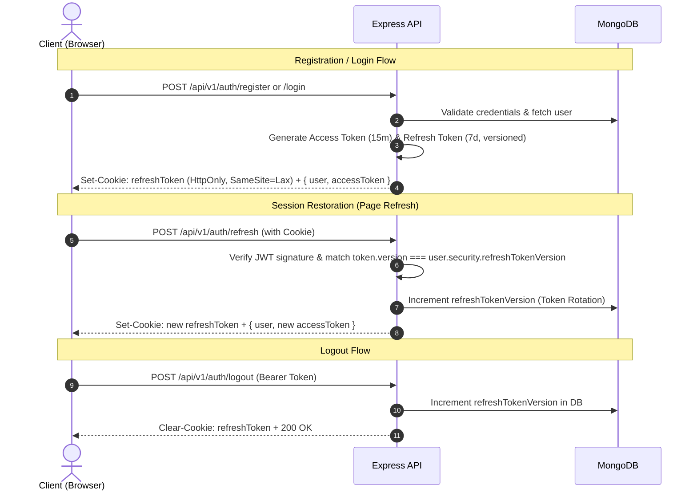
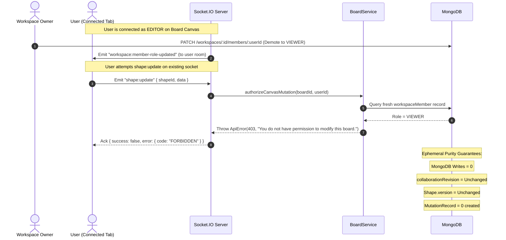

# 12. Security & RBAC Architecture

This document details the authentication lifecycle, role-based access control (RBAC), multi-tenant isolation, real-time WebSocket authorization guarantees, and runtime security enforcement in CanvasFlow.

---

## 1. Authentication Architecture

CanvasFlow uses a hybrid JWT + HTTP-Only Cookie strategy:
- **Short-Lived Access Tokens (JWT)**: Passed via the `Authorization: Bearer <token>` header for stateless API and WebSocket authentication.
- **Long-Lived Refresh Tokens**: Stored in a secure, HTTP-only, SameSite cookie (`refreshToken`) with a 7-day lifespan.
- **Refresh Token Versioning (`refreshTokenVersion`)**: Stored in the MongoDB user document to support instant global revocation and token rotation.

---

## 2. Workspace & Board RBAC Matrix

CanvasFlow implements a resource-oriented Role-Based Access Control (RBAC) model across four workspace roles: `OWNER`, `ADMIN`, `EDITOR`, and `VIEWER`.

| Permission / Action | OWNER | ADMIN | EDITOR | VIEWER |
|---|:---:|:---:|:---:|:---:|
| **View Workspace & Board List** | ✅ | ✅ | ✅ | ✅ |
| **Update Workspace Settings** (Name/Desc) | ✅ | ✅ | ❌ | ❌ |
| **Delete Workspace** | ✅ | ❌ | ❌ | ❌ |
| **View Workspace Members** | ✅ | ✅ | ✅ | ✅ |
| **Add / Invite Members** | ✅ | ✅ | ❌ | ❌ |
| **Update Member Role** | ✅ | ✅ (Cannot modify OWNER) | ❌ | ❌ |
| **Remove Member** | ✅ | ✅ (Cannot remove OWNER) | ❌ | ❌ |
| **Leave Workspace** | ❌ (Must transfer ownership) | ✅ | ✅ | ✅ |
| **Create Board** | ✅ | ✅ | ✅ | ❌ |
| **Update Board** | ✅ | ✅ | ✅ (If creator or workspace editor) | ❌ |
| **Delete Board** | ✅ | ✅ | ✅ (If board creator) | ❌ |
| **Canvas Mutations & Shape Edits** | ✅ | ✅ | ✅ | ❌ (Read-Only) |
| **Acquire Shape Soft-Locks** | ✅ | ✅ | ✅ | ❌ (Forbidden) |
| **Add Comments & Replies** | ✅ | ✅ | ✅ | ✅ |
| **Real-Time Cursors & Presence** | ✅ | ✅ | ✅ | ✅ |

---

## 3. Runtime RBAC Enforcement for Connected WebSocket Sessions

### The Distributed Session Concurrency Problem
In collaborative whiteboard applications, users establish persistent WebSocket connections that outlive individual API requests. If a workspace owner demotes an active collaborator (`EDITOR -> VIEWER`), existing socket connections could remain authorized if permissions were checked only at socket handshake or cached on the socket object.

### The Solution: Dynamic Authorization & Ephemeral Purity

### Invariants Enforced:
1. **Dynamic Database Resolution**: Sockets do not store immutable role claims. Every durable mutation (`shape:create`, `shape:update`, `shape:delete`, `shape:lock`) and REST mutation executes `boardService.authorizeCanvasMutation(boardId, userId)` against current database state.
2. **Immediate Effect (0 ms propagation delay)**: Role demotion in MongoDB takes effect on the very next WebSocket frame without requiring socket disconnection or page refresh.
3. **Multi-Tab Synchronization**: Real-time event `workspace:member-role-updated` is broadcast to room `user:${userId}`, invalidating TanStack Query caches across all open tabs simultaneously.
4. **Ephemeral vs. Durable Separation**: `VIEWER` users can participate in presence tracking (cursor positions, heartbeats, online status) and add comments, but are strictly barred from durable canvas state mutations and shape soft-locks.

---

## 4. IDOR & Multi-Tenant Isolation

### Insecure Direct Object Reference (IDOR) Prevention
- **Workspace Boundary Enforcement**: Every board, canvas, shape, and comment route resolves the parent workspace and ensures the calling user is an active member with appropriate permissions.
- **Cross-Tenant Attack Mitigation**: A user belonging to `Workspace A` cannot query, mutate, or delete resources belonging to `Workspace B` by guessing ObjectIDs. Requests are checked against database-backed membership and ownership invariants.

### Backend Defense in Depth
1. **Authentication Middleware**: Verifies Bearer JWT signature, expiration, and payload claims (`req.user = { userId, role }`).
2. **Resource Resolution & Authorization**: Services (`WorkspaceService`, `BoardService`, `CommentService`) independently resolve resource ownership and membership records (`workspaceMemberRepository.findByWorkspaceAndUser`), preventing bypasses.
3. **Optimistic Locking & Revision Controls**: Real-time collaborative canvas operations enforce atomic revisions.

---

## 5. Frontend vs. Backend Authorization Boundary

- **Backend is Authoritative**: All permissions, mutations, and queries are verified server-side. Frontend role checks are never trusted as security mechanisms.
- **Frontend Permission Utility (`permissions.ts` & `useWorkspacePermissions`)**: Used strictly for UI/UX gating:
  - Hiding workspace settings and danger zone for non-owners.
  - Hiding member invite/remove buttons for viewers and editors.
  - Disabling canvas tools and shape editing for viewers.
  - Showing visual "View Only" badge on canvas toolbar.

---

## 6. Senior Engineering Interview Questions & Deep Dives

### Q1: Why use a short-lived JWT access token with an HTTP-only refresh token instead of storing tokens in localStorage?
**Answer**:
Storing access tokens in `localStorage` makes them vulnerable to Cross-Site Scripting (XSS) attacks; any injected malicious script can read `localStorage.getItem('token')` and exfiltrate credentials. By using short-lived in-memory access tokens (retained in Zustand/React memory) paired with an `HttpOnly`, `SameSite=Lax`, `Secure` cookie for refresh tokens:
1. JavaScript running in the browser cannot read the refresh token cookie.
2. Even if an XSS vulnerability exists, the attacker cannot steal the long-lived refresh token.
3. The short-lived access token naturally expires in minutes, minimizing the window of vulnerability.

---

### Q2: How does Refresh Token Rotation and `refreshTokenVersion` prevent replay attacks and enable instant revocation?
**Answer**:
JWTs are inherently stateless and cannot be revoked without maintaining server-side state. CanvasFlow implements **Token Versioning**:
- Each user document stores `security.refreshTokenVersion: number`.
- The refresh token JWT payload contains `{ userId, version }`.
- When `/api/v1/auth/refresh` is called, the server verifies `payload.version === user.security.refreshTokenVersion`.
- On every successful refresh or password change or logout, `refreshTokenVersion` is incremented.
- If a stolen refresh token is used after rotation, the version mismatch rejects the request immediately.
- On `/auth/logout`, incrementing the version in the database invalidates all active sessions across all devices simultaneously without requiring a Redis blacklist.

---

### Q3: Why is checking permissions during the WebSocket connection handshake insufficient for real-time collaborative applications?
**Answer**:
Handshake-only authorization creates a stale session window. If user permissions change after the socket connects (e.g. role demoted from `EDITOR` to `VIEWER`, member removed from workspace, or board visibility changed to private), the long-lived TCP socket continues operating with obsolete privileges until severed.
CanvasFlow solves this by:
1. Validating token authenticity at handshake (`socket.data.user = { userId }`).
2. Enforcing dynamic permission verification (`authorizeCanvasMutation`) at the handler level on every durable mutation frame.
3. Broadcasting real-time role change events to user-scoped rooms (`user:${userId}`) so client UI state stays synchronized across all connected tabs.

---

### Q4: How does CanvasFlow maintain Ephemeral Zero-Persistence Purity on rejected unauthorized mutations?
**Answer**:
When an unauthorized or demoted user (`VIEWER`) emits a mutation (`shape:create`, `shape:update`, `shape:delete`):
1. Authorization validation occurs *before* any database query or transaction lock is acquired.
2. The server acknowledges the socket with `{ success: false, error: { code: "FORBIDDEN" } }`.
3. Zero document writes occur in MongoDB.
4. The board's `collaborationRevision` is not incremented.
5. Target `Shape.version` is not incremented.
6. Zero `MutationRecord` deduplication logs are created.
7. No broadcast event is emitted to collaborator sockets in the board room.

---

### Q5: What is the difference between `SHAPE_LOCKED` (Interaction Conflict) and `FORBIDDEN` (Authorization Failure)?
**Answer**:
- `SHAPE_LOCKED` is an optimistic concurrency control signal indicating that two authorized collaborators are attempting to edit the same shape simultaneously. The client responds by showing an informative toast with collaborator name.
- `FORBIDDEN` is an access control violation indicating that the actor lacks the `EDIT_CANVAS` privilege for the board's parent workspace. The server rejects the action unconditionally regardless of whether the shape is currently unlocked.

---

### Q6: How do you scale multi-tenant authorization to tens of thousands of requests per second?
**Answer**:
1. **Hierarchical Caching**: Cache the user's workspace membership and role in Redis with a short TTL (e.g., 60 seconds) keyed by `ws:{workspaceId}:user:{userId}:role`.
2. **JWT Tenant Claims**: For workspace-specific sub-domains or active workspace sessions, include `{ workspaceId, role }` directly inside a short-lived workspace access token.
3. **Database Indexing**: Compound index `{ workspaceId: 1, userId: 1 }` on `workspace_members` ensures $O(1)$ indexed lookup time.
4. **CDC / Cache Invalidation**: Use MongoDB change streams or event buses (e.g., Redis Pub/Sub, Kafka) to invalidate the cached membership immediately when an administrator updates a role or removes a member.
