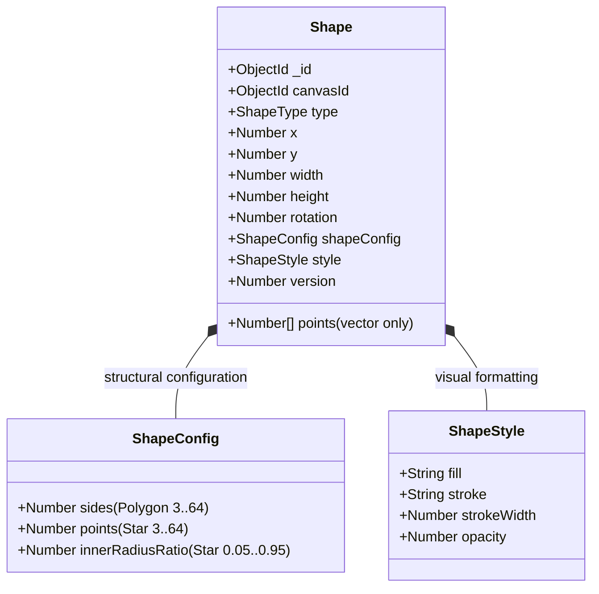

# Socket Architecture

## 1. Purpose

CanvasFlow uses Socket.IO for real-time collaboration.

- **REST APIs** are responsible for initial workspace loading, authentication, and read-heavy views.
- **Socket.IO** is responsible for establishing real-time communication channels, authenticating sockets, managing board room collaboration lifecycles, broadcasting live canvas shape events, synchronizing collaborator cursors, synchronizing collaborator shape selections, managing collaborative shape soft-locks, and synchronizing rich shape mutations (Text Shapes & Sticky Notes).

---

## 2. Layered Architecture

The socket layer adheres strictly to the project's layered architectural pattern:

```text
Client (React + Konva + Zustand + SocketClientService)
       ↓
Socket.IO Transport & Middleware (Authentication)
       ↓
Socket Handlers (Transport validation, orchestration, room management)
       ↓
Domain Services & In-Memory Managers (BoardService, ShapeService, PresenceManager, ShapeLockManager)
       ↓
Repositories (BoardRepository, ShapeRepository, WorkspaceMemberRepository)
       ↓
MongoDB (Authoritative Persistence Layer)
```

No business logic or direct database queries exist inside socket servers, middlewares, or handlers.

---

## 3. Connection & Authentication Flow

```text
Client (SocketClientService)
    │
    │ (Handshake auth: { token: "Bearer <jwt>" })
    ▼
Socket Auth Middleware (socket.middleware.ts)
    │
    ├── 1. Read token from handshake auth or headers
    ├── 2. Verify token via verifyAccessToken() (JWT)
    ├── 3. Extract userId and role
    ├── 4. Attach socket.data.user = { userId, role }
    │
    ▼
Socket Server (socket.server.ts)
    │
    ├── Authenticated connection registered
    ├── registerBoardHandlers(socket)
    ├── registerShapeHandlers(socket)
    ├── registerCursorHandlers(socket)
    ├── registerSelectionHandlers(socket)
    └── registerLockHandlers(socket)
```

- **Zero Client Identity Trust**: Client payloads cannot provide or forge `userId` or `role`. The server extracts user identity exclusively from the verified JWT in `socket.data.user`.

---

## 4. Board Room Lifecycle (Slice 2)

Users collaborate through board-specific Socket.IO rooms formatted deterministically via `getBoardRoom(boardId)` (`board:<boardId>`).

### A. Board Access Authorization (`authorizeBoardAccess`)

Before a socket joins a board room or receives canvas data, the domain service verifies access permissions:

1. **Board Existence**: Verifies the board exists and `isArchived` is false (returns 404 if missing).
2. **Creator Access**: If `board.createdBy.equals(userId)` → Access Granted.
3. **Public Board**: If `board.visibility === "PUBLIC"` → Access Granted.
4. **Workspace Verification**:
   - Finds associated workspace (returns 404 if workspace missing).
   - If `workspace.ownerId.equals(userId)` → Access Granted.
   - If `workspace.visibility === "PUBLIC"` → Access Granted.
   - If user is an active workspace member in `WorkspaceMemberModel` → Access Granted.
5. **Unauthorized Access**: If none match, throws `ApiError(HttpStatus.FORBIDDEN)` (returns 403 error ack).

### B. Board Join Flow (`board:join`)

```text
Client                              Server
  │                                    │
  ├─── board:join { boardId } ────────►│
  │                                    ├── 1. Validate payload & ObjectId format
  │                                    ├── 2. boardService.authorizeBoardAccess()
  │                                    ├── 3. Resolve canvas (specified or default Page 1)
  │                                    ├── 4. shapeService.getCanvasShapes()
  │                                    ├── 5. ShapeMapper.toResponseDto()
  │                                    ├── 6. socket.join("board:<boardId>")
  │                                    ├── 7. presenceManager.joinBoard()
  │                                    │
  │◄── canvas:sync { canvasId, shapes }┤ (Sent ONLY to joining socket)
  │                                    │
  │                                    ├── 8. Broadcast user:joined to OTHER room members
  │◄── Ack { success: true, data } ────┤
```

### C. Board Leave Flow (`board:leave`)

```text
Client                              Server
  │                                    │
  ├─── board:leave { boardId } ───────►│
  │                                    ├── 1. socket.leave("board:<boardId>")
  │                                    ├── 2. presenceManager.leaveBoard()
  │                                    ├── 3. If last socket for user:
  │                                    │        Broadcast user:left to room
  │◄── Ack { success: true } ──────────┤
```

---

## 5. Shape Synchronization (Slice 3)

Real-time shape manipulation uses authoritative backend synchronization over Socket.IO.

```text
User A (Initiator)                   Backend Authoritative Server             User B (Collaborator)
       │                                         │                                      │
       ├─── 1. Local action (draw/move/resize)  │                                      │
       ├─── 2. Update local Zustand store        │                                      │
       │       (records undo snapshot)           │                                      │
       │                                         │                                      │
       ├─── 3. Emit shape:create/update/delete ─►│                                      │
       │                                         ├── 4. Validate transport payload     │
       │                                         ├── 5. Derive canvasId & boardId       │
       │                                         ├── 6. Authorize board access          │
       │                                         ├── 7. Verify socket room membership   │
       │                                         ├── 8. ShapeService persistence in DB │
       │                                         ├── 9. ShapeMapper.toResponseDto()     │
       │                                         │                                      │
       │◄── 10. Ack { success: true, data } ─────┤                                      │
       │                                         ├── 11. Broadcast to room (excludes A)►│
       │                                         │   (shape:created/updated/deleted)    ├── 12. useCanvasSocket catches event
       │                                         │                                      └── 13. applyRemoteShape* (NO undo snapshot)
```

---

## 6. Live Collaborator Cursor Synchronization (Slice 4)

Live cursor synchronization allows active collaborators on the same board to see each other's mouse movements in real time.

```text
User A (Moving Mouse)                         Server                              User B (Collaborator)
       │                                         │                                         │
       ├─── 1. pointermove on Stage              │                                         │
       ├─── 2. screenToWorld(pointer)            │                                         │
       ├─── 3. Throttle (~30 fps / 33ms)         │                                         │
       │                                         │                                         │
       ├─── 4. socket.emit("cursor:move") ──────►│                                         │
       │       { boardId, x, y }                 ├── 5. Zod schema validation              │
       │                                         ├── 6. Extract socket.data.user.userId    │
       │                                         ├── 7. Verify room membership             │
       │                                         │                                         │
       │                                         ├── 8. socket.to(boardRoom).emit() ──────►│
       │                                         │      ("cursor:moved", { userId, ... })  ├── 9. useCanvasSocket catches
       │                                         │                                         ├── 10. setRemoteCursor(payload)
       │                                         │                                         └── 11. Render CollaboratorCursor
```

---

## 7. Live Collaborator Selection Synchronization (Slice 5)

Live selection synchronization allows collaborators on the same board to see which shapes other collaborators currently have selected.

```text
User A (Selects Shape locally)                Server (Authoritative Transport)           User B (Collaborator)
       │                                                     │                                      │
       ├── 1. Updates selectedShapeIds in Zustand            │                                      │
       ├── 2. Broadcast effect detects selection change      │                                      │
       │                                                     │                                      │
       ├── 3. socket.emit("selection:change") ──────────────►│                                      │
       │      { boardId, shapeIds }                          ├── 4. Zod schema validation           │
       │                                                     ├── 5. Extract socket.data.user.userId │
       │                                                     ├── 6. Verify board room membership    │
       │                                                     ├── 7. Verify shapes belong to board   │
       │                                                     │                                      │
       │                                                     ├── 8. Broadcast to room (excludes A) ─►│
       │                                                     │   ("selection:changed")              ├── 9. useCanvasSocket catches event
       │                                                     │                                      ├── 10. setRemoteSelection(payload)
       │                                                     │                                      └── 11. CollaboratorSelection renders
```

---

## 8. Collaborative Selection Conflict Resolution & Soft-Locking (Slice 6)

### Soft-Lock Rationale
When multiple collaborators view a shared whiteboard, concurrent edits on the same shape lead to visual jumping and race conditions in document persistence.

- **Hard-Locking (Anti-Pattern)**: Completely restricts multiple users from selecting, reading, or inspecting a shape, ruining whiteboard fluidity.
- **Soft-Locking (CanvasFlow Pattern)**: Multiple users may freely select the same shape. However, the instant User A begins actively transforming or editing a shape, User A acquires an exclusive, ephemeral **soft-lock**. Peer collaborators see a non-blocking "User A editing" lock badge and cannot transform or edit that specific shape until released.

```text
User A (Starts Drag/Transform/Edit)              Server (Authoritative Lock Layer)            User B (Peer Collaborator)
       │                                                       │                                         │
       ├── 1. onDragStart / onDoubleClick                      │                                         │
       ├── 2. socketClientService.lockShape(boardId, shapeId) ─►│                                         │
       │                                                       ├── 3. Zod validation                     │
       │                                                       ├── 4. Verify board room membership       │
       │                                                       ├── 5. Verify shape belongs to board      │
       │                                                       ├── 6. shapeLockManager.acquireLock()     │
       │                                                       │                                         │
       │◄── 7. Ack { success: true, data: { ... } } ───────────┤                                         │
       │                                                       ├── 8. Broadcast to room (excludes A) ───►│
       │                                                       │   ("shape:locked", { shapeId, ... })    ├── 9. useCanvasSocket catches
       │                                                       │                                         ├── 10. setRemoteShapeLock()
       │                                                       │                                         └── 11. CollaboratorShapeLock renders
       │                                                       │                                         │
       ├── 12. Finishes editing / dragging (onBlur / onDragEnd)│                                         │
       ├── 13. socketClientService.updateShape(...)            │                                         │
       ├── 14. socketClientService.unlockShape(...) ──────────►│                                         │
       │                                                       ├── 15. shapeLockManager.releaseLock()    │
       │◄── 16. Ack { success: true } ─────────────────────────┤                                         │
       │                                                       ├── 17. Broadcast to room (excludes A) ──►│
       │                                                       │   ("shape:unlocked", { shapeId })       ├── 18. removeRemoteShapeLock()
       │                                                       │                                         └── 19. CollaboratorShapeLock unmounts
```

---

## 9. Real-Time Text Shapes & Sticky Notes (Slice 7)

### Discriminated Union Shape Model
CanvasFlow enforces a strict TypeScript discriminated union across backend entities, DTOs, mappers, and frontend Zustand state:

```typescript
type Shape =
  | RectangleShape
  | TextShape
  | StickyNoteShape;
```

Each shape type defines its unique visual attributes while sharing fundamental canvas geometry (`id`, `x`, `y`, `width`, `height`, `rotation`, `opacity`, `zIndex`).

### Inline HTML Overlay Text Editing Architecture
Konva `<Text>` is rendered on an HTML5 `<canvas>` element and does not support native text carets, spellchecking, or multi-line selection.

When a user double-clicks or triggers text editing:
1. **Soft-Lock Acquisition**: Client emits `shape:lock`. If rejected (`SHAPE_LOCKED`), editing is prevented and a non-blocking toast alerts the user.
2. **Projected HTML `<textarea>`**: If lock succeeds, an `<InlineTextEditor>` is mounted directly over the shape.
3. **Screen Projection Math**:
   ```typescript
   screenX = shape.x * zoom + pan.x;
   screenY = shape.y * zoom + pan.y;
   screenWidth = shape.width * zoom;
   screenHeight = shape.height * zoom;
   screenFontSize = shape.fontSize * zoom;
   ```
4. **Lock Heartbeat**: During long drafting sessions, a 1500ms interval calls `refreshShapeLock(boardId, shapeId)` to prevent the 10-second safety timeout from prematurely releasing the lock.
5. **Idempotent Commit / Cancel**:
   - `Blur` / `Ctrl+Enter`: Calls `onCommit()`, emits `shape:update`, emits `shape:unlock`, unmounts overlay.
   - `Escape`: Reverts changes, emits `shape:unlock`, unmounts overlay.

### Architectural Decision: Local Editing + Commit vs. Keystroke Synchronization
**Why CanvasFlow does NOT synchronize every keystroke to MongoDB:**
- Typing at 60 words per minute across 10 collaborators generates ~300 write operations per minute per user.
- Emitting every keystroke through MongoDB causes severe database write amplification, oplog saturation, lock contention, and network churn.
- **CanvasFlow Solution**: Keystrokes remain local to the active client. The shape soft-lock guarantees zero collisions. When editing concludes, the authoritative final text is committed in a single, atomic `shape:update` transaction.
- **Future Roadmap**: Character-level collaborative editing (Google Docs style) will introduce CRDTs (e.g. Yjs / Automerge) over WebSockets without persisting intermediary keystrokes to MongoDB.

---

## 10. Remote State & Undo/Redo Isolation

To prevent infinite feedback loops and avoid polluting local undo/redo history:
- **Local User Actions**: Mutate Zustand store via `addShape`, `moveSelectedShapes`, `updateShapeTransform`, `updateShapeText`, or `deleteShape`, which append snapshots to `past` and clear `future`.
- **Remote Collaborator Actions**: Dispatched via dedicated remote store actions:
  - `applyRemoteShapeCreated(shape)`
  - `applyRemoteShapeUpdated(shape)`
  - `applyRemoteShapeDeleted(shapeId)`
  - `setRemoteCursor(cursor)`
  - `removeRemoteCursor(userId)`
  - `clearRemoteCursors()`
  - `setRemoteSelection(selection)`
  - `removeRemoteSelection(userId)`
  - `clearRemoteSelections()`
  - `setRemoteShapeLock(lock)`
  - `removeRemoteShapeLock(shapeId)`
  - `clearRemoteShapeLocks()`
- **Isolation Guarantee**: Remote actions update presentation states directly without touching `past` or `future` stacks and without re-emitting socket events.

---

## 11. Sender Exclusion

Socket broadcasts use `socket.to(getBoardRoom(boardId)).emit(...)` rather than `io.to(...).emit(...)`.
- The originating client is acknowledged directly via the Socket.IO acknowledgement callback (or skipped for ephemeral events like cursors).
- The originating client never receives its own broadcast, preventing redundant UI re-renders, self-echo, and transformation jumping.

---

## 12. In-Memory Presence & Multi-Tab Model

`PresenceManager` tracks active connections in memory without writing temporary presence state to MongoDB.

### Data Structure:
- `boards`: `Map<boardId, Map<socketId, SocketUser>>`
- `socketBoards`: `Map<socketId, boardId>`

### Multi-Tab Departure Handling:
A user may open multiple tabs (multiple socket connections) for the same board:
- When Tab 1 closes, `leaveBoard` checks if the user has other active sockets in that board.
- If remaining sockets exist, `isLastSocketForUser` is `false`, and no `user:left` event is broadcast.
- When the user's final tab disconnects or leaves, `isLastSocketForUser` is `true`, and `user:left` is broadcast to remaining collaborators.
- `getActiveUsers(boardId)` automatically deduplicates sockets by user ID.

---

## 13. Disconnect Cleanup

When a network drop, page refresh, or tab closure triggers Socket.IO `disconnect`:
1. `socket.server.ts` catches `SocketEvents.DISCONNECT`.
2. Releases all shape locks held by the socket via `shapeLockManager.releaseSocketLocks(socket.id)` and broadcasts `shape:unlocked` for each released lock.
3. Calls `presenceManager.removeSocket(socket.id)`.
4. If the socket was in an active board and was the user's last connection, broadcasts `user:left` with updated `activeUsers` to the board room.
5. Cleans up in-memory mappings cleanly without throwing unhandled exceptions.

---

## 14. Supported Events

| Client → Server | Server → Client | Description | Frequency | Persistence |
|---|---|---|---|---|
| `board:join` | `canvas:sync` | Validates access, joins room, delivers initial canonical shapes | On load | None |
| `board:leave` | `user:joined` | Leaves room, updates presence, notifies remaining collaborators | On exit | None |
| `shape:create` | `shape:created` | Authoritative shape creation broadcast (Rectangle, Text, Sticky) | Low | MongoDB |
| `shape:update` | `shape:updated` | Authoritative shape transform/position/text update broadcast | Low/Med | MongoDB |
| `shape:delete` | `shape:deleted` | Authoritative shape deletion broadcast | Low | MongoDB |
| `cursor:move` | `cursor:moved` | Live collaborator cursor synchronization | High (~30/s) | None (Ephemeral) |
| `selection:change` | `selection:changed` | Live collaborator shape selection synchronization | On change | None (Ephemeral) |
| `shape:lock` | `shape:locked` | Exclusive soft-lock acquisition before shape editing/transform | On edit start | None (Ephemeral) |
| `shape:unlock` | `shape:unlocked` | Release shape soft-lock after editing/transform completes | On edit end | None (Ephemeral) |
| `shape:lock-refresh` | | Extend soft-lock timeout heartbeat during active editing | ~1.5s during edit | None (Ephemeral) |
| `shape:transforming` | `shape:transforming` | Live ephemeral transform streaming (30–60 FPS) during drag/resize/rotate | High (~30-60/s) | None (Ephemeral) |
| `shape:transform-end` | `shape:transform-end` | Transform completion notification to peer collaborators | On transform end | None (Ephemeral) |
| | `user:left` | User departure notification | On exit | None |
| | `error` | Error notifications and status | On failure | None |

---

## 15. Real-Time Shape Transform Streaming (Slice 8)

### Architecture Overview

When a user drags, resizes, or rotates a shape, collaborators observe the transformation live at 30–60 FPS without overloading the database.

```text
LOCAL POINTER / TRANSFORM
         ↓ (requestAnimationFrame)
  SocketClientService.transformShape()
         ↓ (shape:transforming)
    Socket.IO Server
         ↓ (lock ownership check & broadcast)
  socket.to(boardRoom).emit(shape:transforming)
         ↓
  REMOTE COLLABORATORS (setRemoteShapeTransform)
         ↓
  ShapeRenderer (effectiveTransform)
```

### Key Engineering Principles:

1. **Zero Database Write Amplification**:
   - Intermediate transform frames are purely in-memory and ephemeral.
   - Only the final position/dimension is persisted to MongoDB via `shape:update` upon mouse release / transform end.
2. **Soft-Lock Ownership Verification**:
   - The server verifies `shapeLockManager.getLock(boardId, shapeId)?.socketId === socket.id` before broadcasting `shape:transforming`. Non-owners cannot stream transforms.
3. **Undo/Redo Stack Purity**:
   - Remote transforms only update `remoteShapeTransforms` in Zustand, completely isolated from `past` and `future` stacks.
   - Local user produces exactly **one** undo snapshot per drag/transform operation upon release.
4. **Effective Transform Rendering**:
   - Renderers compute `effectiveTransform = (isLockedByOther && remoteShapeTransforms[shape.id]) ?? shape`.
   - Outlines and lock badges follow `effectiveTransform` in real time.
5. **Stale Transform Garbage Collection**:
   - Stale transforms older than 3000ms are automatically purged every 1000ms.
   - Transforms are also cleaned up on `shape:unlocked`, `shape:updated`, `shape:deleted`, and `user:left`.

---

## 17. Real-Time Comments & Collaborative Annotations (Slice 9)

Collaborative annotations introduce persistent discussion threads attached to either the **canvas** (`shapeId: null`) or a **specific shape** (`shapeId: "<shapeId>"`).

### A. Architectural Principles & Invariants:
1. **Durable Persistence & Threading**:
   - Comments are persisted in MongoDB in `comments` collection with compound indexes (`{ boardId: 1, createdAt: -1 }`, `{ boardId: 1, shapeId: 1 }`, `{ parentCommentId: 1 }`).
   - Threading is strictly 1-level (root comment $\rightarrow$ replies). Reply-to-reply nesting is rejected at domain service level.
2. **Author Identity Enforcement**:
   - `authorId` is strictly extracted from verified session JWT (`socket.data.user.userId` / `req.user.userId`).
   - Sockets cannot spoof author identity or edit/delete comments authored by others.
3. **Soft-Deletion Model**:
   - When a comment is deleted, its record remains in MongoDB with `isDeleted: true`, `deletedAt: Date`, and `content: ""`.
   - Replies to deleted comments remain preserved and readable. Soft-deleted comments cannot be edited or replied to.
4. **Shape Deletion Decoupling**:
   - When a shape is deleted, attached comments are not deleted. Their `shapeId` is gracefully nullified (`shapeId: null`), converting them into canvas-level comments.
5. **Undo/Redo History Isolation**:
   - Comments live in an independent Zustand store (`useCommentStore`) and React Query cache.
   - Comment actions (create, reply, edit, delete, resolve) **never** enter the canvas undo/redo stack (`past` / `future`).

### B. Comment Socket Event Lifecycles:

```text
1. COMMENT_CREATE (comment:create)
   Client ──► Server (validates Zod schema, checks board access)
            ├── commentRepository.create()
            ├── CommentMapper.toResponseDto()
            ├── socket.to(boardRoom).emit("comment:created", dto)
            └── ack({ success: true, data: dto })

2. COMMENT_UPDATE (comment:update)
   Client ──► Server (author equality check, soft-delete lockout)
            ├── commentRepository.updateById() (sets isEdited: true)
            ├── socket.to(boardRoom).emit("comment:updated", dto)
            └── ack({ success: true, data: dto })

3. COMMENT_RESOLVE (comment:resolve)
   Client ──► Server (checks board access, updates isResolved)
            ├── socket.to(boardRoom).emit("comment:resolved", dto)
            └── ack({ success: true, data: dto })

4. COMMENT_DELETE (comment:delete)
   Client ──► Server (author equality or board creator check)
            ├── commentRepository.softDeleteById()
            ├── socket.to(boardRoom).emit("comment:deleted", { boardId, commentId })
            └── ack({ success: true, data: dto })
```

---

## 18. Slice 10 — Real-Time Reconnection & Authoritative Board State Recovery

### A. Architectural Principles

When network drops, tab sleep, or mobile backgrounding breaks a WebSocket connection, systems must recover seamlessly without state corruption or stale collaboration artifacts.

1. **State Categorization & Recovery Boundaries**:
   - **Authoritative State** (Boards, Canvases, Shapes, Comments): Persisted in MongoDB; recovered cleanly via authoritative REST hydration.
   - **Ephemeral Collaboration State** (Presence, Cursors, Selections, Shape Locks, Live Transforms): Exists in-memory during active connections; wiped on disconnect and reconstructed fresh from server snapshot.
   - **Undo/Redo History Isolation**: Recovery replaces stale store state atomically (`replaceShapesFromRecovery`) without pushing snapshots into `past` or wiping `future`. Recovery is never treated as a local undoable user action.

2. **Race Condition Prevention**:
   - **Single-Flight Mutex (`isRecoveringRef`)**: Prevents rapid connection churn or retry bursts from triggering concurrent overlapping hydration flights.
   - **Generation Counter Token (`recoveryGenerationRef`)**: Every recovery cycle increments a monotonic integer token. If a subsequent recovery initiates while a slow API request is in-flight, the stale response from the superseded recovery is silently discarded upon arrival.

3. **Multi-Tab Session Isolation**:
   - Tab-specific socket IDs join board rooms and register in `PresenceManager`.
   - When Tab 1 disconnects and reconnects, other active tabs for the same user remain undisturbed, and room presence deduplication guarantees zero phantom user drops.

### B. Recovery Event Lifecycle:

```text
1. Network / Tab Reconnection Event
   Client: socket.on("connect") fires after disconnect
   Client ──► Sets status = "recovering"
             ├── Wipes local ephemeral state (remoteCursors, remoteSelections, remoteShapeLocks, remoteShapeTransforms)
             ├── Emits "board:recovery-request" { boardId }
             ├── Fetches GET /api/v1/shapes/canvas/:canvasId
             └── Fetches GET /api/v1/comments/board/:boardId

2. Server Processing:
   Server ──► Validates boardId (Zod hex ObjectId)
            ├── Authorizes board access (boardService.authorizeBoardAccess)
            ├── Idempotently joins socket.join(getBoardRoom(boardId))
            ├── Updates PresenceManager: presenceManager.joinBoard(boardId, socket.id, user)
            ├── Broadcasts "user:joined" if first active socket for user
            └── Returns ack({ success: true, data: { boardId, recoveredAt, presence: { activeUsers } } })

3. Client Store Hydration:
   Client ──► Verifies generation token
            ├── useCanvasStore.replaceShapesFromRecovery(authoritativeShapes)
            ├── useCommentStore.setComments(authoritativeComments)
            ├── queryClient.invalidateQueries(["boards", boardId, "comments"])
            └── Sets status = "recovered" (transitions to "idle" after 2.5s)
```

---

## 19. Security & Hardening

1. **Authentication**: All connections require a valid JWT access token verified against `JWT_ACCESS_SECRET`.
2. **Authorization Boundary**: Board access authorization is verified server-side through `boardService.authorizeBoardAccess` before room entry, recovery, or data sync.
3. **Persisted Boundary Resolution**: Sockets cannot supply arbitrary `boardId` or `userId` values; the server derives `boardId` strictly from `Shape` → `Canvas` → `Board`.
4. **Room Membership Enforcement**: Shape, cursor, selection, lock, and comment handlers verify `socket.rooms.has(getBoardRoom(boardId))` before allowing actions.
5. **Shape Ownership Verification**: For selection and lock requests, `shapeService.verifyShapesBelongToBoard` guarantees foreign shapes cannot be locked or selected across boards.
6. **Payload Bounds & Validation**: Zod validates all shape properties (`text` length $\le 5000$, `fontSize` 8–200, valid text alignment, finite coordinates), comment payloads (`content` 1–2000 chars), and recovery requests (`boardId` 24-char ObjectId).
7. **DTO Sanitization**: Raw Mongoose model instances are never broadcast over sockets; all entities pass through DTO mappers (`ShapeMapper`, `CommentMapper`) with soft-delete masking.

---

## 20. Interview Concepts

### 1. Discriminated Unions in Real-Time Systems
Using a literal discriminator field (`type: "rectangle" | "text" | "sticky_note"`) enables TypeScript to perform exhaustive pattern matching and type narrowing. This eliminates optional-property soup and ensures component renderers receive guaranteed, non-null properties for specific shape types.

### 2. Ephemeral vs. Durable Collaboration State
- **Durable State**: Shapes, text content, colors, z-indexes, board settings, comment threads. Persisted authoritatively in MongoDB.
- **Ephemeral State**: Cursor coordinates, shape selections, soft-locks, heartbeat refresh timers. Managed in-memory to prevent database write amplification.

### 3. State Invalidation vs. Event Replay during Recovery
Attempting to recover state by replaying a buffer of missed Socket.IO events introduces severe consistency and ordering hazards (race conditions, dropped events, split-brain). The robust industry standard (used by Figma and Google Docs) is to fetch the current authoritative snapshot from durable persistence, atomically replace canonical state, and rebuild transient presence from live in-memory managers.

### 4. Generation Token Pattern for Out-of-Order Async Responses
When network conditions fluctuate rapidly, multiple asynchronous recovery cycles may be dispatched. By tagging each recovery invocation with a monotonically increasing integer (`recoveryGeneration`), late-arriving responses from superseded requests are discarded, preventing stale data from overwriting newer snapshots.

### 5. Screen vs. World Coordinate Projection
- **World Space**: The invariant infinite canvas coordinates where a shape lives at `(x, y)`.
- **Screen Space**: The pixel position on the viewport computed via `screenX = worldX * zoom + pan.x`. HTML overlays like `<InlineTextEditor>`, `<CommentBadge>`, and `<RecoveryStatusIndicator>` dynamically compute screen projections so editing controls match the visual canvas perfectly during pan and zoom.

### 6. Decoupled Persistence & Soft-Deletion Cascades
In collaborative systems, hard-deleting records or cascading deletes can destroy contextual collaborator discussions. By adopting a soft-delete model with masked content on comments and a foreign-key nullification lifecycle (`shapeId: null` on shape deletion), the collaborative history remains resilient without orphaned dangling references.

---

## 21. Real-Time Collaboration Ordering, Versioning & Reliability (Slice 11)

### Architectural Architecture

```text
       Authoritative Mutation
                  │
                  ▼
   Validate Zod & Authorize Access
                  │
                  ▼
CollaborationVersionService.executeWithRevision
                  │
      ┌───────────┴───────────┐
      │  MongoDB Transaction  │
      │  ├── Persist Mutation │
      │  └── $inc Board.collaborationRevision
      │  Commit Transaction   │
      └───────────┬───────────┘
                  │
                  ▼
  CollaborationEventMeta Construction
  ├── eventId: crypto.randomUUID()
  ├── boardId: boardObjectId.toString()
  ├── actorId: user.userId.toString()
  ├── socketId: socket.id
  ├── revision: updatedBoard.collaborationRevision
  └── occurredAt: ISO timestamp
                  │
                  ▼
  Socket.IO Broadcast Envelope
  ├── shape:created  -> { meta, shape }
  ├── shape:updated  -> { meta, shape }
  ├── shape:deleted  -> { meta, shapeId }
  ├── comment:created -> { meta, comment }
  ├── comment:updated -> { meta, comment }
  └── comment:resolved -> { meta, comment }
                  │
                  ▼
           Client Receiver
                  │
      ┌───────────┴───────────┐
      │  checkEventFreshness  │
      └───────────┬───────────┘
                  │
     ┌────────────┼────────────┐
     ▼            ▼            ▼
  incoming     incoming     incoming
  <= current   === curr + 1 > curr + 1
     │            │            │
     ▼            ▼            ▼
  "ignore"     "apply"       "gap"
  (drop stale) (apply state) (trigger Slice 10 recovery)
```

### 1. Authoritative Monotonic Board Revision
- Every `Board` document maintains an integer `collaborationRevision: { type: Number, default: 0, min: 0 }`.
- Only **authoritative mutations** that persist into MongoDB (Shapes and Comments) increment `collaborationRevision`.
- Ephemeral mutations (Presence, Cursors, Selections, Live transforms, Soft-locks) **never** increment `collaborationRevision`.

### 2. Transaction Atomicity & Write Conflict Retry
- Mutation persistence and `$inc: { collaborationRevision: 1 }` execute together inside a MongoDB `ClientSession` transaction.
- If concurrent mutations contend on the same `Board` document, `CollaborationVersionService` intercepts `TransientTransactionError` / `WriteConflict` and applies automatic exponential backoff retries (up to 5 attempts).
- An event is **never** broadcast if mutation persistence fails.

### 3. Server-Generated Event Envelopes
Every versioned socket event wraps its payload with an authoritative metadata block:
```typescript
export type CollaborationEventMeta = {
  eventId: string;     // Unique UUID generated server-side
  boardId: string;     // Canonical board identifier
  actorId: string;     // Authenticated user ID who performed mutation
  socketId: string;    // Originating socket ID
  revision: number;    // Monotonically increasing board revision integer
  occurredAt: string;  // ISO 8601 server timestamp
};
```

### 4. Client Freshness State Machine
Client components and hooks (`useCanvasSocket`, `useCommentSocket`) route incoming events through `useCollaborationStore.checkEventFreshness(boardId, meta.revision)`:
1. **Stale or Duplicate (`incoming <= currentRevision`)**: Discarded silently. Protects against out-of-order delivery, slow networks, and post-reconnection message echoes.
2. **Sequential Next (`incoming === currentRevision + 1` or `currentRevision === 0`)**: Applied directly to the canvas/comment store, advancing `currentRevision`.
3. **Gap Detected (`incoming > currentRevision + 1`)**: Indicates one or more intermediate mutations were dropped or missed. Automatically triggers authoritative snapshot recovery via `useBoardRecovery(boardId, canvasId)`.

### 5. Concept Disambiguation: Epoch vs. Revision vs. Generation
| Concept | Scope | Source | Purpose |
| :--- | :--- | :--- | :--- |
| **`connectionEpoch`** | Ephemeral Connection | Client Socket.IO | Tracks "Which socket connection session am I currently in?" Incremented on every socket `connect`. |
| **`collaborationRevision`**| Authoritative Board State | Server MongoDB | Tracks "Which durable board mutation state am I seeing?" Monotonically incremented per board mutation. |
| **`recoveryGeneration`** | Async Recovery Cycle | Client Recovery Hook | Tracks "Is this async REST hydration response still fresh?" Prevents slow recovery responses from overwriting newer snapshots. |

### 6. Undo/Redo Isolation Guarantees
- Monotonic revision checks, epoch updates, and recovery hydration execute in `useCollaborationStore` and dedicated remote store actions (`replaceShapesFromRecovery`, `applyRemoteShapeCreated`, `applyRemoteShapeUpdated`, `applyRemoteShapeDeleted`).
- Undo/redo stacks (`past` / `future` in `useCanvasStore`) are reserved strictly for local user edits, maintaining pristine edit histories across real-time collaboration.

---

## Slice 12: Concurrent Mutation Conflict Protection (Optimistic Concurrency Control)

Slice 12 introduces server-authoritative **Optimistic Concurrency Control (OCC)** for all durable whiteboard entities (`Shapes` and `Comments`).

### 1. The Concurrency Problem
While Slice 11 orders durable mutations globally across a board room (`collaborationRevision`), Slice 12 solves entity-level concurrent mutation races:
> *What happens when two collaborators read version 1 of an entity and concurrently attempt to update or delete it with different data?*

```text
                  Entity (Shape/Comment) [Version: 1]
                                  │
         ┌────────────────────────┴────────────────────────┐
         │                                                 │
   Client A: Update                                  Client B: Update
   expectedVersion: 1                                expectedVersion: 1
         │                                                 │
         ▼                                                 ▼
   [WINNER - FIRST]                                  [LOSER - CONFLICT]
   Version becomes 2                                 Predicate { version: 1 } fails
   Board revision incremented                        409 CONFLICT returned
   Broadcast sent to room                            Transaction aborted
                                                     Zero revision increment
                                                     Zero broadcast
                                                     Triggers Slice 10 recovery
```

### 2. Multi-Tier Concurrency Architecture
CanvasFlow cleanly separates three distinct versioning and concurrency controls:

| Control | Scope | Source | Persistence | Role |
| :--- | :--- | :--- | :--- | :--- |
| **`Shape.version` / `Comment.version`** | Entity Lifecycle | Server MongoDB | Persisted on Entity (`min: 1`) | **Optimistic Concurrency Control (OCC)**. Validates that the client's write was based on the latest entity state. |
| **`collaborationRevision`** | Board Room | Server MongoDB | Persisted on Board (`min: 0`) | **Global Event Ordering & Gap Detection**. Enforces causal event ordering and stale event rejection across room. |
| **`shapeLocks`** | Collaborative Interaction | Server Memory | Ephemeral in-memory | **UX Conflict Avoidance**. Prevents visual fighting during active drag/resize or text edit sessions. |

> **Key Rule**: Ephemeral soft-locks are a UX optimization, NOT a database concurrency guarantee. OCC functions reliably even if a shape is unlocked or if lock heartbeats expire.

### 3. Atomic Compare-and-Modify Pattern
OCC checks are executed directly within MongoDB query predicates to prevent read-then-write race conditions:

```typescript
// Atomically match entity ID AND expected version, then increment version
const updated = await ShapeModel.findOneAndUpdate(
  {
    _id: shapeId,
    version: expectedVersion,
  },
  {
    $set: updateFields,
    $inc: { version: 1 },
  },
  { new: true, session }
);

if (!updated) {
  const existing = await ShapeModel.findById(shapeId, null, { session });
  if (!existing) {
    throw new ApiError(HttpStatus.NOT_FOUND, "Shape not found.");
  }
  // Mismatch detected -> trigger 409 Conflict
  throw new ConflictError("shape", shapeId.toString(), existing.version);
}
```

### 4. Structured Conflict Protocol
When an OCC predicate fails, the server responds with a structured 409 conflict acknowledgement:

```typescript
export type CollaborationConflictPayload = {
  code: "CONFLICT";
  resourceType: "shape" | "comment";
  resourceId: string;
  currentVersion: number;
  message?: string;
};
```

### 5. Zero-Pollution Semantics
When an OCC conflict occurs:
1. **Zero Entity Mutation**: The loser's modifications are completely discarded.
2. **Zero Version Increment**: Entity version is not modified by the failed attempt.
3. **Zero Board Revision Increment**: The MongoDB transaction aborts, ensuring `collaborationRevision` is not consumed.
4. **Zero Broadcast**: No socket events (`shape:updated`, `comment:updated`, etc.) are broadcast to peer clients.
5. **Zero History Pollution**: The loser's local undo/redo stack is not corrupted.
6. **Automatic Recovery**: The conflicting client handles the 409 conflict by querying authoritative state via Slice 10 recovery (`useBoardRecovery`), synchronizing to the winner's version, and presenting fresh state to the user.

---

## Senior Engineering Interview Questions & Deep Architecture Guide

### Q1: Why do we maintain both an entity-level `version` and a board-level `collaborationRevision`?
**Answer:**
They solve two fundamentally different distributed systems problems:
1. **Entity-level `version` (Optimistic Concurrency Control)**: Protects against write-after-write conflicts on a specific record (e.g. two users trying to change the background color of Shape #123 at the same time). It operates per entity, starting at `1` and incrementing on every mutation of that specific document.
2. **Board-level `collaborationRevision` (Global Event Ordering & Freshness)**: Enforces causal ordering across the entire board room. It enables peer clients to detect dropped socket messages (revision gaps) and discard stale out-of-order frames across all shape and comment mutations on that canvas.

If we only used board revision for OCC, updating Shape A would falsely conflict with a concurrent update to Shape B! If we only used entity version for ordering, clients could not detect missed events for newly created or deleted entities.

### Q2: Why is "find entity in JS -> compare version -> update entity" an anti-pattern in high-concurrency systems?
**Answer:**
This is the classic **Time-of-Check to Time-of-Use (TOCTOU)** race condition. If two requests execute the find query simultaneously:
1. Request A reads Version 1.
2. Request B reads Version 1.
3. Request A validates that version === 1, and issues an update writing Version 2.
4. Request B validates that its in-memory variable version === 1, and also issues an update writing Version 2 with its own data.

Request B silently overwrites Request A's changes (Lost Update Problem). By placing `{ _id: id, version: expectedVersion }` in the atomic MongoDB `findOneAndUpdate` predicate with `$inc: { version: 1 }`, the database engine's row-level lock guarantees that only the first write matches and executes. The second write finds 0 matching documents and is rejected.

### Q3: How does CanvasFlow handle database write conflicts when running in a replica set vs standalone MongoDB?
**Answer:**
In `CollaborationVersionService.executeWithRevision`, transactions are used when MongoDB runs with replica set support enabled. If two transactions attempt to update the same board document concurrently, MongoDB raises a `WriteConflict` / `TransientTransactionError`.
`CollaborationVersionService` wraps the transaction in an automatic exponential backoff retry loop (up to 5 attempts).
If MongoDB is operating in standalone mode (where replica set transactions are unsupported), the service seamlessly falls back to direct execution without breaking functionality, ensuring zero developer friction in local development while maintaining transaction isolation in production clusters.

### Q4: If an OCC conflict occurs inside a transaction, how do we guarantee zero state pollution?
**Answer:**
When an OCC predicate fails, the repository returns `null`, and the service immediately throws a `ConflictError`. Because this error is thrown before the transaction commits, the transaction driver (`withTransaction`) aborts the entire transaction.
As a result:
- Any partial database writes in that session are rolled back.
- The `Board.collaborationRevision` increment is rolled back.
- The revision number is not consumed or skipped.
- The handler catches `ConflictError` before calling `socket.to(room).emit(...)`, guaranteeing no peer client receives a phantom socket event.

### Q5: How do ephemeral soft-locks differ from optimistic concurrency control?
**Answer:**
- **Soft-Locks**: An ephemeral in-memory lease (`ShapeLockManager`) acquired by a client when starting a drag/resize or opening an inline text editor. Its purpose is **collaborative UX**: preventing two users from visually fighting over the same element. Locks are stored in Redis/memory with TTLs and release on disconnect.
- **OCC**: A persistent, ACID-backed database constraint enforcing data integrity during state persistence. Even if a user bypasses the UI, loses their soft-lock due to a network stutter, or mutates an unlocked entity, OCC prevents lost updates at the database tier.

### Q6: What is the client-side recovery loop when an OCC 409 CONFLICT is received?
**Answer:**
1. The client mutation promise rejects with an error containing `{ code: 'CONFLICT', resourceType, resourceId, currentVersion }`.
2. The UI / collaboration store sets `lastConflict` to log the conflict event and suppress optimistic reconciliation errors.
3. The client calls `useBoardRecovery(boardId, canvasId)`.
4. `useBoardRecovery` fetches the authoritative snapshot via REST API (`/api/v1/boards/:boardId`), synchronizing all local shapes and comments to their latest server versions.
5. If the user desires, the mutation can be safely re-attempted using the newly acquired version (`recoveredShape.version`).

### Q7: Why must soft-deletions on comments also participate in OCC?
**Answer:**
Soft-deleting a comment modifies its state (`deletedAt`, `content` masked, `version` incremented). If User A soft-deletes a comment while User B concurrently edits its content:
1. If delete did not check `expectedVersion`, User A might delete a comment that User B just significantly updated or corrected.
2. Conversely, if User B's edit arrives after User A's delete, User B could un-delete or resurrect deleted content.
With OCC, whichever mutation reaches the database first increments the version; the second mutation is rejected with 409 CONFLICT and must re-hydrate before taking further action.

### Q8: Why is the `version` field initialized to `1` rather than `0` on creation?
**Answer:**
In JavaScript and TypeScript, `0` is falsy. If `version` is `0`, checks like `if (shape.version)` or DTO validations that verify positive integers (`z.number().int().min(1)`) require verbose explicit undefined checks. Initializing entities at version `1` upon creation provides clear semantic meaning: Version 1 represents the initial creation state, while Version $N$ represents the $N-1$-th update.

### Q9: How does CanvasFlow prevent undo/redo history corruption when an OCC conflict occurs?
**Answer:**
In `useCanvasStore`, local user actions push undo entries onto the `past` stack *only* upon successful local completion or with rollback handlers. When mutations are emitted over the socket, if the server returns a 409 CONFLICT, the rejected promise or error handler reverts the optimistic state change and triggers authoritative recovery without leaving ghost operations on the local undo stack. Remote operations never push to the local undo/redo stack.

### Q10: How does the combination of Slice 10 (Recovery), Slice 11 (Ordering), and Slice 12 (Conflict Protection) achieve end-to-end distributed consistency?
**Answer:**
The three slices form a layered consistency defense:
1. **Slice 10 (Transport Recovery)**: Restores socket connection, re-binds rooms, hydrates authoritative state, and resets ephemeral presence when networks drop.
2. **Slice 11 (Broadcast Freshness)**: Ensures that all peer-to-peer broadcasts are delivered with monotonic board revisions, dropping out-of-order or duplicate frames and detecting network packet gaps.
3. **Slice 12 (Storage OCC)**: Ensures that when multiple clients submit concurrent writes to the same record, only one atomic transaction succeeds, while conflicting writes fail cleanly with 409 CONFLICT and trigger authoritative state realignment.

---

## 22. Slice 13: Offline Mutation Safety & Pending Mutation Reconciliation

Slice 13 implements a production-grade **client-side mutation reconciliation layer** for network disconnections, lost acknowledgements, uncertain mutation results, and optimistic reconciliation.

### 1. Core Problem: The Timeout $\neq$ Rejection Dilemma
When an optimistic mutation is emitted over Socket.IO and the connection stutters:
```text
User Mutates Shape
       │
       ▼
Optimistic UI Update
       │
       ▼
Socket Disconnects / Drops
       │
       ▼
Acknowledgement Never Arrives (Timeout)
```

**Critical Architectural Principle**:
> *A network timeout or lost socket ack does NOT mean the server rejected the mutation.*
> The server may have committed the mutation to MongoDB while the return packet was dropped on the network wire. Retrying blindly would create duplicate entities or trigger false OCC 409 conflicts.

Therefore, CanvasFlow adheres to a strict rule:
**Recovery First $\rightarrow$ Authoritative Comparison $\rightarrow$ Safe Reconciliation**.

---

### 2. Six System Identifiers Architecture
CanvasFlow maintains six distinct identifiers across the collaboration stack:

| Identifier | Scope | Source | Persistence | Purpose |
| :--- | :--- | :--- | :--- | :--- |
| **`mutationId`** | User Mutation Intent | Client UUID v4 | Across Retries & Acks | Tracks one user mutation intent across network retries and acks. |
| **`eventId`** | Socket Event | Server UUID v4 | Socket Broadcast | Identifies a single broadcast event envelope. |
| **`entity.version`** | Entity Lifecycle | Server MongoDB | Persisted on Entity | Optimistic Concurrency Control (OCC) conflict detection. |
| **`collaborationRevision`** | Board Room | Server MongoDB | Persisted on Board | Global monotonic event ordering and gap detection. |
| **`connectionEpoch`** | Socket Connection | Client Memory | Ephemeral | Tracks which socket connection session is active. |
| **`recoveryGeneration`** | Async Recovery Cycle | Client Memory | Ephemeral | Discards stale async REST hydration responses. |

---

### 3. Mutation Lifecycle State Machine
Every local mutation progresses through an explicit lifecycle managed in `useMutationStore`:

```text
                  ┌──────────────┐
                  │   pending    │
                  └──────┬───────┘
                         │
        ┌────────────────┼────────────────┐
        ▼                ▼                ▼
┌──────────────┐ ┌──────────────┐ ┌──────────────┐
│  confirmed   │ │  uncertain   │ │    failed    │
│  (ack ok)    │ │  (timeout)   │ │ (explicit)   │
└──────────────┘ └───────┬──────┘ └──────────────┘
                         │
                         ▼
                 ┌──────────────┐
                 │  reconciling │
                 └───────┬──────┘
                         │
        ┌────────────────┴────────────────┐
        ▼                                 ▼
┌──────────────┐                  ┌──────────────┐
│  confirmed   │                  │  conflicted  │
│(Case A or B) │                  │(Case C or D) │
└──────────────┘                  └──────────────┘
```

- **`pending`**: Mutation emitted, awaiting socket ack.
- **`uncertain`**: 6-second timeout elapsed without ack; mutation may or may not be on server.
- **`confirmed`**: Mutation acknowledged by server or verified present in authoritative state. Removed from journal.
- **`failed`**: Server rejected with non-conflict error (e.g. 400 Bad Request, 403 Forbidden).
- **`conflicted`**: Concurrent modification conflict detected (Case C/D or 409 Conflict).
- **`reconciling`**: Actively evaluating against authoritative REST hydration.

---

### 4. Bounded Mutation Journal
- Implemented in `useMutationStore` (`client/src/features/canvas/store/mutation.store.ts`).
- Separated completely from `useCanvasStore` and `useCollaborationStore`.
- Confirmed mutations are pruned immediately to ensure journal memory stays bounded.
- Zero undo/redo history pollution (`useCanvasStore.past` and `useCanvasStore.future` are untouched).

---

### 5. Four-Case Reconciliation Algorithm
During board recovery (`useBoardRecovery`), `MutationManager.reconcileBoard` compares every pending/uncertain mutation against authoritative REST data:

```text
               authoritative board state + pending mutation journal
                                       │
                                       ▼
                                Reconciliation
     ┌──────────────────┬──────────────────┬──────────────────┬──────────────────┐
     ▼                  ▼                  ▼                  ▼
  Case A             Case B             Case C             Case D
Already Applied    Safe to Retry      Version Advanced   Resource Deleted
(version > expVer  (version === exp)  (version > expVer  (entity not found)
 & changes match)                     & changes differ)
     │                  │                  │                  │
     ▼                  ▼                  ▼                  ▼
 markConfirmed()    retryMutation()    markConflicted()   markConflicted()
 removeMutation()   (same mutationId)
```

1. **Case A (Already Applied)**: Server version $> \text{expectedVersion}$ and changes match the entity. Server committed the mutation before disconnect! Mark confirmed and remove from journal.
2. **Case B (Safe to Retry)**: Server version $== \text{expectedVersion}$. Mutation was lost in transit. Safe to re-emit to server using the **same original `mutationId`**.
3. **Case C (Concurrent Modification Conflict)**: Server version $> \text{expectedVersion}$ but changes do not match. Another collaborator modified the entity in the meantime. Mark conflicted and notify UI.
4. **Case D (Resource Deleted)**: Entity no longer exists on server. Another collaborator deleted the target item. Mark conflicted and notify UI.

---

### 6. Temporary Client ID Reconciliation
When creating a shape while offline or optimistically:
1. Client generates a local temporary ID (`temp-uuid`).
2. Server persists shape and assigns canonical MongoDB `ObjectId`.
3. On ack / recovery, `MutationManager.replaceTemporaryShapeId(tempId, serverId)` seamlessly updates `useCanvasStore.shapes` and `selectedShapeIds` without resetting canvas view or losing selections.

---

## 23. Slice 13 Senior Engineering Interview Questions

### Q1: Why must a retry attempt reuse the original `mutationId` instead of generating a new one?
**Answer:**
A `mutationId` represents **one discrete user mutation intent**. If a client retries a mutation with a newly generated `mutationId`, the server has no way of correlating the retry with the previous attempt. In systems with deduplication or idempotency caches, generating a new ID causes duplicate execution. Reusing the original `mutationId` ensures that retries across network boundaries represent the exact same semantic intent.

### Q2: What is the difference between an `eventId` and a `mutationId`?
**Answer:**
- **`mutationId`**: Generated on the **client** to represent the user's intent to perform a mutation. It remains constant across retries, re-emits, and acknowledgements.
- **`eventId`**: Generated on the **server** for each unique broadcast packet transmitted to peer clients. It identifies that specific broadcast event envelope.

### Q3: Why should the mutation journal be stored in a separate Zustand store rather than in `useCanvasStore`?
**Answer:**
`useCanvasStore` manages canvas rendering, shape arrays, viewport pan/zoom, and the local undo/redo history stacks (`past` / `future`).
If mutation status transitions (`pending` $\rightarrow$ `uncertain` $\rightarrow$ `reconciling` $\rightarrow$ `confirmed`) were tracked inside `useCanvasStore`, every timer tick and status transition would trigger re-renders of the canvas workspace and risk polluting undo/redo history. Separating it into `useMutationStore` guarantees zero undo/redo pollution and optimal render performance.

### Q4: Why is a network timeout treated as `uncertain` rather than `failed`?
**Answer:**
In a distributed network, packet loss can occur in the request path (client $\rightarrow$ server) OR the response path (server $\rightarrow$ client). If the request reached the server, the database transaction succeeded, and the return socket packet was lost, marking the mutation as `failed` would present a false state to the user. Marking it as `uncertain` signals that the client must verify authoritative server state during recovery before concluding what happened.

### Q5: How does Case A reconciliation detect that a mutation was already applied?
**Answer:**
Case A checks if `serverEntity.version > mutation.expectedVersion` AND verifies that the intended changes (e.g. `x`, `y`, `width`, `height`, `text`, `style`) are reflected in the authoritative entity payload. If they match, the server clearly processed that specific mutation before the client disconnected.

### Q6: How does Case B reconciliation safely retry without causing race conditions?
**Answer:**
In Case B, `serverEntity.version === mutation.expectedVersion`. This proves that no other collaborator has touched the entity and the server has not yet applied the mutation. The client can safely re-emit the socket request with `expectedVersion` and the original `mutationId`. If an intervening collaborator write happens during the retry flight, the server's OCC predicate will reject it with 409 CONFLICT, preserving data integrity.

### Q7: Why do we clear confirmed mutations from the journal store instead of keeping a permanent log?
**Answer:**
In real-time collaborative whiteboards, users may create hundreds or thousands of shape transforms, drag updates, text edits, and comments per session. Keeping confirmed mutations in memory indefinitely causes an unbounded memory leak. Once a mutation is confirmed (acknowledged or reconciled), its purpose is fulfilled and it is safely pruned.

### Q8: How does the UI indicate reconciliation states without disrupting the user?
**Answer:**
The `<RecoveryStatusIndicator>` floating pill displays discrete non-blocking states:
- `"reconnecting"`: Amber pulse when socket is down.
- `"recovering"`: Blue spinner when hydrating authoritative state from REST.
- `"reconciling"`: Blue spinner with "Resolving changes..." when evaluating pending mutations.
- `"conflict"`: Red alert pill ("Some changes could not be applied because the item was modified by another collaborator") when Case C/D occurs.
- `"recovered"`: Green checkmark ("Board synchronized") for 2.5s before transitioning to idle.

### Q9: What happens if a shape created with a temporary ID is selected by the user while the server ack is in flight?
**Answer:**
The user may begin dragging or modifying the newly created shape with `temp-uuid` selected in `useCanvasStore.selectedShapeIds`. When the server ack arrives with the canonical MongoDB `ObjectId`, `MutationManager.replaceTemporaryShapeId` replaces the ID in `useCanvasStore.shapes` and simultaneously updates the ID in `selectedShapeIds`, preventing deselection or dangling references.

### Q10: How does the combination of Slices 10, 11, 12, and 13 complete the real-time reliability matrix?
**Answer:**
1. **Slice 10 (Transport Recovery)**: Re-establishes connectivity and hydrates clean authoritative state.
2. **Slice 11 (Broadcast Ordering)**: Orders durable broadcasts monotonically and discards stale/duplicate socket packets.
3. **Slice 12 (Storage OCC)**: Prevents write-after-write conflicts at the database tier using atomic version predicates.
4. **Slice 13 (Client Mutation Safety)**: Protects optimistic client updates across lost acks, timeouts, and network disconnects through a bounded journal and 4-case reconciliation.

---

## 24. Server-Side Mutation Idempotency & Duplicate Request Protection (Slice 14)

### 1. The Core Invariant
When a client experiences network instability, disconnects, or delayed socket acknowledgements, it re-emits pending mutations with the same `mutationId`.
The backend guarantees:

$$\text{Same } mutationId + \text{Same authenticated } actorId + \text{Same } boardId \implies \text{Execute At Most Once}$$

If a duplicate request arrives with the same `mutationId`:
1. **MongoDB Mutation**: Zero repeated database writes.
2. **Entity Version**: Zero secondary version increments.
3. **Board Revision**: Zero secondary `collaborationRevision` increments.
4. **Socket Broadcast**: Zero duplicate broadcasts to peer collaborators in the room.
5. **Sender Response**: The exact original canonical response DTO is returned with `success: true`.

---

### 2. Idempotency Execution Lifecycle & Transaction Boundary

```text
Incoming Socket Event (shape:*, comment:*)
               │
               ▼
   Extract Actor & Validate Zod Schema
               │
               ├── Has mutationId?
               │       │
               │       ├── NO ──► Execute standard mutation (backward compatible)
               │       │
               │       └── YES ─► Evaluate Idempotency Record (MutationRecordModel)
               │                     │
               │                     ├── 1. Completed Record Found
               │                     │     ├── Hash Matches  ──► Return Stored Response (Replay)
               │                     │     │                     (Zero DB write, zero revision, zero broadcast)
               │                     │     └── Hash Differs  ──► Reject 409 IDEMPOTENCY_KEY_REUSED
               │                     │
               │                     ├── 2. In-Progress Record Found
               │                     │     ├── Hash Matches  ──► Reject 409 MUTATION_IN_PROGRESS
               │                     │     │                     (If lease expired >30s -> Takeover)
               │                     │     └── Hash Differs  ──► Reject 409 IDEMPOTENCY_KEY_REUSED
               │                     │
               │                     └── 3. No Record Found (Fresh Request)
               │                           │
               │                           ▼
               │                  Reserve Record (status: 'processing')
               │                  Compound Index enforces atomic uniqueness
               │                           │
               │                           ▼
               │                  MongoDB Multi-Document Transaction
               │                  ├── Apply Entity Mutation (OCC check)
               │                  ├── Increment Board.collaborationRevision
               │                  └── Update Mutation Record (status: 'completed', response, eventId, revision)
               │                           │
               │                           ├── ON COMMIT ──► Broadcast to Room (meta.isIdempotentReplay: false)
               │                           │                 Return Ack to Sender
               │                           │
               │                           └── ON ABORT  ──► Delete/Fail Reservation Record
               │                                             Return Error Ack to Sender
```

---

### 3. Request Hash Generation (`generateMutationHash`)
To prevent malicious or accidental reuse of a `mutationId` with altered payloads:
1. Canonicalizes object keys recursively (deterministic JSON serialization).
2. Strips ephemeral transport metadata (`socketId`, `occurredAt`, `connectionEpoch`, `recoveryGeneration`).
3. Hashes the canonical payload with SHA-256:
   $$\text{Hash} = \text{SHA-256}(\text{operation} + \text{boardId} + \text{actorId} + \text{mutationId} + \text{canonicalPayload})$$

If a client sends an identical `mutationId` with a different payload hash, the server immediately rejects the request with `409 IDEMPOTENCY_KEY_REUSED`.

---

### 4. Storage Model & Concurrency Protection
The `MutationRecordModel` uses MongoDB compound indexes:
- Compound Unique Index: `{ actorId: 1, boardId: 1, mutationId: 1 }` (Unique).
- TTL Index: `{ expiresAt: 1 }` with 24-hour retention for automatic pruning.
- Lease Takeover: If a server crashes mid-flight leaving a record in `processing` state, any subsequent request after 30 seconds can atomically take over the stale reservation.

---

### 5. Interaction With Optimistic Concurrency Control (OCC)
In Slice 12, the server enforces OCC: `expectedVersion === entity.version`.
Without idempotency, when a client retries a mutation whose first attempt succeeded (advancing `version` from 1 to 2), the retry with `expectedVersion=1` would be falsely rejected as a 409 OCC Conflict.

**Slice 14 Guarantee**: Idempotency evaluation occurs **prior to OCC execution**. The retry detects the completed record and returns the cached `version: 2` response without executing an OCC query or throwing a false conflict.

---

## 25. Slice 14 Senior Engineering Interview Questions

### Q1: What exact problem does server-side mutation idempotency solve in real-time collaborative canvas systems?
**Answer:**
In distributed systems, networks are inherently unreliable. When a client emits a mutation (e.g. creating a shape, updating coordinates, or deleting a sticky note), the server might successfully persist the changes and commit the database transaction, but the network connection drops before the acknowledgement packet reaches the client.
Without server-side idempotency, when the client reconnects and retries the mutation with the same `mutationId`, the server would treat it as a second distinct mutation: creating a duplicate shape, incrementing board revision again, and broadcasting a duplicate event. Server-side idempotency ensures at-most-once execution: retried requests return the original canonical result with zero redundant persistence and zero duplicate broadcasts.

### Q2: Why is the compound unique index scoped to `(actorId, boardId, mutationId)` rather than just `mutationId`?
**Answer:**
1. **Multi-Tenant / Multi-User Isolation**: A UUID v4 collision between completely independent users or across separate boards should not cause one user's mutation to hijack or block another user's mutation.
2. **Security & Authorization**: Scoping by `actorId` prevents an unauthorized client from learning or intercepting another user's mutation results by guessing or spoofing a `mutationId`.
3. **Partitioning / Query Performance**: Scoping by board and actor ensures high-cardinality index clustering aligned with room-level collaboration patterns.

### Q3: What is the difference between `IDEMPOTENCY_KEY_REUSED` and `MUTATION_IN_PROGRESS`?
**Answer:**
- **`409 IDEMPOTENCY_KEY_REUSED`**: Returned when a client sends a request with an existing `mutationId`, but the SHA-256 hash of the payload does not match the original request. This represents a client-side programming error or malicious intent (reusing an idempotency key for a completely different action). The mutation fails permanently.
- **`409 MUTATION_IN_PROGRESS`**: Returned when a duplicate request arrives while the original request is still actively executing inside the database transaction (its reservation status is still `processing` within the 30-second lease). The client marks the mutation as `uncertain` and keeps the same `mutationId` to retry later or verify during board recovery.

### Q4: How does CanvasFlow prevent duplicate Socket.IO broadcasts on idempotent replays?
**Answer:**
When `collaborationVersionService.executeWithRevision` detects an existing completed mutation record:
1. It retrieves the saved canonical response DTO, `eventId`, and board `revision`.
2. It sets `meta.isIdempotentReplay = true` in the returned event envelope metadata.
3. The socket handler checks `if (!meta.isIdempotentReplay) socket.to(room).emit(...)`.
4. The sender client receives the successful ack callback with the original DTO, but the room broadcast is skipped, ensuring other collaborators never receive duplicate socket events.

### Q5: Why is deep key canonicalization necessary before hashing the mutation payload?
**Answer:**
In JavaScript and JSON, object keys have no guaranteed serialization order (e.g. `{ x: 100, y: 200 }` vs `{ y: 200, x: 100 }`). Furthermore, client transports may attach ephemeral timestamps or socket session IDs.
`generateMutationHash` performs two vital operations:
1. Strips ephemeral fields (`socketId`, `occurredAt`, `connectionEpoch`, `recoveryGeneration`).
2. Recursively sorts all JSON object keys deterministically.
This ensures that two identical semantic operations produce the exact same SHA-256 hash regardless of key ordering.

### Q6: How does the server handle a crash or power failure while a mutation is in `processing` state?
**Answer:**
CanvasFlow implements a **30-second processing lease**:
1. When a reservation is created, `createdAt` is timestamped with `status: 'processing'`.
2. If the server node crashes before committing or rolling back, the record remains in `processing`.
3. When the client retries after 30 seconds, `takeoverStaleReservation` atomically updates the reservation if `status === 'processing'` and `createdAt < Date.now() - 30000`.
4. This avoids deadlocks and allows the recovery worker or retrying client to safely resume execution.

### Q7: Why must the mutation completion record be saved in the SAME MongoDB transaction as the entity mutation?
**Answer:**
If the entity mutation and idempotency record update were executed in separate database operations, a failure between the two would cause data inconsistency:
- If entity succeeds but idempotency record fails to write: a subsequent retry would execute the mutation a second time (double-execution bug).
- If idempotency record is marked completed before entity mutation commits: a failure in the entity write would leave a fake "completed" record, permanently preventing the user from ever applying their change.
Atomic multi-document transactions ensure that the entity mutation, board revision increment, and idempotency completion commit together or rollback together.

### Q8: How does server-side idempotency prevent false Optimistic Concurrency Control (OCC) conflicts?
**Answer:**
Consider User A updating a shape from version 1 to version 2 (`expectedVersion: 1`).
1. Request 1 arrives at the server. The server verifies `shape.version === 1`, updates the shape to version 2, and commits.
2. The ack packet is lost in transit.
3. User A retries with `mutationId: M1` and `expectedVersion: 1`.
4. Without idempotency, OCC would check `shape.version (2) === expectedVersion (1)` and reject with `409 CONFLICT`.
5. With idempotency, the handler intercepts `mutationId: M1`, finds the completed record, and returns the cached `version: 2` response. No OCC query is executed, preventing false conflict errors.

### Q9: Why is a 24-hour TTL index used for completed mutation records instead of deleting them immediately?
**Answer:**
Clients may stay offline or backgrounded for minutes or hours before reconnecting and retrying pending mutations.
- Deleting the record immediately upon completion would cause retries after temporary network blips to be treated as fresh mutations, destroying idempotency.
- Retaining completed records for 24 hours via MongoDB TTL index (`expiresAt: Date.now() + 86400000`) provides a wide reliability window for mobile/web reconnections while ensuring database storage remains bounded and clean.

### Q10: How do Slices 10 through 14 form an unbreakable real-time collaboration guarantee?
**Answer:**
Each slice addresses a distinct distributed systems failure mode:
1. **Slice 10 (Recovery)**: Handles socket reconnections, room rejoining, and authoritative REST state hydration.
2. **Slice 11 (Ordering)**: Monotonic `collaborationRevision` ensures gap detection and drops out-of-order/stale broadcast envelopes.
3. **Slice 12 (Conflict Detection)**: Server-authoritative OCC (`entity.version`) prevents silent overwrites during concurrent edits.
4. **Slice 13 (Client Journaling)**: Bounded pending mutation journal with 4-case reconciliation handles offline/optimistic updates.
5. **Slice 14 (Server Idempotency)**: Atomic mutation reservations and replay caches guarantee at-most-once server execution across network retries and lost acks.
Together, these 5 slices provide complete end-to-end distributed consistency for real-time collaborative canvas applications.

---

## 26. Collaborative Presence & Session Lifecycle (Slice 15)

### 26.1 Purpose & Guarantees

CanvasFlow implements a server-authoritative, ephemeral **Collaborative Presence and Session Lifecycle Engine**.

```text
Collaborator Tab 1 (Socket S1) ──┐
                                 ├──► Logical User (PresenceUser) ──► Board Presence Snapshot
Collaborator Tab 2 (Socket S2) ──┘
```

The system provides the following architectural guarantees:
1. **Multi-Tab Awareness**: A user opening 3 tabs on the same board appears as a single online collaborator with `sessionCount = 3`.
2. **Graceful Partial Disconnection**: Closing 1 tab decrements `sessionCount` to 2; the user remains `online`. Only closing the final tab triggers `presence:user-left`.
3. **Real-Time Cursor & Activity Sync**: Collaborator mouse positions and active interaction states (`idle`, `cursor`, `selecting`, `moving`, `resizing`, `editing-text`, `commenting`) stream in real time without lag.
4. **Ephemeral Purity**: Presence operations NEVER write to MongoDB, NEVER increment `collaborationRevision`, NEVER increment `entity.version`, NEVER generate mutation records, and NEVER alter undo/redo history.
5. **Stale Session Expiration**: Background pruning terminates zombie sessions after 45 seconds of lost heartbeats.

---

### 26.2 User Identity vs Socket Identity Architecture

A fundamental architectural distinction in CanvasFlow is the separation between **Logical User Identity** and **Physical Socket Session Identity**:

```text
Logical User (userId)
  │
  ├── Physical Session A: Socket ID `sock_alpha` (Tab 1, Desktop)
  │     └── connectedAt: 12:00:00, lastHeartbeatAt: 12:01:20
  │
  └── Physical Session B: Socket ID `sock_beta`  (Tab 2, Laptop)
        └── connectedAt: 12:00:45, lastHeartbeatAt: 12:01:30
```

```typescript
export interface PresenceUser {
  userId: string;
  fullName: string;
  avatar?: string;
  status: "online" | "away" | "offline";
  activity: "idle" | "cursor" | "selecting" | "moving" | "resizing" | "editing-text" | "commenting";
  sessionCount: number;
  lastSeenAt: string;
}

export interface PresenceSession {
  sessionId: string; // UUID v4 generated on connect
  socketId: string;  // Socket.IO connection id
  userId: string;    // Logical user id
  boardId: string;   // Board scope
  connectedAt: string;
  lastHeartbeatAt: string;
}
```

---

### 26.3 PresenceManager Domain Service

The server encapsulates all presence state in an in-memory domain service `PresenceManager` utilizing five indexing maps for $O(1)$ operations:

```text
PresenceManager
  │
  ├── sessions: Map<socketId, PresenceSession>
  ├── boardSockets: Map<boardId, Set<socketId>>
  ├── userSockets: Map<userId, Set<socketId>>
  ├── boardUsers: Map<boardId, Map<userId, PresenceUser>>
  └── boardCursors: Map<boardId, Map<userId, PresenceCursor>>
```

#### Core Operational Invariants:
1. `registerSession(boardId, socketId, user)`:
   - Registers physical session in `sessions` and `boardSockets`.
   - Adds `socketId` to `userSockets.get(userId)`.
   - Computes `sessionCount = userSockets.get(userId).size`.
   - If first socket for user (`sessionCount === 1`), flags `isFirstSocketForUser = true`.
2. `unregisterSession(socketId)`:
   - Deletes session from `sessions` and `boardSockets`.
   - Removes `socketId` from `userSockets.get(userId)`.
   - If `userSockets.get(userId).size === 0`, removes user from `boardUsers` and cursors from `boardCursors`, flagging `isLastSocketForUser = true`.
   - If remaining sessions > 0, updates `user.sessionCount = remainingSessions`.
3. `touchSession(socketId)`:
   - Updates `lastHeartbeatAt` and user's `lastSeenAt` to current timestamp.
4. `removeExpiredSessions(maxInactivityMs)`:
   - Iterates sessions and unregisters any session where `Date.now() - lastHeartbeatAt > maxInactivityMs`.

---

### 26.4 End-to-End Presence Lifecycle Sequences

#### A. Board Join & Presence Hydration Flow

```text
Client (Alice Tab 1)                     Server (SocketServer + PresenceManager)
  │                                                        │
  ├─── board:join { boardId } ────────────────────────────►│
  │                                                        ├── 1. Authorize Board Access
  │                                                        ├── 2. Fetch User Profile (fullName, avatar)
  │                                                        ├── 3. presenceManager.registerSession()
  │                                                        │       (isFirstSocketForUser = true)
  │◄── presence:snapshot { users: [Alice], cursors: [] }───┤ (Sent ONLY to Alice)
  │                                                        │
  │                                                        ├── 4. Broadcast presence:user-joined
  │                                                        │       to OTHER board room members
```

#### B. Multi-Tab Deduplication & Partial Disconnection Flow

```text
Client (Alice Tab 2)                               Server
  │                                                  │
  ├─── board:join { boardId } ──────────────────────►│
  │                                                  ├── presenceManager.registerSession()
  │                                                  │    (sessionCount = 2, isFirstSocket = false)
  │◄── presence:snapshot { users: [Alice (x2)] } ────┤
  │                                                  │ (NO presence:user-joined broadcast)
  │
  ─── [Alice closes Tab 2] ──────────────────────────►
  │                                                  ├── presenceManager.unregisterSession()
  │                                                  │    (remainingSessions = 1, isLast = false)
  │                                                  │ (NO presence:user-left broadcast)
  │
  ─── [Alice closes Tab 1] ──────────────────────────►
  │                                                  ├── presenceManager.unregisterSession()
  │                                                  │    (remainingSessions = 0, isLast = true)
  │                                                  ├── Broadcast presence:user-left to room
```

#### C. Periodic Heartbeat & Stale Session Expiration

```text
Client                                             Server
  │                                                  │
  ├─── [Every 20s] presence:heartbeat { boardId } ──►│
  │                                                  ├── presenceManager.touchSession(socket.id)
  │                                                  │
  ├─── [Network drop / Tab crash] ───────────────────► (No heartbeats sent)
  │                                                  │
  │                                                  ├── [Background Timer - Every 30s]
  │                                                  ├── presenceManager.removeExpiredSessions(45000)
  │                                                  ├── Session pruned -> isLastSocketForUser?
  │                                                  └── Broadcast presence:user-left to room
```

---

### 26.5 Live Collaborator Cursor & Activity Synchronization

Collaborator cursor positions and interactions stream across active room members with strict performance optimizations:

```text
Client Pointer Move (~60-120 Hz)
  │
  ├── 1. Local Konva Cursor updates immediately (0ms latency)
  ├── 2. emitCursor throttled to ~30 FPS (33ms interval)
  ├── 3. socket.emit("presence:cursor", { boardId, x, y })
  ▼
Server presence.handler.ts
  │
  ├── 1. Validates coordinate boundaries (-1,000,000 <= x, y <= 1,000,000)
  ├── 2. presenceManager.updateCursor(boardId, userId, x, y)
  └── 3. socket.to(room).emit("presence:cursor", { userId, x, y })
         (Sender strictly excluded from broadcast)
```

#### Activity State Transitions
- Activity values: `"idle" | "cursor" | "selecting" | "moving" | "resizing" | "editing-text" | "commenting"`
- When user performs canvas operations (drag selection, shape moving), client sets `localActivity` and emits `presence:activity`.
- An auto-idle timer resets `localActivity` to `"idle"` after 5 seconds of user inactivity.

---

### 26.6 Ephemeral Purity Invariant

Presence data is **ephemeral runtime telemetry**, distinct from durable domain entity data.

| System Characteristic | Durable Domain State (Shapes, Comments) | Ephemeral Presence (Users, Cursors, Activities) |
| :--- | :--- | :--- |
| **Storage Engine** | MongoDB Multi-Document Transactions | In-Memory `PresenceManager` (RAM) |
| **Board Revision** | Increments monotonic `collaborationRevision` | **ZERO** revision bump |
| **OCC Versioning** | Increments `Shape.version` / `Comment.version` | **ZERO** version changes |
| **Idempotency Log** | Enters `MutationRecordModel` with 24h TTL | **ZERO** mutation records |
| **Undo/Redo Stack** | Tracked in `useCanvasStore.past / future` | **ZERO** history modifications |
| **Network Delivery** | Reliable ordered broadcast with ACK verification | Loss-tolerant real-time UDP-style broadcast |

---

### 26.7 Future Redis Migration Strategy

The `PresenceManager` is decoupled behind domain interfaces (`RegisterSessionResult`, `UnregisterSessionResult`, `BoardSnapshot`). In a clustered multi-node deployment:

```text
Socket Node 1 ──┐
                 ├──► Redis Hashes (`board:{id}:presence`, `board:{id}:cursors`)
Socket Node 2 ──┤     Redis Sorted Sets (`board:{id}:heartbeats` for ZREMRANGEBYSCORE)
                 ├──► Redis Pub/Sub (`presence:broadcasts`)
Socket Node N ──┘
```

The client-server Socket.IO event schema (`presence:snapshot`, `presence:user-joined`, `presence:user-left`, `presence:cursor`, `presence:activity`, `presence:heartbeat`) remains 100% identical.

---

## 27. Senior Engineering Interview Q&A: Collaborative Presence & Distributed Lifecycle

### Q1: Why must user identity and socket connection identity be strictly decoupled in collaborative whiteboards?
**Answer:**
A user is a logical identity, whereas a socket is a physical transport connection. A user frequently opens multiple tabs on the same board, uses dual monitors, or joins simultaneously from a desktop and a tablet.
- If socket and user were 1-to-1, opening a second tab would duplicate the user in the presence stack or trigger false "user left" events when one tab is closed.
- Decoupling enables **reference-counted session management**: the user appears once in the UI with a `sessionCount` badge, and is only marked offline when all active socket sessions are terminated.

### Q2: Why is presence state maintained entirely in memory rather than written to MongoDB?
**Answer:**
1. **High Write Frequency**: Mouse cursor streaming generates ~30 updates per second per collaborator. With 50 concurrent users on a board, that equates to 1,500 operations/sec. Writing high-frequency ephemeral telemetry to MongoDB would thrash disk I/O, exhaust write concern pools, and inflate database storage with useless data.
2. **Ephemeral Nature**: When all users leave a board, active cursor positions and editing activity have zero historical value. Reconnection and fresh join sequences automatically construct pristine presence state from active sockets.

### Q3: Why must presence operations NEVER increment `collaborationRevision`?
**Answer:**
`collaborationRevision` is the board's monotonic ordering counter used by clients to detect missed durable mutations and trigger board recovery.
- If cursor moves incremented `collaborationRevision`, a client dropping a single 33ms cursor packet would observe a revision gap and trigger a heavyweight HTTP/WebSocket board recovery.
- Keeping presence isolated from `collaborationRevision` guarantees that durable canvas entity synchronization and lightweight presence telemetry never interfere with each other.

### Q4: How does CanvasFlow prevent ghost/zombie presence entries if a client abruptly loses power or drops Wi-Fi?
**Answer:**
TCP half-open connections can remain un-notified at the OS level for minutes. CanvasFlow enforces a **dual heartbeat and pruning model**:
1. Clients emit `presence:heartbeat` every 20 seconds.
2. The server runs an unreferenced background interval every 30 seconds, executing `presenceManager.removeExpiredSessions(45000)`.
3. Any session with no heartbeat for > 45 seconds is pruned, and if it was the user's last session, `presence:user-left` is automatically broadcast to room members.

### Q5: How is sender exclusion implemented in cursor and activity broadcasts, and why is it critical?
**Answer:**
The server uses `socket.to(room).emit(...)` instead of `io.to(room).emit(...)`.
- The sender client renders its own cursor locally at 60–120 FPS with 0ms latency.
- Echoing cursor coordinates back to the sender would waste network bandwidth, increase client CPU overhead, and cause cursor jitter if the echoed position overwrote a newer local mouse position.

### Q6: How does the client prevent re-render cascades when high-frequency remote cursors stream into the application?
**Answer:**
1. **Isolated Zustand Store**: Cursor and presence state are stored in a dedicated `usePresenceStore`, isolated from `useCanvasStore` and `useCommentStore`.
2. **Selective State Subscriptions**: Konva components subscribe only to individual user cursor slices (`usePresenceStore((s) => s.cursors[userId])`) or render within dedicated overlay layers (`RemoteCursorLayer`).
3. **Throttled Emitters**: Client cursor emits are throttled via timestamp comparisons (`now - lastEmit >= 33ms`) to cap network transmission at ~30 FPS.

### Q7: What happens to presence state when a client triggers Board Recovery (Slice 10)?
**Answer:**
During `board:recovery-request`:
1. The server re-authenticates board access and re-registers the socket in `presenceManager.registerSession(...)`.
2. The recovery response payload includes an authoritative `presence:snapshot` alongside the shapes and comments.
3. The client wipes its local ephemeral remote cursors/locks and hydrates the authoritative snapshot, guaranteeing zero presence drift across reconnections.

### Q8: How does the system prevent cross-board presence leakage?
**Answer:**
1. **Payload Room Verification**: Every presence event (`presence:cursor`, `presence:activity`, `presence:heartbeat`) validates that `socket.rooms.has("board:" + payload.boardId)`. Sockets not joined to the board room are rejected with `FORBIDDEN`.
2. **Internal Scoping**: `PresenceManager` maps (`boardSockets`, `boardUsers`, `boardCursors`) are strictly partitioned by `boardId`.
3. **Room-Scoped Broadcasts**: Socket.IO events are emitted strictly to `board:<boardId>` rooms.

### Q9: Why is coordinate bounds validation critical on cursor payloads?
**Answer:**
Clients send raw coordinate pairs `(x, y)` from mouse events. Without validation:
- Malicious clients could emit `NaN`, `Infinity`, or extreme values (`1e308`) causing client rendering engines (HTML5 Canvas / Konva) to crash, hang, or enter infinite layout recalculation loops.
- CanvasFlow uses Zod to validate that coordinates are finite numbers within valid whiteboard bounds (`-1,000,000 <= x, y <= 1,000,000`).

### Q10: How would you migrate CanvasFlow's presence engine from a single node to a horizontally scaled cluster?
**Answer:**
1. **Data Store**: Replace the in-memory maps in `PresenceManager` with a Redis cluster:
   - User sessions: Redis Hash `board:{boardId}:presence` storing serialized `PresenceUser`.
   - Cursors: Redis Hash `board:{boardId}:cursors`.
   - Heartbeats: Redis Sorted Set `board:{boardId}:heartbeats` with timestamp scores.
2. **Pub/Sub Broker**: Use Redis Pub/Sub (or the Socket.IO Redis Adapter) to broadcast `presence:cursor` and `presence:user-joined` across all server nodes.
3. **Pruning Worker**: Run a scheduled cron job executing `ZREMRANGEBYSCORE` to atomically remove expired heartbeats and publish `presence:user-left` messages.
4. **Zero Client Changes**: Because the WebSocket event contracts and payload schemas are strictly abstracted, client code requires zero modification.

---

## 28. Slice 16 — Collaborative Interaction State & Gesture Coordination Architecture

### 28.1 Overview & Architectural Objectives
Slice 16 implements high-performance, real-time coordination of transient user gestures across collaborators:
- **Gestures Supported**: `selecting`, `moving`, `resizing`, `rotating`, `editing-text`, `commenting`.
- **Target Types**: `shape` and `comment`.
- **Latency Target**: Sub-20ms gesture propagation with sender exclusion.
- **Concurrency Model**: Exclusive target locking for manipulation gestures (`moving`, `resizing`, `rotating`, `editing-text`) vs. Shared simultaneous interactions for observation/annotation (`selecting`, `commenting`).

```text
┌─────────────────────────────────────────────────────────────────────────────┐
│                   SLICE 16: COLLABORATIVE INTERACTION FLOW                  │
└─────────────────────────────────────────────────────────────────────────────┘

       Collaborator A (User 1)                    Collaborator B (User 2)
              │                                              │
       [1] Pointer Down / Drag Start                         │
              │                                              │
              ├──► Pre-check targetOwner in Memory           │
              │    (Abort if peer locked)                    │
              │                                              │
              ├──► Emit interaction:start                    │
              │    (Exclusive lock on Shape 1)               │
              ▼                                              │
       ┌───────────────────────────────┐                     │
       │    Server InteractionManager  │                     │
       │    ├── Target lock acquired   │                     │
       │    └── Index in targetOwners  │                     │
       └──────────────┬────────────────┘                     │
                      │                                      │
                      ├──► Ack { success: true }             │
                      │                                      │
                      └──► Broadcast interaction:start ─────►│
                           (sender excluded)                 ├──► Render Remote Halo
                                                             │    & Activity Badge
              ┌───────────────────────────────┐              │
              │ High-Frequency Drag Movement  │              │
              │ (~30 FPS Throttled Packets)   │              │
              └──────────────┬────────────────┘              │
                             │                               │
                             ├──► Emit interaction:update ──►│ Update Halo Position
                             │                               │
              ┌──────────────┴────────────────┐              │
       [2] Pointer Up / Drag End                             │
              │                                              │
              ├──► Emit interaction:end                      │
              │                                              │
              ├──► Emit durable shape:update (Slice 14)      │
              │    (MongoDB Transaction + OCC Revision bump) │
              ▼                                              │
       ┌───────────────────────────────┐                     │
       │  Server releases targetOwner  │                     │
       └──────────────┬────────────────┘                     │
                      │                                      │
                      └──► Broadcast interaction:end ───────►│ Release Remote Halo
```

---

### 28.2 Invariant Guarantees
1. **Zero Database Writes**: Interaction operations are purely in-memory transient coordination. Zero MongoDB queries, zero documents created or updated.
2. **Zero Revision Bumps**: Interaction events do **NOT** increment `Board.collaborationRevision`.
3. **Zero Entity Version Changes**: `Shape.version` and `Comment.version` remain unaltered during interaction states.
4. **Zero Mutation Records**: Idempotency records (`MutationRecordModel`) are reserved strictly for durable mutations.
5. **Zero Undo/Redo Pollution**: Transient gestures do not push to `useCanvasStore.past` or `future`.

---

### 28.3 Exclusive vs Shared Interaction Matrix

| Interaction Type | Target Scope | Concurrency Rule | Conflict Behavior |
| :--- | :--- | :--- | :--- |
| `moving` | `shape` | **Exclusive** (1 socket per shape) | Rejects with `INTERACTION_CONFLICT` |
| `resizing` | `shape` | **Exclusive** (1 socket per shape) | Rejects with `INTERACTION_CONFLICT` |
| `rotating` | `shape` | **Exclusive** (1 socket per shape) | Rejects with `INTERACTION_CONFLICT` |
| `editing-text` | `shape` | **Exclusive** (1 socket per shape) | Rejects with `INTERACTION_CONFLICT` |
| `selecting` | `shape`, `comment` | **Shared** (Multiple concurrent sockets) | Always succeeds simultaneously |
| `commenting` | `shape`, `comment` | **Shared** (Multiple concurrent sockets) | Always succeeds simultaneously |

---

### 28.4 Multi-Tab & Lifecycle Safety
1. **Socket-Scoped Ownership**: Locks belong to the active physical socket connection (`socketId`), not the abstract `userId`. If Alice has Tab 1 and Tab 2 open, Tab 2 cannot manipulate a shape locked by Tab 1.
2. **Disconnect Cleanup**: Disconnecting Tab 1 releases Tab 1's locks and emits `interaction:end`, while Tab 2 remains active and the user stays online.
3. **Inactivity Pruning**: Sockets that fail to update an interaction for > 10 seconds are automatically cleaned up by the server's periodic 5-second background pruning loop.

---

## 29. Senior Engineering Interview Q&A: Collaborative Interaction State & Gesture Coordination

### Q1: Why must interaction state be separated from both durable entity mutations and presence state?
**Answer:**
A production whiteboard architecture addresses three distinct concerns:
1. **Authoritative Persistence (Durable)**: Entities (`Shape`, `Comment`) stored in MongoDB with OCC versions and global monotonic `collaborationRevision`.
2. **Session Lifecycle (Presence)**: Answers *"Who is currently in the room?"* with multi-tab deduplication.
3. **Active Gestures (Interaction State)**: Answers *"What is a collaborator manipulating right now at this exact sub-second interval?"*
Mixing interaction state into durable mutations would flood MongoDB with 30 writes/sec per active user and destroy revision monotonicity. Mixing interaction state into presence would overload user identity models with transient target indices. Keeping a dedicated ephemeral `InteractionManager` provides $O(1)$ lock lookups, zero disk I/O, and sub-millisecond dispatch.

### Q2: What is the exact sequence of events when User A drags a shape on the whiteboard?
**Answer:**
1. **Client-Side Pre-check**: Client A queries local `useInteractionStore.getTargetOwner("shape", shapeId)`. If locked by a peer, drag is prevented immediately without network round-trips.
2. **Interaction Start**: Client A emits `interaction:start` (`type: "moving"`, `targets: [{ type: "shape", id: shapeId }]`).
3. **Lock Acquisition & Broadcast**: Server locks the target in `targetOwners` map and broadcasts `interaction:start` to room peers (User A excluded). Peer clients render a dashed bounding halo and user tag.
4. **Gesture Streaming**: As User A moves the mouse, throttled `interaction:update` events (~30 FPS) stream delta coordinates to peers.
5. **Gesture End & Lock Release**: On mouse up, Client A emits `interaction:end`. Server frees `targetOwners` and broadcasts `interaction:end`.
6. **Durable Mutation**: Client A emits the authoritative `shape:update` payload with a unique `mutationId` and `expectedVersion`, which goes through OCC validation, increments `collaborationRevision`, and writes to MongoDB.

### Q3: How does CanvasFlow resolve simultaneous drag collisions on the same shape?
**Answer:**
If User A and User B drag Shape 1 at the exact same millisecond:
1. Both requests arrive at the server's event loop.
2. Node.js processes events sequentially. The first event (e.g. User A) acquires the lock in `InteractionManager.targetOwners` and receives `{ success: true, interactionId }`.
3. The second event (User B) detects that `targetOwners.get("board:shape:1")` is occupied by User A's socket.
4. The server rejects User B's request with `{ success: false, error: { code: "INTERACTION_CONFLICT", resourceType: "shape", resourceId: "1", ownerUserId: "userA", interactionType: "moving" } }`.
5. User B's client displays a non-blocking toast notification: `"${ownerName} is currently moving this shape."` and leaves User A in control.

### Q4: Why are interaction locks socket-scoped rather than user-scoped?
**Answer:**
A user can have multiple browser tabs or devices open simultaneously.
- If locks were user-scoped, Tab 1 dragging Shape A would allow Tab 2 to simultaneously resize Shape A without conflict, causing local visual tearing.
- Socket-scoped ownership ensures that every browser viewport maintains strict exclusive gesture boundaries. If Tab 1 crashes or closes, only Tab 1's locks are released without disturbing Tab 2.

### Q5: How does the system prevent stale interaction locks if a client abruptly crashes mid-drag?
**Answer:**
CanvasFlow utilizes two complementary safety nets:
1. **Immediate Socket Disconnect**: On TCP close or Socket.IO disconnect, `interactionManager.removeSocketInteractions(socket.id)` cleans up all locks held by that socket and emits `interaction:end` to the board room immediately.
2. **Periodic Background Pruning**: If a network partition occurs without a clean TCP FIN, the server runs a 5-second interval that checks `interaction.updatedAt`. Any interaction with no activity for > 10 seconds is pruned, freeing the target.

### Q6: Why do `selecting` and `commenting` use shared ownership while `moving` and `editing-text` use exclusive ownership?
**Answer:**
- **Observational/Annotation Actions**: Multiple users can view or highlight the same shape or leave comments on the same thread simultaneously without corrupting geometric coordinates or text strings. Shared interactions do not block peers.
- **Transformative Actions**: Translating coordinates, scaling dimensions, or editing character strings simultaneously leads to visual chaos and race conditions. Exclusive ownership guarantees that only one collaborator manipulates geometry or character streams at a time.

### Q7: How does Board Recovery (Slice 10) synchronize active interaction state after a reconnection?
**Answer:**
When a client reconnects and triggers `useBoardRecovery`:
1. The client clears its local ephemeral interaction maps.
2. Alongside fetching authoritative shapes and comments, it requests `socketClientService.getInteractionSnapshot(boardId)`.
3. The server returns all active `CollaborativeInteraction` records from memory.
4. The client hydrates `useInteractionStore.setSnapshot(interactions)`, immediately restoring remote manipulation halos without triggering false undo/redo entries.

### Q8: What data structure provides $O(1)$ lock management in the `InteractionManager`?
**Answer:**
The server utilizes 5 synchronized `Map` indices:
1. `interactions`: `Map<string, CollaborativeInteraction>` (keyed by `interactionId`).
2. `boardInteractions`: `Map<string, Set<string>>` (board to interaction IDs).
3. `userInteractions`: `Map<string, Set<string>>` (`${boardId}:${userId}` to interaction IDs).
4. `socketInteractions`: `Map<string, Set<string>>` (`socketId` to interaction IDs).
5. `targetOwners`: `Map<string, string>` (`${boardId}:${targetType}:${targetId}` to `socketId`).
Looking up an exclusive owner, registering a lock, or releasing all socket locks on disconnect takes strictly $O(1)$ or $O(k)$ where $k$ is the small number of targets held by that socket.

### Q9: How is client UI performance protected during high-frequency gesture updates?
**Answer:**
1. **Isolated State Slices**: Interaction state is kept in `useInteractionStore`, completely decoupled from the heavyweight canvas shapes tree.
2. **Rate Limiting**: `FrontendInteractionManager` throttles outbound updates to ~30 FPS (33ms debounce window).
3. **Lightweight Konva Overlay**: Remote indicators are drawn on a separate `listening={false}` overlay layer, avoiding canvas hit-testing recalculations.

### Q10: How would you scale the `InteractionManager` across a horizontally distributed WebSocket cluster?
**Answer:**
1. **Redis Key-Value with TTL**: Store target ownership in Redis keys `lock:{boardId}:{targetType}:{targetId}` with a 10s TTL, acquired atomically via `SET lock:... socketId NX PX 10000`.
2. **Redis Pub/Sub**: Broadcast `interaction:start`, `interaction:update`, and `interaction:end` across server nodes using the Socket.IO Redis Adapter.
3. **Heartbeat Refresh**: The active socket extends the Redis key TTL via `PEXPIRE` during `interaction:update`.
4. **Disconnect Sweeper**: On socket disconnect, the local node deletes its owned Redis keys and publishes `interaction:end`.

---

## 29. Slice 17 — Advanced Canvas Tools: Production-Quality Collaborative Freehand Drawing Architecture

### 29.1 Overview & System Objectives
Slice 17 integrates production-grade, collaborative freehand drawing into CanvasFlow's unified distributed architecture. Unlike trivial client-only canvas drawing widgets, CanvasFlow's freehand engine is designed for high-concurrency multi-user whiteboards with strict persistence guarantees, OCC conflict protection, zero bandwidth waste, and rigorous RBAC:
- **Geometry Model**: `points` is treated strictly as **Shape Geometry** (flat coordinate array `[x0, y0, x1, y1, ...]`), normalized to the shape's local bounding box `(x, y)`. Visual styling (`stroke`, `strokeWidth`, `opacity`) remains cleanly separated.
- **Ramer-Douglas-Peucker (RDP) Simplification**: Raw mouse/pointer strokes containing redundant points along linear segments or below radial jitter thresholds are simplified before durable persistence, substantially reducing database payload and rendering complexity while preserving perceptual contour.
- **Non-blocking Ephemeral Streaming**: During active gesture drawing (`pointerdown` -> `pointermove`), strokes are transmitted at ~30 FPS as incremental point batches (`pointsBatch`) via the Slice 16 Ephemeral Interaction layer.
- **Absolute Durable Purity**: While drawing, **ZERO** MongoDB writes occur, `collaborationRevision` remains strictly unchanged, `Shape.version` is untouched, **ZERO** `MutationRecord` entries are generated, and local undo history is pristine. Only the final stroke release commits a durable shape.
- **Scale Normalization on Transform**: Freehand strokes integrate seamlessly with Konva's `<Transformer>`, normalizing scale factors on transform end and recalculating local coordinates so strokes can be rotated, scaled, and translated identically to primitive shapes.

```text
[POINTER DOWN]
      │
      ▼
Local Component State: `freehandDrawing`
Emit `interaction:start("drawing", [], { points, stroke, strokeWidth })`
      │
      ▼ (Pointer Move ~30 FPS)
Local Append with Jitter Filter (>= 1px)
Emit `interaction:update(interactionId, { pointsBatch, stroke, strokeWidth })`
      │
      ▼ [POINTER UP]
End Ephemeral Interaction `interaction:end(interactionId)`
RDP Simplification + Bounding Box Calculation + Coordinate Normalization
      │
      ▼
Durable Commit: `socketClientService.createShape({ type: "freehand", x, y, width, height, points, style })`
      │
      ▼
Server Authorizes RBAC -> Creates MongoDB Shape -> Increments Revision -> Broadcasts `shape:created`
      │
      ▼
Client Commits to Zustand `useCanvasStore.shapes` (Exactly 1 Undo History Entry)
```

---

### 29.2 Geometry vs. Visual Style Separation
A major architectural antipattern in naive canvas applications is dumping coordinate points into a `style` dictionary (e.g. `style.points`). CanvasFlow strictly separates:
1. **Root Geometry**:
   - `x`, `y`: Top-left world coordinate of the stroke's axis-aligned bounding box (AABB).
   - `width`, `height`: Span of the bounding box including stroke thickness padding.
   - `rotation`: Angle in degrees.
   - `points`: Flat `number[]` array of local coordinates `[lx0, ly0, lx1, ly1, ...]` relative to `(x, y)`.
2. **Visual Style**:
   - `stroke`: Stroke color hex string (`#1f2937`).
   - `strokeWidth`: Stroke thickness integer (`2` - `32`).
   - `opacity`: Alpha channel (`0.0` - `1.0`).

#### Translation Invariant
Because points are normalized to the local origin `(0, 0)`:
$$\text{localPoint}_i = (\text{worldPoint}_i.x - \text{minX}, \text{worldPoint}_i.y - \text{minY})$$
Dragging or translating a freehand stroke modifies **only** the root `x` and `y` coordinates. The internal `points` array remains completely immutable during translation.

#### Scale Normalization Invariant
When a user rescales a freehand stroke with the Konva Transformer:
1. Konva applies temporary scale transforms: `scaleX != 1` or `scaleY != 1`.
2. On `onTransformEnd`:
   - The node's scale factors are captured: $s_x = \text{node.scaleX()}$, $s_y = \text{node.scaleY()}$.
   - The node's scale is immediately reset to $1$: `node.scaleX(1); node.scaleY(1);`.
   - Points are multiplied by the scale factors: $lx'_i = lx_i \cdot s_x, ly'_i = ly_i \cdot s_y$.
   - The bounding box is recomputed, and points are re-normalized to local coordinates relative to the new origin:
     $$x_{\text{final}} = \text{node.x()} + \text{bbox.x}, \quad y_{\text{final}} = \text{node.y()} + \text{bbox.y}$$
   - The final normalized points and bounding box dimensions are committed in a single authoritative `shape:update` socket event.

---

### 29.3 Network Efficiency: Incremental Point Streaming
In naive real-time collaborative drawing implementations, clients emit the entire accumulated points array on every `pointermove`. For a stroke with $N$ points sampled over 3 seconds:
$$\text{Bandwidth Naive} = \sum_{k=1}^N k \cdot \text{sizeOf}(\text{Point}) = O(N^2)$$
For a 500-point stroke, this sends $125,250$ coordinate points over the wire!

CanvasFlow implements **Incremental Batch Streaming**:
1. While drawing, local moves push coordinates into an `unstreamedPointsRef` buffer.
2. A throttled interval (~33ms) drains the buffer and transmits only the newly collected points (`pointsBatch`):
   $$\text{Bandwidth CanvasFlow} = \sum_{k=1}^M \text{batch}_k = O(N)$$
3. Remote collaborator clients receive `interaction:update` and append `pointsBatch` to the peer's transient drawing preview.
4. The server's `InteractionManager` accumulates batches in memory so newly joined clients or recovering tabs immediately render the in-progress stroke via `interaction:snapshot`.

---

### 29.4 Dual-Layer Runtime RBAC Enforcement
CanvasFlow guarantees that unauthorized users or users whose permissions are revoked mid-session can never corrupt board data:
1. **Layer 1 (Ephemeral Interaction Start)**:
   When `interaction:start` is called with `type: "drawing"`, `interaction.handler.ts` invokes `boardService.authorizeCanvasMutation(boardId, userId)`. Sockets with `VIEWER` roles are immediately rejected with `403 FORBIDDEN`, suppressing transient stroke broadcasts.
2. **Layer 2 (Durable Shape Commit)**:
   When the user releases the pointer and emits `shape:create`, `shape.handler.ts` executes a fresh, authoritative database permission check. If an EDITOR was downgraded to a VIEWER while drawing the stroke:
   - `shape:create` is rejected with `403 FORBIDDEN`.
   - Zero shapes are inserted into MongoDB.
   - `collaborationRevision` is not incremented.
   - Zero `MutationRecord` entries are generated.
   - The client resets its local transient stroke, keeping Zustand state pristine.

---

## 30. Senior Engineering Interview Q&A: Collaborative Freehand Drawing Architecture

### Q1: Why must freehand drawing points be stored as geometry at the root level rather than inside the style object?
**Answer:**
1. **Domain Integrity**: Coordinates represent fundamental shape geometry (spatial position, dimensions, vertices), whereas `style` defines rendering appearance (stroke color, fill, opacity, line caps).
2. **Transform Pipeline Consistency**: CanvasFlow's transformation system (`useShapeTransform`, `TransformerNode`) operates on geometric properties (`x`, `y`, `width`, `height`, `rotation`, `points`). Mixing geometric vertices into style creates leaky abstractions where visual style mappers must understand spatial projection.
3. **Database Indexing & Querying**: If spatial bounding boxes or intersection indexes (R-Tree / 2D spatial indices) are later introduced, geometry must reside at known schema paths, not buried within free-form style JSON blobs.

### Q2: Explain the Ephemeral/Durable Invariant and why it is critical for whiteboard scalability.
**Answer:**
Active pointer movement is transient user telemetry, not durable canvas state.
- If every pointer move updated MongoDB or incremented `collaborationRevision`:
  1. A single 2-second pencil stroke would trigger 60 database writes and 60 revision increments.
  2. Every peer client would experience 60 OCC version updates and potential reconciliation thrashing.
  3. Every dropped TCP packet would trigger a false revision desynchronization recovery.
  4. The user's undo history would contain 60 micro-steps instead of one unified stroke.
- By isolating drawing to the ephemeral interaction layer and committing only on pointer release, CanvasFlow achieves 60 FPS fluidity with exactly **ONE** atomic database transaction and **ONE** clean undo stack entry.

### Q3: Why does CanvasFlow normalize points to local coordinates `[lx, ly]` relative to the bounding box rather than storing absolute world coordinates?
**Answer:**
1. **$O(1)$ Translation**: When a user drags a 1,000-point freehand stroke across the board, storing absolute coordinates would require re-calculating and saving all 1,000 coordinates on drag end ($O(N)$ payload and CPU work). With local normalization, dragging updates only root `x` and `y` ($O(1)$).
2. **Transformer Uniformity**: Konva's `<Transformer>` scales and rotates nodes based on their origin `(x, y)`. Local coordinates allow standard Konva scale normalization and matrix multiplication without offset drift.
3. **Storage Compression**: Local coordinates are small relative offsets (e.g. `[0, 0, 12, 18, 45, 60]`), which serialize into substantially fewer bytes in JSON/BSON than absolute world coordinates (e.g. `[19482.4, 48291.8, 19494.4, 48309.8]`).

### Q4: How does the Ramer-Douglas-Peucker (RDP) algorithm work, and why is radial distance pre-filtering applied before RDP?
**Answer:**
- **RDP Algorithm**: Given a curve composed of line segments, RDP recursively identifies the point with the maximum perpendicular distance from the line joining the curve's endpoints. If this distance exceeds a threshold $\epsilon$ (tolerance), the point is retained and the algorithm recurses on both sub-curves; otherwise, intermediate points are discarded.
- **Radial Distance Pre-Filtering**: Pointer events fire at up to 120–240 Hz on high-refresh mice/tablets, generating dense clusters of points separated by $< 1$ pixel. Running RDP directly ($O(N \log N)$ average, $O(N^2)$ worst-case) on thousands of points causes frame drops. Radial filtering discards points closer than a minimum distance threshold ($d < 1.0\text{px}$) in a single $O(N)$ pass, eliminating up to 60% of points before RDP runs.

### Q5: How does CanvasFlow prevent the $O(N^2)$ bandwidth trap during collaborative freehand streaming?
**Answer:**
In naive implementations, clients emit the entire accumulated stroke array `points` on every `pointermove`. If a stroke has $N$ points, the total coordinates transmitted is $\sum_{k=1}^N k = \frac{N(N+1)}{2} = O(N^2)$.
- CanvasFlow implements **Incremental Batching**:
  1. The client buffers points into an `unstreamedPointsRef` array.
  2. Every ~33ms (~30 FPS), the buffer is flushed and transmitted as `pointsBatch` via `interaction:update`.
  3. Total bandwidth is strictly $O(N)$ — each coordinate pair is transmitted across the WebSocket connection exactly once.

### Q6: What happens if a collaborator disconnects or experiences a network partition while drawing?
**Answer:**
1. The ephemeral interaction is tied to the physical socket session ID (`socket.id`).
2. When the socket disconnects, the server's `SocketServer` catches the disconnect event and calls `interactionManager.removeSocketInteractions(socket.id)`.
3. The server broadcasts `interaction:end` to all remaining room members.
4. Peers immediately discard the transient drawing preview from their `RemoteCursorLayer`.
5. Because zero database records or revision increments occurred, the canvas remains 100% pristine with zero orphaned fragments.

### Q7: How does CanvasFlow handle runtime RBAC downgrades (e.g., EDITOR -> VIEWER) during an active drawing stroke?
**Answer:**
CanvasFlow enforces **Dual-Layer Authorization**:
1. Sockets cannot bypass the REST/Socket authorization boundaries. When the user begins drawing, `interaction:start` verifies the user has `EDITOR`, `ADMIN`, or `OWNER` permissions.
2. If an administrator downgrades the user to `VIEWER` while their mouse is pressed down:
   - When the user releases the pointer, the client emits `shape:create`.
   - The server handler executes `boardService.authorizeCanvasMutation(boardId, userId)`.
   - The check detects the updated `VIEWER` role in MongoDB and rejects the commit with `403 FORBIDDEN`.
   - Zero database mutations occur, and the client displays a toast notifying the user that their permissions were revoked.

### Q8: How does the Konva Transformer normalize scale for freehand strokes on `onTransformEnd`?
**Answer:**
Konva's `<Transformer>` applies 2D scaling to the visual node rather than altering its geometry, resulting in `scaleX != 1` or `scaleY != 1`. If left un-normalized, subsequent stroke width or bounding box calculations become distorted.
- In `FreehandNode.tsx`:
  1. Reads `scaleX = node.scaleX()`, `scaleY = node.scaleY()`.
  2. Resets the node's internal scale to unity: `node.scaleX(1); node.scaleY(1);`.
  3. Rescales each local coordinate: $lx'_i = lx_i \cdot \text{scaleX}$, $ly'_i = ly_i \cdot \text{scaleY}$.
  4. Recalculates the bounding box using `computeBoundingBox(rescaledPoints)`.
  5. Re-normalizes points so the top-left vertex aligns with `(0, 0)`:
     $$x_{\text{final}} = \text{node.x()} + \text{bbox.x}, \quad y_{\text{final}} = \text{node.y()} + \text{bbox.y}$$
  6. Emits `shape:update` with the updated bounding box, new local `points`, and the expected OCC version.

### Q9: Why does board state recovery (Slice 10) retrieve freehand strokes from MongoDB rather than replaying socket events?
**Answer:**
Event replay architectures require maintaining an append-only event log (event sourcing) and replaying thousands of socket packets upon reconnection, which is prone to race conditions, missed ACKs, and unbounded memory consumption.
- CanvasFlow uses **State-Based REST Hydration**:
  1. MongoDB is the single authoritative source of truth.
  2. When a client reconnects, it calls `GET /api/v1/shapes/canvas/:canvasId`.
  3. The response contains fully materialized, canonical shape DTOs, including freehand strokes with simplified points.
  4. The client replaces its local shapes atomically without replaying transient gestures, guaranteeing 100% convergence.

### Q10: How does the client ensure that drawing a stroke produces exactly ONE entry in the undo/redo history?
**Answer:**
1. While drawing (`pointerdown` -> `pointermove`), all coordinates are stored in component-local React state (`useState<FreehandDrawingState>`).
2. Zustand's durable `shapes` array and `past` history stack are **never touched** during active pointer moves.
3. On `pointerup`, the finalized stroke is sent to the server via `socketClientService.createShape(...)`.
4. Upon server ACK, the returned shape is added to the store via `addShape(freehandShape)`.
5. `addShape` pushes the previous canvas state into `past` exactly once, enabling the user to undo the entire stroke in a single `Ctrl+Z`.

### Q11: How does the server prevent malicious or malformed freehand stroke payloads from degrading canvas performance?
**Answer:**
`shape.validation.ts` enforces strict Zod validation on `shapePointsSchema`:
1. **Coordinate Format**: Must be an array of finite numbers (rejects `NaN`, `Infinity`, strings, and nulls).
2. **Even Array Length**: Array length must be an even number ($2k$), representing coordinate pairs $(x, y)$.
3. **Minimum Length**: Minimum 4 numbers (at least 2 points). Single clicks that fail to move are rejected.
4. **Maximum Points Bound**: Bounded at `MAX_FREEHAND_POINTS = 2000` (1,000 vertices). Strokes exceeding this limit are rejected with `BAD_REQUEST`.
5. **Coordinate Range Bounds**: Each coordinate must fall within $[-100000, 100000]$ to prevent integer overflow and canvas rendering crashes.

### Q12: Why are multiple concurrent freehand drawings non-exclusive (unlike shape dragging or resizing)?
**Answer:**
- Shape dragging, resizing, and text editing modify **existing shared objects**. If User A and User B drag Shape 1 concurrently, their operations collide, requiring exclusive target locking (`INTERACTION_CONFLICT`).
- Freehand drawing creates a **brand-new shape** upon completion. While drawing, User A and User B are creating independent strokes in separate memory buffers with empty `targets: []`.
- Therefore, the interaction system treats `"drawing"` as non-exclusive, allowing hundreds of users to sketch on the canvas simultaneously without blocking each other.

### Q13: How does CanvasFlow avoid rendering artifacts (stitching, gaps) while maintaining 60 FPS drawing smoothness?
**Answer:**
1. **Tension Spline Smoothing**: In Konva, `<Line>` is configured with `tension={0.2}`, `lineCap="round"`, and `lineJoin="round"`. This uses cardinal spline interpolation to smooth sharp corners without distorting user intent.
2. **Jitter Threshold Filtering**: During `pointermove`, points with Euclidean distance $\Delta x^2 + \Delta y^2 < 1.0\text{px}^2$ are discarded, preventing micro-jitter when the mouse hovers in place.
3. **Transient Preview Node**: The active stroke is rendered as a standalone `<Line>` in the shapes layer with `listening={false}`, bypassing event hit-detection trees and avoiding re-renders of existing canvas shapes.

### Q14: How does CanvasFlow synchronize in-progress strokes when a peer joins a board mid-drawing?
**Answer:**
1. While User A draws, the server accumulates incoming `pointsBatch` chunks inside `interaction.data.points` in the `InteractionManager`.
2. When User B joins the board, their client requests `interaction:snapshot`.
3. The server returns all active interactions, including User A's current accumulated points.
4. User B's `RemoteCursorLayer` immediately renders User A's in-progress stroke preview, ensuring complete visual continuity for late joiners.

### Q15: How would you architect pressure-sensitive stylus/tablet drawing (e.g. Apple Pencil or Wacom) in CanvasFlow?
**Answer:**
1. **PointerEvent API**: Read `e.pressure` (normalized $0.0 - 1.0$) alongside `e.clientX` and `e.clientY`.
2. **Point Data Structure**: Extend the coordinate streaming tuple from 2D `[x, y]` to 3D `[x, y, pressure]` or normalize pressure into a parallel byte array `Uint8Array`.
3. **Variable Width Polygonal Meshing**: Use an algorithm such as Chaikin's smoothing or a polygon extrusion library (e.g. `perfect-freehand`) to convert pressure-stamped points into a closed outline path.
4. **SVG Path Storage**: Persist the resulting outline as an SVG path string (`M ... C ... Z`) in MongoDB, allowing GPU-accelerated path rendering without client-side stroke-width interpolation overhead.

---

## 31. Slice 18 — Advanced Vector Drawing Architecture (Line, Arrow & Connector)

### 31.1 Overview & Architectural Objectives
Slice 18 elevates CanvasFlow from basic bounding-box geometric primitives and freehand strokes into a structured vector diagramming engine:
- **Vector Primitives**: `line`, `arrow`, and `connector` implemented as first-class domain shapes.
- **Strict Separation of Geometry vs. Style**: Root coordinate bounding box $(x, y, w, h)$ and local vertices `points: [lx1, ly1, lx2, ly2]` define geometry; `style` contains purely aesthetic attributes (stroke, dashed style, arrowhead glyphs).
- **Dynamic Reactive Connector Topology**: Connectors maintain relational links (`sourceShapeId`, `sourceAnchor`, `targetShapeId`, `targetAnchor`) and derive their world-space geometry dynamically at render time.
- **Zero-Write Shape Translation**: Moving an attached shape updates only that shape's $(x, y)$ in MongoDB. The connector document incurs **zero network emissions and zero database writes** during movement.
- **Resilient Fallback Geometry**: Connectors retain offline fallback geometry `points`, ensuring graceful visual degradation if an attached shape is deleted or missing during hydration.
- **Trigonometric Anchor Mathematics**: 5 canonical anchor points (`top`, `right`, `bottom`, `left`, `center`) supporting arbitrary shape rotations around the center $(c_x, c_y)$.
- **Sub-Threshold Rejection**: Micro-gestures ($< 5\text{px}$) are discarded locally without firing socket events, MongoDB writes, or undo history entries.

---

### 31.2 Coordinate System & Axis-Aligned Bounding Box (AABB) Normalization
For any vector gesture drawn from $(startX, startY)$ to $(endX, endY)$ in canvas world space:
1. **Bounding Box Calculation**:
   $$x = \min(startX, endX), \quad y = \min(startY, endY)$$
   $$\text{width} = \max(|endX - startX|, 1), \quad \text{height} = \max(|endY - startY|, 1)$$
2. **Local Coordinate Translation**:
   $$lx_1 = startX - x, \quad ly_1 = startY - y$$
   $$lx_2 = endX - x, \quad ly_2 = endY - y$$
   $$\text{points} = [lx_1, ly_1, lx_2, ly_2]$$
3. **Translation Invariant**: When moving a vector shape, the client and server mutate only $x$ and $y$. The `points` array remains completely untouched ($O(1)$ move cost).

---

### 31.3 Anchor System & Mathematical Rotation
Given a bounding box with coordinates $(x, y, w, h)$, the 5 unrotated anchor positions are:
- **Top**: $(x + w/2, y)$
- **Right**: $(x + w, y + h/2)$
- **Bottom**: $(x + w/2, y + h)$
- **Left**: $(x, y + h/2)$
- **Center**: $(x + w/2, y + h/2)$

When the shape is rotated by $\theta$ degrees, each anchor is rotated around the shape's center $(c_x, c_y) = (x + w/2, y + h/2)$ using the 2D Cartesian rotation matrix:
$$x' = \cos(\theta_{\text{rad}}) \cdot (x_{\text{anchor}} - c_x) - \sin(\theta_{\text{rad}}) \cdot (y_{\text{anchor}} - c_y) + c_x$$
$$y' = \sin(\theta_{\text{rad}}) \cdot (x_{\text{anchor}} - c_x) + \cos(\theta_{\text{rad}}) \cdot (y_{\text{anchor}} - c_y) + c_y$$

This mathematical logic is isolated in `client/src/features/canvas/utils/anchor.utils.ts` and executed purely in memory without DOM or canvas engine reads.

---

### 31.4 Dynamic Connector Rendering & Relational Graph Architecture
Connectors maintain a relational topology:
```ts
export type ShapeConnectorData = {
  sourceShapeId?: string | null;
  sourceAnchor?: "top" | "right" | "bottom" | "left" | "center" | null;
  targetShapeId?: string | null;
  targetAnchor?: "top" | "right" | "bottom" | "left" | "center" | null;
  routing?: "straight" | "orthogonal" | "curved";
};
```
At render time, `ConnectorNode`:
1. Queries the reactive Zustand `shapes` store for `sourceShape` and `targetShape`.
2. Computes the world-space anchor points:
   $$\text{startPoint} = \text{sourceShape} ? \text{getShapeAnchorPoint}(\text{sourceShape}, \text{sourceAnchor}) : \text{fallbackStart}$$
   $$\text{endPoint} = \text{targetShape} ? \text{getShapeAnchorPoint}(\text{targetShape}, \text{targetAnchor}) : \text{fallbackEnd}$$
3. Renders the Konva `<Arrow>` node at $(0, 0)$ with points `[startPoint.x, startPoint.y, endPoint.x, endPoint.y]`.
4. When a user drags Shape A, only Shape A's coordinates update in the Zustand store. React efficiently re-renders `ConnectorNode`, updating the line endpoints on the next animation frame with **zero network emissions and zero database writes**.

---

### 31.5 Server-Authoritative Relational Invariants & RBAC
On durable `shape:create` and `shape:update`, the backend enforces strict validation:
1. **Authorization**: Validates workspace permission `EDIT_CANVAS`. Connected sockets downgraded to `VIEWER` are rejected with `403 FORBIDDEN`.
2. **Self-Connection**: Rejects payloads where `sourceShapeId === targetShapeId`.
3. **Shape Existence**: Verifies that `sourceShapeId` and `targetShapeId` exist in MongoDB within the current transaction session.
4. **Canvas Boundary**: Enforces `sourceShape.canvasId === canvasId` and `targetShape.canvasId === canvasId` (cross-canvas connections are strictly rejected).
5. **Connector-to-Connector Rejection**: Connectors can attach only to primitive shapes (`rectangle`, `text`, `sticky_note`). Attaching to another connector is rejected with `400 BAD_REQUEST`.

---

## 32. Senior Engineering Interview Questions & Answers (Slice 18)

### Q1: Why are vector lines and arrows represented with local coordinates relative to a bounding box rather than absolute world coordinates?
**Answer:**
1. **$O(1)$ Translation**: When a shape is translated, moving absolute points $[x_1, y_1, x_2, y_2]$ requires rewriting every coordinate pair ($x'_i = x_i + \Delta x$). With bounding box normalization, translation updates only top-level $x$ and $y$. The points array remains immutable.
2. **Unified Architecture**: All shapes in CanvasFlow (rectangles, circles, sticky notes, text, freehand, lines) share the identical transform interface: $(x, y, \text{width}, \text{height}, \text{rotation})$. Transformer hooks and multi-selection bounding boxes operate identically across all shapes without special-casing vector lines.
3. **Local Scale & Rotation**: Applying Konva transformations, matrix inversions, or local SVG exports is mathematically trivial when coordinates are normalized around local origin $(0, 0)$.

---

### Q2: Why is arrowhead configuration (`arrowHeadEnd`, `pointerLength`) stored in `style` while endpoints are stored in root `points`?
**Answer:**
- **Geometry vs. Style Principle**: Geometry defines the spatial topology and path of an object (its vertices, length, bounds). Style defines purely how that geometry is rasterized (stroke color, opacity, dash patterns, arrowhead decorations).
- If a user toggles an arrow from single-headed to double-headed or adjusts pointer length, the underlying spatial line segment does not change. Storing arrowheads in `style` preserves clean separation of concerns and prevents geometric desynchronization.

---

### Q3: Why are connector endpoints derived dynamically at render time rather than written to MongoDB whenever an attached shape moves?
**Answer:**
1. **Network & DB Thrashing**: Moving a connected node at 60 FPS would require simultaneously dragging the node and updating every attached connector document at 60 FPS over WebSocket and MongoDB. With 10 connected lines, dragging one box would generate 660 database writes per second.
2. **Dynamic Invariance**: The true durable invariant is the **relationship** (Shape A anchor X is linked to Shape B anchor Y), not the transient world coordinates of the line.
3. **Derivation Cost**: Computing 5 anchor coordinates via trigonometric rotation takes $< 1\mu\text{s}$ in JavaScript. Deriving endpoints dynamically in `ConnectorNode` leverages React's reactive state graph with zero I/O cost.

---

### Q4: How is anchor point rotation calculated mathematically without relying on DOM or Konva matrix APIs?
**Answer:**
We use the 2D Cartesian rotation matrix around the shape's center $(c_x, c_y) = (x + w/2, y + h/2)$:
1. Translate anchor coordinate to origin: $dx = x - c_x, \quad dy = y - c_y$.
2. Convert degrees to radians: $\theta = \text{deg} \cdot \pi / 180$.
3. Apply rotation transformation:
   $$x' = \cos(\theta) \cdot dx - \sin(\theta) \cdot dy + c_x$$
   $$y' = \sin(\theta) \cdot dx + \cos(\theta) \cdot dy + c_y$$
Isolating this pure mathematical function in `anchor.utils.ts` eliminates DOM coupling, enables high-speed unit testing (15 tests in 11ms), and allows snapping evaluation without rendering elements.

---

### Q5: How does `findNearestAnchor` optimize candidate search, and how would it scale to thousands of shapes using an R-tree?
**Answer:**
1. **Current Optimization**:
   - **Type Filter**: Skips unsupported shapes (`line`, `arrow`, `freehand`) in $O(1)$.
   - **Candidate Bounding-Box Filter**: Calculates distance from pointer to shape center. If $d > \max(w, h)/2 + \text{margin}$, all 5 anchors are rejected immediately without trigonometric calculation.
   - **Proximity Evaluation**: Calculates Euclidean distance only for qualifying candidate shapes and returns the closest anchor within the 20px threshold.
2. **R-Tree Spatial Indexing**:
   - Inboards with $10^4$ shapes, sequential scanning is $O(N)$.
   - We can insert shape AABBs into an R-tree (such as `rbush`). Querying a $50\times 50\text{px}$ search box around the pointer executes in $O(\log N)$, reducing candidate evaluation to 1–3 shapes regardless of total canvas size.

---

### Q6: Why do vector drafting pointer movements make ZERO database writes and generate ZERO undo history entries?
**Answer:**
- **Ephemeral State Purity**: Pointer movements during drafting represent intermediate user intent. If every pointer coordinate wrote to MongoDB, boards would suffer database write saturation and network congestion.
- **Undo History Atomicity**: Undo history must record completed user intentions. If each drag step created an undo record, pressing `Ctrl+Z` would step through individual pixels of an unfinished line rather than removing the created shape.
- Transient geometry lives in component state (`useState<VectorDraftState>`). Durable creation occurs strictly on `pointerup` after sub-threshold validation.

---

### Q7: How does CanvasFlow prevent concurrent OCC conflicts when two users update the same connector?
**Answer:**
1. Every shape document has a monotonic `version: number`.
2. When User A updates a connector, the client sends `expectedVersion: currentVersion`.
3. The server executes an atomic conditional update:
   ```ts
   ShapeModel.findOneAndUpdate({ _id: shapeId, version: expectedVersion }, { ...update, $inc: { version: 1 } })
   ```
4. If User B commits an update first, User A's conditional update matches 0 documents. The server aborts the transaction and returns `409 CONFLICT`.
5. The client catches the 409, refreshes the shape version, and prevents lost updates.

---

### Q8: How does the server enforce graph topology constraints for connectors?
**Answer:**
In `ShapeService.validateConnectorRelations`:
1. **Self-Loops**: Rejects `sourceShapeId === targetShapeId`.
2. **Dangling References**: Queries `shapeRepository.findById` within the active session for source and target shapes. Rejects with `BAD_REQUEST` if either does not exist.
3. **Cross-Canvas Poisoning**: Asserts `sourceShape.canvasId === canvasId` and `targetShape.canvasId === canvasId`.
4. **Connector-to-Connector**: Rejects attachment if `targetShape.type === ShapeType.CONNECTOR` to prevent cyclic dependency graphs and infinite rendering recursion.

---

### Q9: How does the Konva Transformer normalize scale for vector shapes on `onTransformEnd`?
**Answer:**
Konva `<Transformer>` modifies `scaleX` and `scaleY` on the Konva node instead of mutating points directly.
On `onTransformEnd`:
1. The node's scale factors are read: `scaleX = node.scaleX()`, `scaleY = node.scaleY()`.
2. Node scale is immediately reset: `node.scaleX(1); node.scaleY(1);`.
3. Point coordinates are rescaled: $lx'_i = lx_i \cdot \text{scaleX}, \quad ly'_i = ly_i \cdot \text{scaleY}$.
4. A new AABB is computed via `computeBoundingBox(rescaledPoints)`.
5. Points are normalized to the new origin: $[lx - \text{minX}, ly - \text{minY}]$.
6. Top-level $(x, y, w, h)$ and normalized `points` are emitted via `shape:update`. Scale values in durable storage remain permanently normalized to 1.0.

---

### Q10: How does CanvasFlow prevent crashes when a shape connected to a connector is deleted?
**Answer:**
- **Graceful Fallback Invariant**: When a connector is created or transformed, it always persists world-space fallback geometry in `points: [lx1, ly1, lx2, ly2]`.
- In `ConnectorNode`:
  ```ts
  const sourceShape = shapes.find(s => s.id === connector?.sourceShapeId);
  const startWorld = sourceShape && connector?.sourceAnchor
    ? getShapeAnchorPoint(sourceShape, connector.sourceAnchor)
    : { x: shape.x + shape.points[0], y: shape.y + shape.points[1] };
  ```
- If Shape A is deleted or fails to hydrate, `sourceShape` is `undefined`. `ConnectorNode` detects missing metadata and falls back to static coordinates without throwing unhandled exceptions.

---

### Q11: What happens if an `EDITOR` is downgraded to `VIEWER` while drafting a vector shape?
**Answer:**
- CanvasFlow enforces **Dual-Layer RBAC**:
  1. At gesture start, the client tool selection verifies `canEditCanvas === true`.
  2. While the pointer is held down, the administrator modifies the workspace member role in MongoDB.
  3. When the user releases the pointer, the client emits `shape:create`.
  4. The server handler calls `boardService.authorizeCanvasMutation(boardId, userId)` before executing database mutations.
  5. The server discovers the updated `VIEWER` role and rejects the socket emit with `403 FORBIDDEN`.
  6. Zero database mutations occur, and the user receives an error notification.

---

### Q12: Why does durable creation increment `collaborationRevision` exactly once, and how does this prevent desynchronization?
**Answer:**
- `collaborationRevision` is the monotonic heartbeat of the board.
- When `shape:create` commits, `collaborationVersionService.executeWithRevision` increments the revision inside an atomic MongoDB transaction and saves a `MutationRecord`.
- The revision is broadcast to room peers with `shape:created`.
- If peer C drops packets or loses Wi-Fi, upon receiving revision $R + 2$ when its local revision is $R$, it detects the sequence gap and triggers `useBoardRecovery` to rehydrate state from MongoDB, guaranteeing eventual consistency.

---

### Q13: Why are pointer movements under 5px discarded locally during vector drawing?
**Answer:**
1. **Accidental Click Prevention**: When users click to focus the canvas or deselect shapes, natural mouse tremors create 1–3px movements. Without thresholding, accidental clicks would litter the board with invisible, 0-width vector shapes.
2. **Database & Network Conservation**: Discarding sub-threshold gestures before calling `socketClientService.createShape` prevents pointless socket roundtrips, database insertions, and undo stack pollution.

---

### Q14: How does CanvasFlow avoid canvas-wide re-render bottlenecks when dozens of shapes and connectors exist?
**Answer:**
1. **Memoized Nodes**: `LineNode`, `ArrowNode`, and `ConnectorNode` are wrapped in `React.memo` with shallow equality checks.
2. **Selective State Subscriptions**: Components subscribe only to their own selection status (`useCanvasStore(s => s.selectedShapeIds.includes(shape.id))`) rather than the entire canvas store.
3. **Transient Previews with `listening={false}`**: Active draft lines and snap indicator rings disable Konva event hit-detection trees (`listening={false}`), eliminating pointer event overhead during 60 FPS drawing.

---

### Q15: How would you extend the connector system to support Orthogonal (Manhattan) routing with obstacle avoidance?
**Answer:**
1. **Graph Representation**: Treat the canvas as a 2D routing grid. Inflate each shape's bounding box by a clearance padding (e.g. 20px) to form obstacle polygons.
2. **Pathfinding Algorithm**: Apply an A* pathfinding algorithm or Lee's algorithm over an orthogonal visibility graph to find the shortest collision-free path with the minimum number of bends between the source anchor and target anchor.
3. **Waypoint Storage**: Persist the orthogonal waypoints in `points: [x1, y1, x2, y2, x3, y3, ...]`.
4. **Render Integration**: In `ConnectorNode`, if `routing === "orthogonal"`, pass the calculated waypoint sequence to Konva's `<Line>` or `<Arrow>`, keeping the same durable data structure while upgrading visual path layout.

---

# 33. SLICE 19 ARCHITECTURE SPECIFICATION: ADVANCED TEXT EDITING & RICH TEXT SHAPES

Slice 19 establishes production-grade collaborative text editing and rich text formatting across CanvasFlow. It maintains strict architectural separation between ephemeral local typing drafts and authoritative, OCC-guarded durable commits.

### 33.1 Core Architecture Invariants

1. **Root-Level Text Storage (`INVARIANT 1`)**:
   Text content is canonically stored at `Shape.text: string`. The style property holds only visual attributes (`fontSize`, `fontFamily`, `fontWeight`, `fontStyle`, `textDecoration`, `textAlign`, `verticalAlign`, `fill`, `opacity`, `padding`, `lineHeight`).
2. **Backward-Compatible Migration Mapping (`INVARIANT 2`)**:
   Legacy shapes stored with `{ style: { text: "..." } }` continue to hydrate smoothly. Both server and client mappers apply `doc.text ?? doc.style?.text ?? ""` with default rich typography fallbacks.
3. **Typing Purity & Zero Per-Keystroke Persistence (`INVARIANT 3`)**:
   During active typing or editing sessions, keystrokes are retained purely in local component state. Active typing emits zero socket persistence events, writes 0 bytes to MongoDB, creates 0 MutationRecords, and advances 0 collaboration revisions.
4. **Single Atomic Commit (`INVARIANT 4`)**:
   One completed text editing session produces exactly 1 durable `shape:update` socket emission, 1 collaborationRevision increment, 1 MutationRecord, and 1 local undo entry.
5. **Remote Purity (`INVARIANT 5`)**:
   Inbound socket updates from remote collaborators update the canvas presentation layer without polluting the local user's undo/redo history.
6. **Server-Authoritative RBAC (`INVARIANT 6 & 7`)**:
   `VIEWER` roles cannot initiate text creation, update text content, or apply formatting. Runtime role downgrades from `EDITOR` to `VIEWER` while a draft is open result in immediate `403 FORBIDDEN` rejection upon commit.
7. **OCC Conflict Integrity (`INVARIANT 8`)**:
   Concurrent text mutations evaluate `expectedVersion`. If another client has updated the shape in the interim, the server aborts the transaction with `code: "CONFLICT"` and HTTP 409 status without data corruption.

---

### 33.2 Sequence Diagrams

#### A. Ephemeral Text Creation Flow
```
User                Client (TextEditorOverlay)       Server (ShapeHandler)          MongoDB
 │                               │                            │                        │
 ├── Click (TEXT tool) ─────────►│                            │                        │
 │                               │ (Opens ephemeral overlay)  │                        │
 ├── Keystrokes/IME Input ──────►│ (Draft in React state)     │                        │
 │   [0 network emits, 0 DB]     │                            │                        │
 ├── Commit (Ctrl+Enter / Blur) ─┼───────────────────────────►│                        │
 │                               │   emit("shape:create",     │                        │
 │                               │     { text, type: "text",  │                        │
 │                               │       style: { ... } })    │                        │
 │                               │                            ├── Authorize RBAC ─────►│
 │                               │                            ├── Execute Transaction ─► (Save Shape,
 │                               │                            │   collaborationRevision+1,
 │                               │                            │   save MutationRecord) │
 │                               │◄───────────────────────────┤                        │
 │                               │   ack({ success: true,     │                        │
 │                               │         data: TextShape }) │                        │
 │   (Shape rendered on Konva)  │                            ├── Broadcast ──────────► (Room Peers)
 └── Atomic Undo Entry added ───►│                            │   "shape:created"      │
```

#### B. Ephemeral Text Editing with Soft-Lock Heartbeat
```
Collaborator A                   Server                    Collaborator B
      │                             │                            │
      ├── dblclick(TextNode) ───────┼───────────────────────────►│
      ├── emit("interaction:start", │                            │
      │     { type: "editing-text", │                            │
      │       target: shapeId }) ──►│ (Sets soft-lock)           │
      │                             ├─ emit("interaction:started")
      │                             │  { userId, shapeId } ─────►│ (Shows lock banner &
      │                             │                            │  disables edit)
      ├── Heartbeat every 1.5s ────►│ (Refreshes lock TTL)       │
      │                             │                            │
      ├── Keystroke typing ─────────┼───────────────────────────►│ [0 DB writes]
      │                             │                            │
      ├── Commit (Blur / Escape) ──►│                            │
      │   emit("shape:update",      │                            │
      │     { shapeId, text, OCC })─┼─► [Persist to MongoDB]     │
      │                             │                            │
      │   emit("interaction:end") ──┼─► [Clear soft-lock]        │
      │                             ├─ emit("shape:updated") ───►│ (Hydrates new text)
      │                             ├─ emit("interaction:ended")►│ (Removes lock banner)
```

---

### 33.3 Ephemeral vs. Durable State Comparison

| Feature Dimension | Ephemeral State (Active Typing) | Durable State (Committed Text Shape) |
| :--- | :--- | :--- |
| **Storage Medium** | React local state (`useTextEditing` / `TextEditorOverlay`) | MongoDB `shapes` collection |
| **Persistence Event** | None | `shape:create` / `shape:update` |
| **collaborationRevision** | No change | Incremented by 1 atomically |
| **MutationRecord** | 0 records created | 1 idempotency record created |
| **Zustand Store** | Bypasses `canvas.store` | Updates `shapes` array |
| **Undo/Redo History** | 0 undo entries | Exactly 1 atomic undo snapshot |
| **Peer Visibility** | Soft-lock indicator (`editing-text`) | Full visual text re-render (`shape:created`/`shape:updated`) |
| **Empty Input Discard** | Clean discard on blur (0 side effects) | Disallowed (must contain valid geometry and text) |

---

# 34. 15 SENIOR FULL-STACK INTERVIEW Q&AS: ADVANCED COLLABORATIVE TEXT & CANVAS ARCHITECTURE

### Q1: Why should collaborative canvas text editing use an HTML `<textarea>` overlay instead of rendering text directly to an HTML5 Canvas on every keystroke?
**Answer:**
1. **Internationalization & IME (Input Method Editor)**: Native browser `<textarea>` supports complex text input for Japanese, Chinese, Korean, and accented languages where multi-keystroke composition is required before committing glyphs. Canvas-rendered text lacks native IME candidate windows.
2. **Accessibility & Native Platform Features**: Features like spelling auto-correct, bi-directional text (RTL), native text selection, drag-to-highlight, and screen reader announcements come for free with native DOM elements.
3. **Rendering Performance**: Updating Konva canvas text nodes at 60 FPS while managing cursor blink rates and ligature shaping introduces continuous canvas redraw overhead. By overlaying an absolutely positioned `<textarea>` in screen coordinates, the canvas remains static during typing and only re-renders once on commit.

---

### Q2: How does CanvasFlow guarantee that the `<textarea>` overlay precisely tracks the canvas shape across zoom, pan, and rotation?
**Answer:**
CanvasFlow performs continuous coordinate space projection from **World Space** to **Screen Space**:
$$\text{Screen}_X = \text{World}_X \times \text{Zoom} + \text{Pan}_X$$
$$\text{Screen}_Y = \text{World}_Y \times \text{Zoom} + \text{Pan}_Y$$
$$\text{ScreenFontSize} = \max(12, \text{FontSize} \times \text{Zoom})$$
The textarea wrapper is styled with:
```css
position: absolute;
left: ${screenX}px;
top: ${screenY}px;
transform: rotate(${rotation}deg);
transform-origin: top left;
font-size: ${screenFontSize}px;
```
When users zoom or pan, the stage transform triggers recalculation of `ScreenX`, `ScreenY`, and `ScreenFontSize`, keeping the DOM overlay locked to the underlying Konva node.

---

### Q3: What is "Keyboard Event Isolation" in collaborative canvas editors, and why is it critical?
**Answer:**
Canvas applications attach global `keydown` listeners to `window` or the stage container to handle shortcuts (e.g. `Delete`/`Backspace` to remove shapes, `Ctrl+A` to select all shapes, `Ctrl+Z` to undo canvas actions).
If a user is typing "Hello Backspace World" inside a text node without event isolation, the `Backspace` keystroke would bubble to `window` and inadvertently delete all selected shapes on the board!
CanvasFlow implements Keyboard Isolation by calling `event.stopPropagation()` on all keydown events originated within the `TextEditorOverlay`, preserving browser-native text manipulation while shielding canvas state managers.

---

### Q4: How does CanvasFlow handle IME (Input Method Editor) composition during text commit?
**Answer:**
When typing in languages such as Japanese or Chinese, users press `Enter` to confirm phonetic candidate characters (composition) rather than submitting the text.
CanvasFlow tracks composition state using the `compositionstart` and `compositionend` DOM events:
```ts
const isComposingRef = useRef(false);

<textarea
  onCompositionStart={() => { isComposingRef.current = true; }}
  onCompositionEnd={() => { isComposingRef.current = false; }}
  onKeyDown={(e) => {
    if (isComposingRef.current) return;
    if (e.key === "Enter" && (e.ctrlKey || e.metaKey)) commit();
  }}
/>
```
If a commit trigger (e.g., blur or keypress) fires while `isComposingRef.current === true`, the commit is suppressed, avoiding half-composed phonemes from being prematurely saved to the database.

---

### Q5: Why did CanvasFlow migrate `text` from `Shape.style.text` to `Shape.text`, and how was backward compatibility preserved?
**Answer:**
1. **Architectural Purity**: Text is primary domain content, not a decorative visual style like `fill`, `strokeWidth`, or `opacity`. Grouping content inside `style` conflated layout geometry, presentation, and data.
2. **Querying & Indexing**: Storing `text` at root allows full-text indexing, regex searching, and character count validation directly in MongoDB without nested document path traversals.
3. **Backward Compatibility**: To prevent breaking existing boards created prior to Slice 19, both server and client mappers implement fallback resolution:
```ts
const textContent = doc.text ?? doc.style?.text ?? "";
```
Existing database records remain readable, while all new writes write strictly to root `text`.

---

### Q6: How does CanvasFlow prevent database exhaustion during collaborative typing?
**Answer:**
CanvasFlow adheres to **Typing Purity**:
- Typing is completely local to the client's React component state (`draftText`).
- Keystrokes generate 0 HTTP requests, 0 Socket.IO persistence emissions, and 0 MongoDB writes.
- Only when editing concludes (via `blur`, `Ctrl+Enter`, or clicking outside) is a single `shape:update` socket message dispatched.
- A 5-minute continuous typing session generates exactly 1 database write and 1 collaborationRevision increment instead of thousands of per-keystroke mutations.

---

### Q7: What is the purpose of Soft-Locking (`editing-text` interaction), and how does the heartbeat mechanism work?
**Answer:**
To prevent concurrent editing collisions where two users overwrite each other's text in real-time, CanvasFlow implements an ephemeral soft-lock:
1. When User A double-clicks a text shape, client emits `interaction:start` with `type: "editing-text"`.
2. The server stores an in-memory lock on `shapeId` with a TTL (Time-To-Live) of 3 seconds.
3. The client runs a background heartbeat interval every 1.5 seconds, refreshing the lock via `refreshShapeLock`.
4. Peer clients display a collaborator lock badge and disable double-click editing.
5. If User A crashes or loses connectivity, the heartbeat stops and the server automatically frees the soft-lock upon TTL expiration, preventing deadlock.

---

### Q8: How does Optimistic Concurrency Control (OCC) resolve conflicting text updates?
**Answer:**
Each shape maintains an integer `version` field. When User A begins editing Shape 1 at `version: 5`:
1. User A sends `shape:update` with `{ shapeId: "1", expectedVersion: 5, data: { text: "New Content" } }`.
2. The server executes an atomic find-and-update query:
   `ShapeModel.findOneAndUpdate({ _id: "1", version: 5 }, { $set: { text: "New Content" }, $inc: { version: 1 } })`
3. If User B already committed an update first (incrementing the version to 6), the query matches 0 documents.
4. The server throws a `ConflictException` (`code: "CONFLICT"`, HTTP 409).
5. User A's client receives the conflict error, aborts local overwrite, and rehydrates the current server text from MongoDB.

---

### Q9: Why does empty text creation get discarded on the client rather than persisting an empty shape?
**Answer:**
1. **Canvas Clutter**: If a user selects the TEXT tool and clicks the canvas but clicks away without typing, persisting a shape creates an invisible, unselectable 0-width object that clutters the board.
2. **Network & DB Conservation**: Client-side discard eliminates an unnecessary socket roundtrip, saves a MongoDB document insertion, and avoids incrementing `collaborationRevision`.
3. **Undo Stack Integrity**: If an empty shape were created, pressing `Ctrl+Z` would undo an invisible ghost shape, confusing the end user.

---

### Q10: How does CanvasFlow prevent remote socket updates from corrupting the local user's undo/redo history?
**Answer:**
CanvasFlow distinguishes between **local intent** and **remote synchronization**:
- Local actions (`updateShapeText`, `updateShapeFormatting`, `addShape`) push the current canvas snapshot onto the `past` stack in Zustand.
- Remote events (`applyRemoteShapeUpdated`, `applyRemoteShapeCreated`, `applyRemoteShapeDeleted`) mutate the `shapes` array directly:
```ts
applyRemoteShapeUpdated: (shape: Shape): void => {
  set((state) => ({
    shapes: state.shapes.map((s) => (s.id === shape.id ? shape : s)),
  }));
}
```
Because `past` is not modified during remote reconciliation, pressing `Ctrl+Z` undoes only the local user's previous action, maintaining INVARIANT 5.

---

### Q11: How is text formatting (bold, italic, alignment, font size) normalized without Konva glyph distortion?
**Answer:**
Konva `<Text>` nodes allow bounding box scaling via `Transformer`. However, scaling a `<Text>` node directly applies `scaleX` and `scaleY` to the node transformation matrix, which stretches and distorts character glyphs rather than reflowing text.
CanvasFlow enforces **Scale Normalization**:
```ts
onTransformEnd: () => {
  const scaleX = node.scaleX();
  const scaleY = node.scaleY();
  node.scaleX(1); // Reset matrix scale
  node.scaleY(1);
  const nextWidth = Math.max(20, node.width() * scaleX);
  const nextHeight = Math.max(20, node.height() * scaleY);
  endTransform({ width: nextWidth, height: nextHeight });
}
```
Resetting scale factors to 1 and updating width/height forces Konva to reflow text with pristine typographic vectors.

---

### Q12: How are connectors dynamically routed when connected to a text shape that changes size?
**Answer:**
Text shapes serve as valid connector anchors. Every text shape calculates 5 canonical anchor points based on its bounding box $(x, y, w, h)$:
- `top`: $(x + w/2, y)$
- `bottom`: $(x + w/2, y + h)$
- `left`: $(x, y + h/2)$
- `right`: $(x + w, y + h/2)$
- `center`: $(x + w/2, y + h/2)$

When text content expands or font size increases, the shape's width and height update. Inbound and outbound connectors attached to that shape automatically recalculate their endpoint coordinates in real-time without writing to MongoDB (`INVARIANT 10`).

---

### Q13: What happens if an `EDITOR`'s permissions are revoked to `VIEWER` while typing inside a text shape?
**Answer:**
1. While the user is typing, their role is downgraded in MongoDB by an administrator.
2. When the user finishes typing and blur triggers `shape:update`, the request arrives at the server.
3. `shape.handler.ts` executes `boardService.authorizeCanvasMutation(boardId, userId)`.
4. The server queries the current workspace membership, identifies the user as `VIEWER`, and rejects the commit with `403 FORBIDDEN`.
5. Zero database updates take place, zero collaborationRevisions are incremented, and the client displays an error toast.

---

### Q14: How does CanvasFlow combine `fontWeight` and `fontStyle` for Konva `<Text>`?
**Answer:**
Konva's `<Text>` component does not have separate `fontWeight` and `fontStyle` properties; it expects a single composite `fontStyle` string (e.g. `"bold"`, `"italic"`, `"italic bold"`, or `"normal"`).
CanvasFlow provides a pure utility `getKonvaFontStyle`:
```ts
export function getKonvaFontStyle(fontWeight?: string | number, fontStyle?: TextFontStyle): string {
  const isBold = fontWeight === "bold" || fontWeight === 700 || fontWeight === "700";
  const isItalic = fontStyle === "italic";
  if (isBold && isItalic) return "italic bold";
  if (isBold) return "bold";
  if (isItalic) return "italic";
  return "normal";
}
```
This guarantees seamless visual rendering while maintaining standard CSS property separation in DTOs and database records.

---

### Q15: Why does CanvasFlow use pure mathematical text dimension estimation on the client instead of relying strictly on DOM `measureText`?
**Answer:**
1. **Test Environment Compatibility**: In Vitest / Node.js CI environments, `document.createElement("canvas")` or `window.getComputedStyle` may not exist without heavy polyfills like `jsdom` or `canvas`.
2. **Speed & Efficiency**: Pure mathematical bounding box estimation (`estimateTextDimensions`) calculates line breaks, padding, and font-scale ratios synchronously in sub-microsecond time.
3. **Headless Execution**: Mathematical estimation allows server-side validation and headless worker pipelines to calculate bounding boxes identically to frontend clients without initializing a browser instance.

---

# Section 35: Advanced Basic Shapes Architecture (Slice 20)

## 35.1 Overview & First-Class Geometric Shapes
Slice 20 expands CanvasFlow's unified vector drawing system by introducing five first-class collaborative vector shapes:
1. **Circle (`circle`)**: Uniform radius derived from bounding box dimensions with center point alignment.
2. **Ellipse (`ellipse`)**: Independent horizontal and vertical semi-axes (`radiusX`, `radiusY`) derived from bounding box dimensions.
3. **Triangle (`triangle`)**: Isosceles upward-pointing polygon with local vertices `[width / 2, 0, width, height, 0, height]`.
4. **Polygon (`polygon`)**: Regular $N$-sided polygon (sides 3–64, default 5) generated by computing symmetric radial vertices around local center $(cx, cy)$.
5. **Star (`star`)**: Regular $N$-pointed star (points 3–64, default 5) with alternating outer and inner vertices controlled by `innerRadiusRatio` (0.05–0.95, default 0.5).

All five shapes are integrated into the existing unified `Shape` collection, MongoDB persistence layer, Socket.IO real-time collaboration engine, OCC versioning, atomic mutation records, and undo/redo architecture without creating parallel collections or diverging models.

---

## 35.2 Separation of Root Geometry, Vector Points, and Structural Configuration
To prevent geometric ambiguity and schema pollution, Slice 20 enforces strict architectural boundaries:



### Invariant Rules:
1. **Root Geometry (`x`, `y`, `width`, `height`, `rotation`)**:
   Represents the axis-aligned bounding box (AABB) in world canvas coordinates. Canonical connector anchors (`top`, `right`, `bottom`, `left`, `center`) compute attachment coordinates directly from these root dimensions.
2. **Vector Points (`points?: number[]`)**:
   Reserved strictly for variable-vertex freehand paths and multi-segment lines/connectors (`FREEHAND`, `LINE`, `ARROW`, `CONNECTOR`). **Root `points` is never overloaded for Polygon sides or Star configuration.**
3. **Structural Configuration (`shapeConfig`)**:
   Isolated sub-document defining shape geometry generation parameters:
   - For `POLYGON`: `shapeConfig.sides` (default: 5, range: 3–64).
   - For `STAR`: `shapeConfig.points` (default: 5, range: 3–64) and `shapeConfig.innerRadiusRatio` (default: 0.5, range: 0.05–0.95).
4. **Pure Derived Vertices**:
   Polygon and Star coordinate arrays are calculated purely in frontend render nodes and geometry utilities using mathematical trigonometry. **Derived coordinate lists are never stored in MongoDB**, guaranteeing schema purity and minimum database storage footprint.

---

## 35.3 Mathematical Trigonometry & Coordinate Derivation

### 1. Circle & Ellipse Geometry
For bounding box dimensions $(w, h)$:
- **Circle**:
  $$\text{radius} = \frac{\min(w, h)}{2}, \quad (cx, cy) = \left(\frac{w}{2}, \frac{h}{2}\right)$$
- **Ellipse**:
  $$rx = \frac{w}{2}, \quad ry = \frac{h}{2}, \quad (cx, cy) = \left(\frac{w}{2}, \frac{h}{2}\right)$$

### 2. Regular Polygon Geometry
For regular $n$-sided polygon within bounding box $(w, h)$ where $(cx, cy) = (w/2, h/2)$ and $(rx, ry) = (w/2, h/2)$:
The $i$-th vertex ($i \in [0, n - 1]$) starting vertically upward at angle $-\pi/2$:
$$\theta_i = -\frac{\pi}{2} + \frac{2\pi \cdot i}{n}$$
$$x_i = cx + rx \cdot \cos(\theta_i)$$
$$y_i = cy + ry \cdot \sin(\theta_i)$$

### 3. Regular Star Geometry
For $n$-pointed star with inner radius ratio $r \in [0.05, 0.95]$ within bounding box $(w, h)$ where $(cx, cy) = (w/2, h/2)$ and $(rx, ry) = (w/2, h/2)$:
Total vertices $= 2n$. The $i$-th vertex ($i \in [0, 2n - 1]$):
$$\theta_i = -\frac{\pi}{2} + \frac{\pi \cdot i}{n}$$
$$\text{factor} = \begin{cases} 1 & \text{if } i \text{ is even (outer tip)} \\ r & \text{if } i \text{ is odd (inner valley)} \end{cases}$$
$$x_i = cx + (rx \cdot \text{factor}) \cdot \cos(\theta_i)$$
$$y_i = cy + (ry \cdot \text{factor}) \cdot \sin(\theta_i)$$

---

## 35.4 Scale Normalization on Konva Transformer Lifecycle
When a user transforms any advanced shape using Konva's `<Transformer>`, Konva mutates `node.scaleX()` and `node.scaleY()`. To preserve clean vector rendering without distorted stroke borders or cumulative scale compounding:

```ts
onTransformEnd: (event) => {
  event.cancelBubble = true;
  const node = groupRef.current;
  if (!node) return;

  const scaleX = node.scaleX();
  const scaleY = node.scaleY();

  // 1. Reset node transform matrix
  node.scaleX(1);
  node.scaleY(1);

  // 2. Bake scale into width and height
  const nextWidth = Math.max(5, Math.round(node.width() * scaleX));
  const nextHeight = Math.max(5, Math.round(node.height() * scaleY));
  const nextRotation = node.rotation();
  const nextX = node.x();
  const nextY = node.y();

  // 3. Update local node geometry
  node.width(nextWidth);
  node.height(nextHeight);

  // 4. Persist durable mutation through useShapeTransform
  endTransform({
    x: nextX,
    y: nextY,
    width: nextWidth,
    height: nextHeight,
    rotation: nextRotation,
  });
}
```

---

# Section 36: Production Architecture FAQ (Slice 20)

### Q1: Why are derived polygon and star coordinates calculated mathematically in frontend nodes instead of stored in MongoDB?
**Answer:**
1. **Purity of Representation**: A regular octagon or 5-pointed star is structurally defined by its bounding box and structural parameters (`sides` or `points` + `innerRadiusRatio`). Storing raw point lists in MongoDB would duplicate geometric truth and open the system to divergence.
2. **Payload & Storage Efficiency**: Storing `{ sides: 8 }` uses a few bytes, whereas storing coordinate arrays across millions of shapes wastes bandwidth and database cache.
3. **Responsive Resizing**: When a shape is transformed or scaled, only `width` and `height` update. The vertices adapt instantaneously and smoothly via pure mathematics without mutating persistent point arrays.

---

### Q2: Why does `StarShape` isolate `points` inside `shapeConfig` rather than on the root object?
**Answer:**
Root `points` (`points?: number[]`) is reserved exclusively across CanvasFlow for variable-vertex paths (`FREEHAND`, `LINE`, `ARROW`, `CONNECTOR`). Placing a scalar `points: number` on the root of `StarShape` creates a type-level and semantic collision with vector coordinate arrays (`number` vs `number[]`). Isolating structural parameters in `shapeConfig: { points: number; innerRadiusRatio: number }` preserves complete type-safety across discriminated unions and generic transform handlers.

---

### Q3: How do connectors attach to Circle, Ellipse, Triangle, Polygon, and Star shapes?
**Answer:**
Connectors calculate anchor attachment points (`top`, `right`, `bottom`, `left`, `center`) using the shape's root axis-aligned bounding box and rotation in `anchor.utils.ts`. Because all five advanced shapes conform to the unified `BaseShape` interface (`x`, `y`, `width`, `height`, `rotation`), existing anchor attachment and dynamic routing work out-of-the-box without requiring custom anchor implementations per shape type.

---

### Q4: How is runtime RBAC enforced when a user downgrades to VIEWER while actively dragging a new shape?
**Answer:**
1. While dragging, only ephemeral local state is updated; zero database mutations or socket events are persisted.
2. On pointer up, the client sends `shape:create` with the shape payload.
3. The server socket handler calls `boardService.authorizeCanvasMutation(boardId, userId)` against the live database membership record.
4. If the user's role was changed to `VIEWER`, the handler immediately throws a `403 FORBIDDEN` ApiError.
5. The transaction aborts: zero shapes are saved to MongoDB, `collaborationRevision` is not incremented, and no `MutationRecord` is created.

---

### Q5: What happens if a user tries to create a polygon with 2 sides or 100 sides?
**Answer:**
1. **Server Validation**: The server validates incoming `shapeConfig.sides` with Zod schema `z.number().int().min(3).max(64)`. A payload with 2 or 100 sides is rejected with `400 BAD_REQUEST`.
2. **Frontend Clamping**: In `shape-geometry.utils.ts`, `calculatePolygonPoints` enforces `Math.min(64, Math.max(3, Math.round(sides)))`, guaranteeing that rendering never crashes or enters an invalid geometric state even under unexpected network inputs.

---

# Section 37: Slice 21 — Shape Styling & Advanced Appearance Architecture

### 37.1 Architecture & Design Philosophy
Slice 21 implements an extensible, capability-aware appearance and styling engine shared across the entire CanvasFlow shape hierarchy (`rectangle`, `circle`, `ellipse`, `triangle`, `polygon`, `star`, `line`, `arrow`, `connector`, `freehand`, `text`, `sticky_note`).

```text
┌─────────────────────────────────────────────────────────────────────────────┐
│                    SLICE 21: SHAPE APPEARANCE & STYLING                    │
└─────────────────────────────────────────────────────────────────────────────┘

                                   Client
                ┌─────────────────────────────────────────┐
                │        ShapeStyleToolbar / UI           │
                │   (Fill, Stroke, Width, Dash, Shadow)   │
                └───────────────────┬─────────────────────┘
                                    │
                                    ├─── 60fps Drag (isLivePreview=true)
                                    │    └─► Local Zustand Store Only (0 DB writes)
                                    │
                                    └─── Commit / Pointer Up (isLivePreview=false)
                                         ├─► Atomic Undo Snapshot (1 past entry)
                                         └─► Socket.IO 'shape:update' (with expectedVersion)
                                                  │
                                                  ▼
                                                Server
                ┌─────────────────────────────────────────────────────────┐
                │ 1. ShapeHandler Socket Controller                       │
                │    └─ Zod shapeStyleValidationSchema                     │
                │ 2. Runtime RBAC Check                                   │
                │    └─ CanvasMutationGuard (OWNER / ADMIN / EDITOR)      │
                │ 3. ShapeService Deep-Merge Partial Update               │
                │    ├─ Object unwrap: existing.toObject()                │
                │    ├─ Partial style merge: { ...style, ...dto.style }   │
                │    └─ Nested shadow merge: { ...shadow, ...dto.shadow } │
                │ 4. OCC Concurrency Check                                │
                │    └─ Shape.version === expectedVersion (409 Conflict)  │
                │ 5. Atomic Durable Mutation Execution                    │
                │    ├─ Increment Shape.version                           │
                │    ├─ Increment Canvas.collaborationRevision            │
                │    └─ Create MutationRecord (UNDO/REDO durable audit)   │
                │ 6. Broadcast 'shape:updated' to Board Room              │
                └─────────────────────────────────────────────────────────┘
```

### 37.2 Single Source of Truth Principle
Appearance properties strictly reside inside `style`:
- `style.fill?: string`
- `style.stroke?: string`
- `style.strokeWidth?: number`
- `style.strokeStyle?: "solid" | "dashed" | "dotted"`
- `style.opacity?: number`
- `style.shadow?: { enabled?: boolean; color?: string; blur?: number; offsetX?: number; offsetY?: number; opacity?: number }`

Parallel or duplicate top-level fields (such as `shape.strokeStyle` alongside `shape.style.strokeStyle`) are strictly disallowed. All persistent MongoDB schemas, Zod validation schemas, client mappers, and socket contracts treat `style` as the sole authority for appearance attributes.

### 37.3 Capability Matrix
Different shape families possess distinct rendering capabilities. The client resolver `getShapeStyleCapabilities(type)` and multi-shape aggregator `getMultiShapeCapabilities(shapes)` enforce capability boundaries:

| Shape Family | Types | Fill | Stroke | Stroke Width | Stroke Style | Opacity | Shadow |
|---|---|:---:|:---:|:---:|:---:|:---:|:---:|
| **Filled Shapes** | `rectangle`, `circle`, `ellipse`, `triangle`, `polygon`, `star` | ✅ | ✅ | ✅ | ✅ | ✅ | ✅ |
| **Vector Paths** | `line`, `arrow`, `connector`, `freehand` | ❌ | ✅ | ✅ | ✅ | ✅ | ✅ |
| **Text** | `text` | ✅ *(color)* | ❌ | ❌ | ❌ | ✅ | ✅ |
| **Sticky Note** | `sticky_note` | ✅ *(bg)* | ❌ | ❌ | ❌ | ✅ | ✅ |

### 37.4 Multi-Selection & Atomic Undo Invariants
1. **Multi-Selection Aggregation**: When multiple heterogeneous shapes are selected, only properties supported by at least one shape are presented in the floating toolbar.
2. **Safe Filtered Application**: Applying a styling update across a heterogeneous selection safely updates compatible shapes while silently ignoring incompatible properties on others (e.g., applying `fill` and `stroke` to a selection containing a Rectangle and a Line updates both properties on the Rectangle, but only updates `stroke` on the Line without corrupting it).
3. **Atomic Undo History**: `canvas.store.ts` pushes exactly ONE snapshot of `state.shapes` to `past` during a multi-shape styling update. A single invocation of `undo()` restores all selected shapes simultaneously to their exact prior styles.
4. **Ephemeral Purity**: During continuous user interactions (such as dragging opacity sliders or live previewing color swatches), `isLivePreview = true` prevents polluting the undo stack with hundreds of micro-states. When the interaction commits on release, a single durable update is recorded.

### 37.5 Deep-Merge Partial Updates in Backend Service
When updating appearance attributes, clients often send partial style payloads (e.g., updating only `strokeWidth`, or updating `shadow.blur` without re-sending `shadow.offsetY`). In `server/src/modules/shape/shape.service.ts`, nested appearance properties undergo defensive deep-merging:
```typescript
const existingShadow = (existingObj.style?.shadow ?? {}) as Record<string, unknown>;
const incomingShadow = (dto.style.shadow ?? {}) as Record<string, unknown>;

mergedStyle = {
  ...existingObj.style,
  ...dto.style,
  ...(dto.style.shadow
    ? {
        shadow: {
          ...existingShadow,
          ...incomingShadow,
        },
      }
    : {}),
};
```
This guarantees that updating a single appearance property never zeroes out sibling properties.

---

# Section 38: Production Architecture FAQ (Slice 21)

### Q1: Why does Mongoose require `.toObject()` unwrapping when deep-merging nested schemas?
**Answer:**
Mongoose document instances wrap sub-documents in specialized proxy getters. Spreading `{ ...existing.style }` when `style` has a sub-schema can produce internal Mongoose metadata properties and omit fields configured with `{ strict: false }`. Defensively unwrapping via `(typeof existing.toObject === "function" ? existing.toObject() : existing)` yields a pristine plain JavaScript object, allowing accurate shallow and deep spreads without mutating Mongoose internal state.

---

### Q2: How does CanvasFlow prevent conflicting style edits on the same shape?
**Answer:**
CanvasFlow enforces Optimistic Concurrency Control (OCC) through `Shape.version`:
1. Every client mutation must supply `expectedVersion`.
2. The server compares `shape.version === expectedVersion`.
3. If versions do not match (because another collaborator updated the shape's fill or stroke first), the server immediately rejects the update with `409 CONFLICT`.
4. The client reconciles with the authoritative state and notifies the user.

---

### Q3: Why does `updateShapeSocketSchema` not define default values for partial updates?
**Answer:**
In partial update validation schemas, Zod `.default(...)` directives on nested fields are hazardous: if a client emits `{ style: { strokeWidth: 5 } }`, Zod schemas configured with `.default()` would inject defaults for missing fields (e.g. injecting `shadow: { enabled: false, blur: 10 }`), inadvertently overwriting custom shadow configurations in MongoDB. By declaring all nested fields as `.optional()`, incoming payloads remain strictly partial and allow true deep-merge behavior.

---

### Q4: How is 60fps performance maintained during slider drags in the styling toolbar?
**Answer:**
1. **Zustand Reactivity**: Dragging an opacity or blur slider dispatches an optimistic state update with `isLivePreview = true`.
2. **Zero Network Traffic**: 0 Socket.IO packets are emitted and 0 database writes occur during the continuous drag gesture.
3. **Konva Direct Batch Draw**: React-Konva nodes re-render in local canvas memory at 60fps.
4. **Commit on Release**: Only when the user releases the slider pointer (`onMouseUp` / `onTouchEnd`) does the client push an undo snapshot to Zustand and dispatch the single durable `shape:update` socket event.

---

### Q5: How are mixed values rendered in the styling toolbar when multiple shapes are selected?
**Answer:**
`getMixedStyleValue(shapes, selector)` compares the property across all selected shapes supporting that property:
- If all compatible shapes have identical values (e.g., both have `strokeWidth: 4`), `{ isMixed: false, value: 4 }` is returned, and the UI displays `4px`.
- If values differ (e.g., one has `strokeWidth: 2` and another has `strokeWidth: 6`), `{ isMixed: true, value: undefined }` is returned.
- The UI gracefully renders a `"Mixed"` indicator in dropdowns, a multi-color gradient swatch in color pickers, and a `"Mix"` label in sliders, without forcing an arbitrary default upon the selection until the user explicitly selects a new value.

---

# Section 39: Slice 22 — Grouping System Architecture & OCC

### 39.1 Architectural Mandate & Single Source of Truth
Slice 22 implements a production-grade Grouping & Ungrouping subsystem for the CanvasFlow collaborative whiteboard. The architecture adheres to three non-negotiable principles:

```text
┌─────────────────────────────────────────────────────────────────────────────┐
│                 SLICE 22: GROUPING SUBSYSTEM ARCHITECTURE                   │
└─────────────────────────────────────────────────────────────────────────────┘

                                   Client
                ┌─────────────────────────────────────────┐
                │ 1. CanvasEditor / ShapeStyleToolbar     │
                │    - Multi-select (>= 2 shapes)         │
                │    - Shortcuts (Ctrl+G, Ctrl+Shift+G)   │
                │    - Group Edit Mode (double click)     │
                └───────────────────┬─────────────────────┘
                                    │
                                    ├─── Group / Ungroup Request (Local Optimistic + Socket)
                                    │    ├─► Pure Geometry (group-geometry.utils.ts)
                                    │    ├─► Atomic Undo Snapshot (exactly 1 past entry)
                                    │    └─► Socket.IO 'shape:group' / 'shape:ungroup'
                                    │
                                    ▼
                                  Server
                ┌─────────────────────────────────────────────────────────┐
                │ 1. ShapeHandler Socket Controller                       │
                │    └─ Zod groupShapeSocketSchema / ungroupSocketSchema  │
                │ 2. Runtime RBAC Authorization                           │
                │    └─ boardService.authorizeCanvasMutation              │
                │ 3. ShapeService Transaction                             │
                │    ├─ Validate identical canvasId & parentId            │
                │    ├─ Cycle detection (hasCyclicHierarchy check)        │
                │    ├─ OCC Verification (expectedVersions map)           │
                │    ├─ Compute tight bounding box across all children    │
                │    ├─ Convert child coords from World to Group Local   │
                │    ├─ Create Group Shape document in MongoDB            │
                │    ├─ Update children with parentId: group._id          │
                │    └─ Increment Shape.versions & CollaborationRevision  │
                │ 4. MutationRecord Generation ('shape:group' / 'ungroup')│
                │ 5. Broadcast 'shape:grouped' / 'shape:ungrouped'        │
                └─────────────────────────────────────────────────────────┘
```

1. **First-Class Group Shape**: A group is not a synthetic client-only concept or an ephemeral array of IDs. It is a full, first-class `Shape` document in MongoDB with `type: "group"`, its own `_id`, position (`x`, `y`), dimensions (`width`, `height`), `rotation`, `zIndex`, and `version`.
2. **Parent-Child Hierarchy Source of Truth**: The hierarchy's sole source of truth is `child.parentId`. We strictly reject maintaining both `group.childIds` and `child.parentId` as competing sources of truth, which inevitably leads to distributed synchronization drift and phantom children.
3. **Local-Space Coordinate Model**: Grouped children store coordinates **relative to their immediate parent group's origin** (`x: childWorldX - groupWorldX`, `y: childWorldY - groupWorldY`). When a group is translated, scaled, or rotated, only the group shape itself is mutated. Children coordinates are not rewritten on drag, achieving $O(1)$ updates rather than $O(N)$ database writes.

### 39.2 Coordinate Transformation Mathematics
Coordinate transformations between local and world space are handled by pure, deterministic geometric functions in `group-geometry.utils.ts`:

- **World-to-Local Translation & Rotation**:
  For an unrotated parent group, local coordinates are simply $x_{\text{local}} = x_{\text{world}} - x_{\text{group}}$ and $y_{\text{local}} = y_{\text{world}} - y_{\text{group}}$. For rotated parent groups, the point is translated to the group center, inversely rotated by $-\theta$, and mapped into group bounding box space.
- **Nested Ancestor Accumulation**:
  For deeply nested groups ($C \subset G_1 \subset G_2 \dots \subset \text{Root}$), `getShapeWorldTransform` traverses up the ancestor chain from immediate parent to root ancestor, composing affine transforms and guarding against circular hierarchies with an active `visitedSet`.
- **Connector World Anchor Resolution**:
  `getShapeWorldAnchorPoint(shape, shapes, anchor)` resolves a shape's true canvas world position and dimensions by calculating its world transform across all ancestors. Groups themselves are fully connectable, supporting `top`, `right`, `bottom`, `left`, and `center` anchors.

### 39.3 Optimistic Concurrency Control (OCC) in Grouping & Ungrouping
Grouping modifies multiple entities simultaneously: the new Group shape is created, and all child shapes are updated. Concurrency safety is enforced at the database level:

1. **Grouping OCC Verification**:
   The client passes `expectedVersions?: Record<string, number>`. Inside an atomic MongoDB transaction, `ShapeService.groupShapes` verifies that every shape's current `version` matches its expected version. If any child has been modified or deleted concurrently by another collaborator, a `ConflictError` is thrown, the transaction aborts, and the server returns `409 CONFLICT`.
2. **Ungrouping OCC Verification**:
   The client passes `expectedVersion?: number` for the group. `ShapeService.ungroupShape` verifies `group.version === expectedVersion`. If stale, a `ConflictError` is thrown, returning `409 CONFLICT`.
3. **Zero Partial Mutation on Failure**:
   Because all grouping/ungrouping mutations execute within `collaborationVersionService.executeWithRevision` in a MongoDB session, any failure (OCC mismatch, cycle detection, permission rejection) triggers an immediate `abortTransaction()`. Zero shapes are partially updated, zero revision numbers are consumed, and no broadcast is emitted.

### 39.4 Runtime RBAC Matrix
Role-based access control is validated on every grouping socket mutation:

| Workspace Role | `shape:group` | `shape:ungroup` | Notes |
| :--- | :---: | :---: | :--- |
| **OWNER** | ✅ Permitted | ✅ Permitted | Full whiteboard ownership |
| **ADMIN** | ✅ Permitted | ✅ Permitted | Full workspace administration |
| **EDITOR** | ✅ Permitted | ✅ Permitted | Standard collaborative authoring |
| **VIEWER** | ❌ Rejected (403) | ❌ Rejected (403) | Read-only canvas access |

If an active user is downgraded from `EDITOR` to `VIEWER` while preparing a group action, the next socket event is rejected with `403 FORBIDDEN` via live database membership resolution.

### 39.5 Cascade Deletion & Connector Survival
- **Cascade Deletion**:
  When a group shape is deleted via `shape:delete`, `ShapeRepository.findDescendantIds` traverses the MongoDB tree using recursive graph lookups, finding all direct children, grandchildren, and deeply nested shapes. All descendant shapes are deleted atomically in the same transaction.
- **Connector Reference Nullification**:
  When a group or any of its children are deleted, `ShapeRepository.nullifyConnectorsReferencingShapes` automatically sets `connector.sourceShapeId = null` and/or `connector.targetShapeId = null` on any surviving connector pointing to the deleted shapes, preventing dangling foreign key references.
- **Connector Hierarchy Survival**:
  When shapes are grouped or ungrouped, their stable `id` values are preserved. Existing connectors anchored to child shapes remain anchored and dynamically track the shape through its new parent transform.

---

# Section 40: Slice 22 — Group Event Contracts, Invariants & FAQ

### 40.1 Socket Event Contracts

#### 1. Group Shapes Request (`shape:group`)
```typescript
export type GroupShapesPayload = {
  canvasId: string;
  shapeIds: string[];                          // Minimum 2 shapes
  expectedVersions?: Record<string, number>;  // OCC validation per shape
  mutationId?: string;                         // Idempotency token
};
```

#### 2. Group Shapes Acknowledgement (`SocketAck<GroupShapesAckData>`)
```typescript
export type GroupShapesAckData = {
  group: ShapeResponseDto;
  children: ShapeResponseDto[];
};
```

#### 3. Group Shapes Broadcast (`shape:grouped`)
```typescript
export type GroupShapesBroadcastPayload = {
  meta: CollaborationEventMeta;
  group: ShapeResponseDto;
  children: ShapeResponseDto[];
};
```

#### 4. Ungroup Shape Request (`shape:ungroup`)
```typescript
export type UngroupShapePayload = {
  canvasId: string;
  groupId: string;
  expectedVersion?: number;                    // OCC validation for group
  mutationId?: string;
};
```

#### 5. Ungroup Shape Broadcast (`shape:ungrouped`)
```typescript
export type UngroupShapeBroadcastPayload = {
  meta: CollaborationEventMeta;
  groupId: string;
  children: ShapeResponseDto[];
};
```

### 40.2 The 10 Core Architectural Invariants

| # | Invariant | Enforcement Mechanism |
|---|---|---|
| **1** | **Single Parent** | A shape can have at most one parent (`parentId: ObjectId \| null`). |
| **2** | **Non-Self-Parent** | A shape cannot be its own parent (`child._id !== parentId`). |
| **3** | **Cycle Prevention** | Prospective parent cannot be an indirect descendant (`hasCyclicHierarchy` check). |
| **4** | **Single Canvas** | A group and all its children must belong to the exact same `canvasId`. |
| **5** | **Minimum Children** | Group creation requires $\ge 2$ shapes. |
| **6** | **ID Stability** | Group and child `_id` values remain strictly stable during grouping/ungrouping. |
| **7** | **Connector Stability** | Connectors reference permanent shape IDs; anchor points dynamically recompute via world bounds. |
| **8** | **Nested Groups** | Arbitrary tree nesting supported; ungrouping sets `child.parentId = group.parentId`. |
| **9** | **Atomic Undo/Redo** | Exactly ONE snapshot pushed to Zustand `past`; 1 undo restores pre-group state. |
| **10**| **Zero History Pollution**| Remote `shape:grouped` and `shape:ungrouped` bypass history, modifying store with 0 undo pollution. |

### 40.3 Senior Engineering Architecture FAQ

#### Q1: Why did we choose `child.parentId` over a `group.childIds` array?
**Answer:**
Maintaining `group.childIds` introduces the dual-source-of-truth problem: if `group.childIds` contains shape $A$, but shape $A$ has `parentId: null` (or references a different group due to a network glitch or partial write), the system enters an ambiguous state.
By using `child.parentId` as the single source of truth:
1. A shape can physically only have one parent at any time.
2. MongoDB compound indexes (`{ canvasId: 1, parentId: 1 }`) allow lightning-fast queries (`ShapeModel.find({ parentId: group._id })`).
3. Hierarchy queries use standard relational tree algorithms with zero risk of array/pointer divergence.

#### Q2: Why do grouped children use local coordinates instead of world coordinates?
**Answer:**
If children stored world coordinates:
1. Dragging a group containing 50 shapes would require updating 51 documents in MongoDB on every frame or drag release ($O(N)$ writes).
2. Rotating a group would require recalculating trigonometry for every child and issuing 50 database writes with potential rounding drift.
3. Concurrent transforms by collaborators would produce severe race conditions across individual child coordinates.

With local-space coordinates:
- The child position is fixed relative to the group origin $(0, 0)$.
- The group owns translation, scale, and rotation.
- Moving or transforming a group requires updating **exactly 1 document in MongoDB** ($O(1)$ write), regardless of whether it contains 2 shapes or 500 shapes.

#### Q3: How does Group Edit Mode work in Konva?
**Answer:**
When not in edit mode (`editingGroupId !== group.id`), a transparent hit rectangle covers the group's bounding box (`(0, 0, width, height)`). Any mouse clicks or drags interact with the group as a single unit, and the Konva `Transformer` binds to the group.
When entering Group Edit Mode (via double-click or Enter):
1. The transparent hit overlay is disabled (`listening={false}`).
2. A dashed bounding outline renders around the group to provide clear visual feedback.
3. Mouse events pass directly through to child shapes, allowing individual child selection, color styling, text editing, and repositioning within the group's coordinate space.
4. Pressing Escape or clicking empty canvas space exits edit mode and restores the group hit box.

#### Q4: How do connectors resolve anchor points when connected to a shape nested inside groups?
**Answer:**
Connectors call `getShapeWorldAnchorPoint(shape, shapes, anchor)`:
1. It looks up `shape.parentId`.
2. If `parentId` exists, it traverses the ancestor tree up to the root, composing translations and rotations.
3. It derives the shape's true canvas world bounding box (`getShapeWorldBounds`).
4. It computes the anchor coordinate (`top`, `right`, `bottom`, `left`, `center`) from the world bounding box and applies the accumulated world rotation.
5. As the parent group is moved or rotated, the connector updates its endpoints in real time without needing to rewrite any connector properties.

#### Q5: Why is OCC validation essential during shape grouping?
**Answer:**
Consider two users, Alice and Bob:
- Alice selects Shape 1 and Shape 2 and clicks Group.
- Bob simultaneously deletes Shape 2 or edits Shape 2's position.
If grouping did not validate `expectedVersions`:
1. Alice's group would capture an outdated position for Shape 2, converting stale coordinates into local space.
2. If Bob deleted Shape 2, Alice's group would point to a non-existent child, creating an orphaned hierarchy.
With OCC, Alice's payload sends `expectedVersions: { [s1.id]: 1, [s2.id]: 1 }`. When Bob's delete or edit commits first, Alice's group transaction detects `s2.version !== expectedVersion` and fails with `409 CONFLICT`. Alice's client automatically re-hydrates canonical state without data corruption.

---

## 41. Slice 23: Alignment, Distribution & Smart Guides Protocol Specifications

Slice 23 extends CanvasFlow with production-grade geometric alignment, distribution, and smart-guide snapping for collaborative whiteboard canvases.

### 41.1 Socket Event Contracts

| Event Name | Direction | Payload Type | Description |
| :--- | :--- | :--- | :--- |
| `shape:align` | Client → Server | `AlignShapesPayload` | Requests geometric alignment of 2+ shapes along a specified axis. |
| `shape:aligned` | Server → Room | `AlignShapesBroadcastPayload` | Broadcasts canonical updated shapes after authoritative server alignment. |
| `shape:distribute` | Client → Server | `DistributeShapesPayload` | Requests equidistant distribution of 3+ shapes along horizontal or vertical axis. |
| `shape:distributed` | Server → Room | `DistributeShapesBroadcastPayload` | Broadcasts canonical updated shapes after authoritative server distribution. |

### 41.2 Payload Schemas

#### 1. `shape:align` (Client → Server)
```typescript
interface AlignShapesPayload {
  canvasId: string;
  shapeIds: string[]; // Minimum 2 unique shape IDs
  alignment: "left" | "center-horizontal" | "right" | "top" | "center-vertical" | "bottom";
  expectedVersions?: Record<string, number>; // OCC versions
  mutationId?: string; // Client idempotency UUID
}
```

#### 2. `shape:aligned` (Server → Room Broadcast)
```typescript
interface AlignShapesBroadcastPayload {
  meta: CollaborationEventMeta;
  shapes: ShapeResponseDto[]; // Authoritative updated shapes
}
```

#### 3. `shape:distribute` (Client → Server)
```typescript
interface DistributeShapesPayload {
  canvasId: string;
  shapeIds: string[]; // Minimum 3 unique shape IDs
  axis: "horizontal" | "vertical";
  expectedVersions?: Record<string, number>; // OCC versions
  mutationId?: string; // Client idempotency UUID
}
```

#### 4. `shape:distributed` (Server → Room Broadcast)
```typescript
interface DistributeShapesBroadcastPayload {
  meta: CollaborationEventMeta;
  shapes: ShapeResponseDto[]; // Authoritative updated shapes
}
```

---

## 42. Data Flow Diagrams

### 42.1 Alignment & Distribution Authoritative Mutation Flow

```text
┌─────────────────────────────────────────────────────────────────────────────┐
│             SLICE 23: AUTHORITATIVE ALIGNMENT & DISTRIBUTION FLOW           │
└─────────────────────────────────────────────────────────────────────────────┘

    Collaborator A (Client)                        Server (ShapeService)                 Collaborator B (Peer)
           │                                                │                                      │
    [1] User selects 3 shapes                               │                                      │
        Clicks "Distribute Horizontally"                    │                                      │
           │                                                │                                      │
           ├──► [Local Preview]                             │                                      │
           │    1. Calculate target local coords            │                                      │
           │    2. Push exactly 1 snapshot to past []       │                                      │
           │    3. Clear future []                          │                                      │
           │    4. Apply local optimistic positions         │                                      │
           │                                                │                                      │
           ├──► Emit shape:distribute ─────────────────────►│                                      │
           │    (canvasId, shapeIds, axis, expectedVersions)│                                      │
           │                                                ├──► [2] Zod Validation (>= 3 shapes,  │
           │                                                │        no duplicates, valid axis)    │
           │                                                │                                      │
           │                                                ├──► [3] RBAC Verification             │
           │                                                │        (OWNER, ADMIN, EDITOR only)   │
           │                                                │                                      │
           │                                                ├──► [4] MongoDB Atomic Session        │
           │                                                │    - Fetch shapes from MongoDB       │
           │                                                │    - Check OCC expectedVersions      │
           │                                                │      (Mismatch => Abort 409)         │
           │                                                │    - Project to World Space AABBs    │
           │                                                │    - Compute authoritative targets   │
           │                                                │    - Invert parent transforms        │
           │                                                │    - Bulk write with $inc version: 1 │
           │                                                │    - Create MutationRecord           │
           │                                                │    - Increment board revision        │
           │                                                │                                      │
           │◄── Ack { success: true, shapes } ──────────────┤                                      │
           │    (Reconcile canonical versions)              │                                      │
           │                                                ├──► Broadcast shape:distributed ─────►│
           │                                                │    (sender excluded)                 ├──► [5] Check revision freshness
           │                                                │                                      │    Apply remote update
           │                                                │                                      │    (0 undo/redo pollution!)
```

### 42.2 Ephemeral Smart Guide Lifecycle Flow

```text
┌─────────────────────────────────────────────────────────────────────────────┐
│                 SLICE 23: EPHEMERAL SMART GUIDE LIFECYCLE                   │
└─────────────────────────────────────────────────────────────────────────────┘

    Pointer Event                 Candidate Filter & Geometry Engine          Store & Konva View
          │                                        │                                   │
    [1] onDragStart                                │                                   │
          ├──► Collect moving shape & descendants  │                                   │
          ├──► Precompute static candidate bounds  │                                   │
          │    (exclude moving shape & hierarchy)  │                                   │
          ▼                                        ▼                                   │
    [2] onDragMove                                                                     │
          ├──► Query tentative local coordinates (x, y)                                │
          ├──► Project to World-Space AABB (getShapeWorldAABB)                         │
          ├──► Evaluate Snap Lines:                                                    │
          │    - Edge: minX, maxX, minY, maxY                                          │
          │    - Center: centerX, centerY                                              │
          │    - Equal Spacing: gapLeft == gapRight                                    │
          ├──► Apply Zoom-Aware Threshold:                                             │
          │    - snapThreshold = 6 / zoom                                              │
          │    - releaseThreshold = 9 / zoom (Hysteresis)                              │
          ├──► Break Ties: Nearest candidate distance                                  │
          ├──► Apply Snap Deltas:                                                      │
          │    x' = x + snapDeltaX, y' = y + snapDeltaY                                │
          ▼                                        ▼                                   ▼
                                                   ├──► setSmartGuides(guides) ───────► Render <SmartGuideOverlay />
                                                   │                                   (Dashed lines, listening=false)
                                                   ├──► event.target.x(x')             │
                                                   └──► event.target.y(y')             │
                                                                                       │
    [3] onDragEnd                                                                      │
          ├──► clearSmartGuides() ────────────────────────────────────────────────────► Remove guides overlay
          ├──► Commit final geometry to MongoDB via shape:update                       │
          └──► Release soft-lock                                                       │
```

---

## 43. Senior Engineering Architecture FAQ

#### Q1: Why must the server calculate authoritative target positions instead of trusting client targets?
**Answer:**
In a collaborative system, trusting client-computed target positions opens vulnerability vectors:
1. **Malicious or Buggy Clients:** A modified client could send arbitrary target coordinates, corrupting shapes or placing objects off-canvas.
2. **Stale Local State:** If Client A's view has not received an in-flight move by Client B, Client A's local calculation would use stale positions for surrounding shapes.
3. **True Source of Truth:** By deriving world-space bounding boxes and inverse parent projections directly from MongoDB documents within an atomic transaction, the server guarantees mathematical correctness and consistency across all connected collaborators.

#### Q2: Why are smart guides frontend-only and ephemeral?
**Answer:**
Smart guides represent visual assistance for interactive pointer manipulation:
1. **Zero Persistence Overhead:** Broadcasting or persisting smart guides would saturate the network with 60 FPS ephemeral guide packets and bloat MongoDB with throwaway records.
2. **Local Perspective:** Snapping occurs relative to each individual user's active viewport, zoom factor, and interactive drag operations.
3. **Clean Architecture:** Keeping smart guides purely in frontend Zustand state ensures they never pollute `past` / `future` undo stacks, never increment `Shape.version`, and never alter board `collaborationRevision`.

#### Q3: How does alignment work with rotated shapes?
**Answer:**
CanvasFlow computes the Axis-Aligned Bounding Box (AABB) of the rotated geometry:
1. The 4 corner points $(0, 0), (w, 0), (w, h), (0, h)$ are transformed by the shape's local translation and rotation around its center $(\frac{w}{2}, \frac{h}{2})$.
2. The corners are mapped through the ancestor transformation matrix into canvas world coordinates.
3. The minimum and maximum coordinates $[\min(x_i), \min(y_i), \max(x_i), \max(y_i)]$ form the visual world AABB.
4. Alignment targets match the outer bounding envelope, aligning shapes according to how the user visually perceives them on screen.

#### Q4: How does alignment work when shapes belong to different parent groups?
**Answer:**
CanvasFlow performs a 4-step coordinate projection:
1. **Local to World:** Each selected shape's local coordinates are projected through its ancestor group chain into world space.
2. **World Bounds Calculation:** Visual alignment targets are determined in world coordinates (e.g. `minWorldX`).
3. **World Translation Delta:** The necessary world shift $(\Delta X, \Delta Y)$ is computed for each shape.
4. **Inverse Parent Transform:** The target world point is passed through the shape's parent transform inverse (`convertWorldPositionToLocal`). For an unrotated parent group at $(G_x, G_y)$, local coordinate becomes:
   $$x_{\text{local}} = x_{\text{world}} - G_x$$
   $$y_{\text{local}} = y_{\text{world}} - G_y$$
This guarantees that regardless of container hierarchy or nesting depth, shapes align visually on screen while maintaining valid local coordinates.

#### Q5: Why is OCC validation essential during alignment and distribution?
**Answer:**
Alignment and distribution mutate multiple shapes simultaneously. If User A aligns Shapes 1, 2, and 3 while User B deletes Shape 2 or moves Shape 3:
1. Without OCC, User A's alignment would overwrite User B's movement with stale calculations or resurrect deleted shapes.
2. With OCC (`expectedVersions: { [s1]: v1, [s2]: v2, [s3]: v3 }`), MongoDB verifies that all participating shapes match the exact versions User A based their calculation upon.
3. If any shape was concurrently updated, the transaction safely aborts with `409 CONFLICT`, rolling back all changes with zero partial writes.

#### Q6: Why do we use dual-threshold hysteresis for smart guide snapping?
**Answer:**
Single-threshold snapping causes visual jitter and control fighting:
- If threshold is 6px, a pointer moving between 5.9px and 6.1px will rapidly snap and un-snap on every frame.
- With dual-threshold hysteresis:
  - **Snap Acquisition:** The shape snaps only when within `6 / zoom` px.
  - **Snap Retention:** Once locked to a snap line, it remains snapped until the user moves past `9 / zoom` px.
This produces a smooth, tactile feel that respects user intent and prevents jitter.

#### Q7: Why do remote alignment/distribution events not pollute local undo/redo history?
**Answer:**
In collaborative whiteboards, undo must be personal and user-scoped:
1. If Remote User B aligns shapes, pushing that state into Local User A's `past` stack would cause User A's `Ctrl+Z` to undo User B's alignment rather than User A's last action.
2. CanvasFlow's Zustand store separates local user intents (`alignShapes`, `distributeShapes`) from remote socket events (`applyRemoteShapesAligned`, `applyRemoteShapesDistributed`).
3. Remote events update the shapes array directly without pushing snapshots to `past` or `future`.

#### Q8: How does distribution handle negative or insufficient spacing?
**Answer:**
When shapes overlap or total shape span exceeds the distance between first and last anchors:
- `totalGap <= 0` occurs when sum of shape widths exceeds `span`.
- CanvasFlow detects `totalGap <= 0` and switches gracefully from edge-to-edge gap distribution to **equidistant center-to-center distribution**:
  $$\text{centerStep} = \frac{\text{lastCenter} - \text{firstCenter}}{N - 1}$$
- Intermediate shapes are spaced evenly by center points without producing `NaN`, negative gaps, or layout explosions.

---

## 44. Slice 24: Copy/Paste, Duplicate & Clipboard Architecture

### 44.1 Core Architectural Principles
1. **Scene-Graph Cloning, Not Flat Shape Copying:**
   $$\text{COPY/PASTE} = \text{Clone Scene Graph} + \text{Clone Internal References} + \text{Preserve Local/World Geometry} + \text{Remap IDs} + \text{Safely Detach External Endpoints}$$
   Copy/paste in CanvasFlow preserves container hierarchies, internal relationship links, rotated and local transforms, and z-ordering semantics.
2. **Authoritative ID Generation:**
   Temporary IDs generated by the frontend for optimistic preview (`crypto.randomUUID()`) are strictly mapped on the server to authoritative, immutable MongoDB ObjectIds (`new Types.ObjectId()`). The server builds an authoritative bidirectional translation map (`tempId -> ObjectId`).
3. **Single Transaction & OCC Boundary:**
   Bulk shape creation operates within a single MongoDB session transaction (`shapeRepository.createMany(docs, { session, ordered: true })`), bumping `Board.collaborationRevision` exactly once and writing exactly one `MutationRecordModel` with `operation: "shape:paste"`.
4. **Zero History Pollution for Remote Collaborators:**
   Pasting records exactly ONE undo snapshot in `past` on the initiating client. Remote collaborators receiving the `shape:pasted` broadcast append the authoritative entities directly to their canvas store, leaving their local `past` and `future` stacks completely pristine.

---

### 44.2 Scene Graph Selection & Extraction Policy

| Selection Scenario | Extraction & Cloning Behavior | Hierarchy & Coordinate Policy |
| :--- | :--- | :--- |
| **Entire Group Selected** | Recursively traverses and extracts the group plus all nested descendant children and sub-groups. | Preserves nested `parentId` relationships using the new ID mapping. Children maintain local coordinates. |
| **Parent + Child Selected** | Deduplicates nodes during traversal so children are cloned only once as part of the parent group. | No duplicate entities are created. |
| **Child-Only Selected (Parent Unselected)** | Promotes child to root-level entity. | Child's world coordinates are derived via `getShapeWorldTransform` and set as root `x, y`. `parentId` is set to `null` to eliminate dangling references to unselected groups. |
| **Pasting Inside Active Group (`editingGroupId`)** | Pasted root shapes are adopted as direct children of the active destination group. | Root world coordinates are projected into the destination group's local space via `worldToLocal({ x, y }, destinationGroup)`. `parentId` is set to `editingGroupId`. |

---

### 44.3 Connector Endpoint Remapping Policy

1. **Internal Endpoints (Both endpoints copied):**
   When Connector $C$ connects Shape $A$ to Shape $B$, and both $A$ and $B$ are part of the copied scene graph:
   $$C'.\text{sourceShapeId} = \text{idMap}[A]$$
   $$C'.\text{targetShapeId} = \text{idMap}[B]$$
   The newly created connector binds cleanly between the newly cloned shapes.
2. **External Endpoints (One or neither endpoint copied):**
   To prevent cloned connectors from stretching back to uncopied shapes across the canvas or creating dangling/foreign cross-canvas bindings, uncopied endpoints are safely detached:
   $$\text{sourceShapeId} = \text{null} \quad \text{or} \quad \text{targetShapeId} = \text{null}$$
   The geometric coordinates (`points: [x1, y1, x2, y2]`), anchor positions, and routing style are fully preserved.

---

### 44.4 Clipboard Serialization & Security
1. **Dual-Tier Clipboard Architecture:**
   - **Internal In-Memory Cache:** Fast, structured in-memory `CanvasFlowClipboardData` stored in `ClipboardService`.
   - **System Clipboard Integration:** Writes stringified JSON payload with MIME metadata. Reads from `navigator.clipboard.readText()`, safely falling back to in-memory cache if clipboard permissions are restricted or clipboard text is not valid CanvasFlow JSON.
2. **Strict Zod Schema Boundary:**
   Untrusted clipboard input is strictly validated through `validateClipboardPayload`:
   - Schema version check (`version === 1`).
   - Maximum shape count limit (`MAX_CLIPBOARD_SHAPES = 100`).
   - Maximum payload size limit (`MAX_CLIPBOARD_PAYLOAD_SIZE = 1024 * 1024` bytes / 1 MB).
   - Valid shape types, finite coordinates, positive dimensions, sanitized colors, and structural reference checks.
3. **Consecutive Paste Offset:**
   The first paste applies an offset of $+20\text{px}, +20\text{px}$ in world space. Consecutive pastes increment the offset ($+40\text{px}, +60\text{px}, \dots$). When a new copy or cut occurs, the consecutive paste counter resets to 0.
4. **Duplicate vs Copy/Paste:**
   `Ctrl+D` invokes instantaneous duplication using the pure cloning engine without mutating system clipboard contents or disturbing the user's external clipboard history.

---

### 44.5 Native Text Editing Protection
CanvasFlow's clipboard shortcuts (`Ctrl+C`, `Ctrl+V`, `Ctrl+D` / `Meta` on Mac) explicitly protect native text editing:
```typescript
function isTextInputContext(target: EventTarget | null): boolean {
  if (!target || !(target instanceof HTMLElement)) return false;
  const tagName = target.tagName;
  return (
    tagName === "INPUT" ||
    tagName === "TEXTAREA" ||
    target.isContentEditable ||
    target.closest("[contenteditable='true']") !== null
  );
}
```
If the user is editing text inside an input, textarea, sticky note, or text shape overlay, the canvas shortcuts immediately bypass execution, allowing standard browser text copy/paste to function natively without interference.

---

## 45. Socket Event Reference: Slice 24 (Paste & Bulk Creation)

### 45.1 `shape:paste` (Client $\to$ Server)
Emitted by the client to request atomic creation of a pasted scene graph.

#### Payload (`PasteShapesPayload`)
```typescript
{
  canvasId: string; // Target canvas ObjectId
  shapes: PasteShapeItemPayload[]; // 1 to 100 shape items with tempId
  destinationParentId?: string | null; // Optional target group container
  mutationId?: string; // Client idempotency UUID
}
```

#### Acknowledgement (`SocketAck<PasteShapesAckData>`)
```typescript
{
  success: true,
  mutationId: "b7e28976-...",
  data: {
    shapes: ShapeResponseDto[], // Authoritative created shapes with MongoDB ObjectIds
    idMap: Record<string, string>, // Mapping from tempId to authoritative ObjectId
  }
}
```

---

### 45.2 `shape:pasted` (Server $\to$ Broadcast Room)
Broadcast to all other collaborators in the board room (excluding initiating sender).

#### Broadcast Payload (`PasteShapesBroadcastPayload`)
```typescript
{
  meta: {
    boardId: string;
    revision: number; // Incremented collaboration revision
    actorId: string;
    socketId: string;
    timestamp: number;
  },
  shapes: ShapeResponseDto[]; // Authoritative created shapes
}
```

---

## 46. Senior Engineering Interview Q&A: Scene-Graph Cloning & Clipboard Architecture

#### Q1: Why is copy/paste treated as scene-graph cloning rather than cloning an array of shapes?
**Answer:**
A whiteboard canvas is a hierarchical scene graph, not a flat collection of pixels or independent shapes. Shapes may belong to nested groups (`parentId`), establish topological links (connectors attaching shapes $A$ and $B$), or carry local coordinates relative to ancestor containers. Merely duplicating shape records produces invalid or dangling references (e.g. pasted child still pointing to original uncopied parent group, or pasted connector still attached to original uncopied shapes). Treating copy/paste as scene-graph cloning ensures internal relationships are remapped, external links are safely handled, and coordinate spaces (local vs world) remain mathematically consistent.

#### Q2: Why are new IDs generated on the server rather than trusting client-proposed IDs?
**Answer:**
In distributed systems, the backend database is the ultimate authority on entity identity and uniqueness. Allowing client-generated MongoDB ObjectIds invites primary key collisions, malicious ID injection, or forgery. The client proposes transient temporary IDs (`tempId`) for optimistic local UI rendering. The server generates authoritative MongoDB `ObjectId` instances in a controlled transaction, validates uniqueness, maps references (`tempId -> ObjectId`), and returns the canonical ID mapping for client reconciliation.

#### Q3: How are nested groups preserved during copy/paste?
**Answer:**
Nested groups form a directed tree. When a root group is copied:
1. All descendants are collected recursively.
2. An ID translation map is built: $\text{oldId} \to \text{newId}$.
3. For child nodes whose `parentId` exists in the copied set, their `parentId` is updated to $\text{idMap}[\text{originalParentId}]$.
4. Children retain their local coordinate offsets $(x, y)$ relative to their parent container.
5. Only the outermost root groups receive the visual world-space paste offset ($+20\text{px}, +20\text{px}$).

#### Q4: What happens when only a child shape is copied without its parent group?
**Answer:**
If child Shape $B$ (nested inside Group $A$) is copied alone, preserving $B$'s original `parentId` would cause the pasted shape to unexpectedly adopt the original group, corrupting its hierarchy. Conversely, keeping $B$'s local coordinates without its parent would place it at an incorrect position. CanvasFlow projects $B$'s coordinates through its ancestor group chain into canvas world coordinates via `getShapeWorldTransform(B, shapes)`, clears its parent reference (`parentId: null`), and pastes it as an independent root-level shape at its exact visual position.

#### Q5: How are internal and external connector references handled?
**Answer:**
When copying a connector:
- **Internal Endpoint:** If the referenced shape is also part of the copied selection, its reference is remapped to the newly cloned shape ID ($\text{sourceShapeId} = \text{idMap}[\text{sourceShapeId}]$).
- **External Endpoint:** If the referenced shape is NOT in the copied selection (or when pasting across different canvases), the endpoint reference is detached ($\text{targetShapeId} = \text{null}$), while preserving the visual endpoints in `points` and anchor position metadata. This prevents connectors from spanning across the entire canvas to stretch back to original unselected shapes or creating invalid cross-canvas foreign keys.

#### Q6: Why must clipboard data be strictly validated using Zod?
**Answer:**
The browser system clipboard is an untrusted external boundary. Users can copy text from arbitrary sources, manipulate clipboard contents via browser developer tools, or copy data from older/incompatible application versions. Without strict runtime validation, malicious payloads could inject invalid shape types, negative dimensions, invalid ObjectIds, or prototype pollution properties. Zod guarantees that only structurally valid, size-bounded ($\le 1\text{ MB}$), count-bounded ($\le 100$ shapes) payloads are accepted.

#### Q7: Why is paste executed as an atomic database transaction?
**Answer:**
A paste operation may create 50+ shapes, groups, and connectors simultaneously. If shape #45 fails validation or hits a database constraint:
- Non-transactional bulk insertion would leave orphaned partial shapes on the canvas.
- A single MongoDB transaction session (`session.withTransaction`) ensures all-or-nothing atomicity. On any failure, the entire operation rolls back with zero partial writes, preserving scene-graph integrity.

#### Q8: Why does paste create exactly ONE undo snapshot?
**Answer:**
From the user's perspective, pasting 12 shapes is a single atomic conceptual gesture. If each pasted shape were pushed to the undo stack individually, the user would have to press `Ctrl+Z` 12 times to undo the paste, creating confusing intermediate states. By pushing a single snapshot of pre-paste shapes to `past`, a single `Ctrl+Z` immediately removes all pasted shapes and restores the exact prior state.

#### Q9: Why does remote paste NOT alter the local user's undo/redo history?
**Answer:**
Undo history is strictly local and user-scoped. If Alice's paste pushed into Bob's `past` stack, Bob pressing `Ctrl+Z` to undo his own typing would accidentally delete Alice's pasted shapes instead. CanvasFlow dispatches remote broadcasts to `applyRemoteShapesPasted`, which updates the canvas shapes array while leaving `past` and `future` stacks completely untouched.

#### Q10: How does CanvasFlow prevent keyboard shortcut interference during text editing?
**Answer:**
When typing inside an `<input>`, `<textarea>`, or contentEditable element, `Ctrl+C` and `Ctrl+V` must perform native text clipboard actions. CanvasFlow implements an explicit text editing guard (`isTextInputContext` and `isEditingText`) that checks whether the active DOM element is a text input. If true, canvas event listeners immediately return without calling `preventDefault()`, ensuring 100% native browser text editing fidelity.

---

# Section 47: Slice 25 — Advanced Selection & Collaborative Presence Architecture

Slice 25 establishes a clear architectural boundary between **ephemeral visual selection** and **authoritative document mutations**.

```
┌─────────────────────────────────────────────────────────────────────────────┐
│                 SLICE 25: COLLABORATIVE SELECTION BOUNDARIES                │
└─────────────────────────────────────────────────────────────────────────────┘

    LOCAL USER INTERACTION
    [ Marquee / Lasso / Click Selection ]
             │
             ├──► Local Store (Zustand: selectedShapeIds) ──► Konva Transformer
             │
             └──► Fire-and-Forget Presence Socket (changeSelection)
                        │
                        ▼
                SOCKET.IO GATEWAY
                (Volatile Board Room Broadcast)
                        │
                        ▼
             REMOTE COLLABORATORS
             (Displays remote selection halos/tags on shapes)

    STRICT COLLABORATIVE ISOLATION INVARIANTS:
    ❌ NEVER writes to MongoDB
    ❌ NEVER creates MutationRecords in useMutationStore
    ❌ NEVER increments collaborationRevision
    ❌ NEVER modifies local or remote Undo/Redo (past/future) stacks
```

### 47.1 Ephemeral Presence Event Contracts

#### `presence:selection` (Client $\to$ Gateway $\to$ Room Broadcast)
Emitted when `selectedShapeIds` changes on the local client. Transmitted over the low-latency volatile presence channel.

```typescript
// Payload
{
  boardId: string;
  selectedShapeIds: string[];
}
```

* **Client Invocation:** `socketClientService.changeSelection(boardId, selectedShapeIds)`
* **Gateway Relay:** Broadcasts `presence:selection` to the board room `board:{boardId}`, skipping sender socket (`socket.to(room).emit`).
* **Collaborator Handling:** Updates `usePresenceStore.users[userId].selectedShapeIds`. Remote shape renderers display colored user-tinted outlines around selected nodes.

### 47.2 Production Selection Architecture FAQ (Slice 25)

#### Q1: Why is selection isolated from `collaborationRevision`?
**Answer:**
`collaborationRevision` tracks document versioning for Optimistic Concurrency Control (OCC) and server catchup snapshots. Incrementing `collaborationRevision` on every selection change would trigger false OCC version conflicts for other users performing legitimate shape transforms, and flood the server with unnecessary revision tracking.

#### Q2: Why does selection NOT create `MutationRecord` entries?
**Answer:**
`MutationRecord` represents an offline-queueable, retryable document mutation intended to be committed to MongoDB. Selection is strictly ephemeral session state. If a user disconnects, their selection is discarded immediately. Storing selection as a mutation would create phantom database writes and cause stale selections to reappear upon reconnection.

#### Q3: How is the Group + Descendant selection invariant enforced in real-time collaboration?
**Answer:**
CanvasFlow's `enforceGroupHierarchyInvariant` guarantees that a parent group and its descendants are never simultaneously selected. If a local user drags a group, the group's transform frame moves all children via scene-graph inheritance. If child shapes were simultaneously selected, multi-selection move logic would apply the translation vector twice, desynchronizing the child relative to other collaborators.
